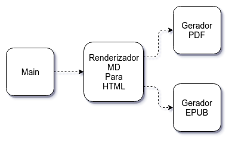

# Single Responsibility Principle: classes coesas

## Uma classe com muitos motivos para ser modificada

Vamos dizer que, em um projeto da sua empresa, você se depara com a seguinte classe:

```java
public class Empregado {

  public BigDecimal calculaPagamento() { 
    //...
  }

  public BigDecimal calculaTaxas() { 
    //... 
  }

  public BigDecimal calculaHorasExtras(List<Hora> horas) { 
    //...
  }


  public void salva() {
    // persiste no Banco de Dados...
  }
  
  public static Empregado buscaPorId(Long id) {
    // busca do Banco de Dados ...
  }


  public String convertePraXML() {
    //...
  }
  
  public static Empregado leXML(String xml) {
    //...
  }
}
```

> Esse exemplo é baseado no livro [UML for Java Programmers](https://www.amazon.com/UML-Java%C2%BF-Programmers-Robert-Martin/dp/0131428489) (MARTIN, 2003).

A classe `Empregado` do código anterior tem um bom design?

As seguintes tarefas são realizadas por essa classe:

- calcula pagamento
- calcula taxas
- calcula horas extras
- salva no BD
- busca do BD por id
- converte pra XML
- lê de XML

Podemos agrupar essas tarefas em alguns conjuntos de "interessados", tanto relacionados ao negócio como à infraestrutura técnica:

- o cálculo de pagamento e taxas interessa ao **setor Financeiro**
- o cálculo de horas extras interessa ao **setor de RH**
- salvar no BD e buscar por id do BD interessa à **implementação de persistência**
- converter de/para XML interessa à **integração com outros sistemas**

Como a classe `Empregado` tem muitos "interessados", pode ser afetada por diversas mudanças:

- nos impostos
- nas regras de horas extra
- nos índices ou nomes de colunas no Banco de Dados
- no Schema do XML (`.xsd`)

Cada "interessado", de negócio ou técnico, faz com que a classe tenha uma responsabilidade diferente.

Sob o ponto de vista das _responsabilidades_, podemos dizer que temos um design _ruim_. A classe `Empregado` tem **muitas responsabilidades**.

E muitas responsabilidades são muitas razões para a classe ser modificada.

## O Princípio da Responsabilidade Única

Pensando na distribuição de responsabilidades entre classes, Uncle Bob cunhou o seguinte princípio:

> **Single Responsibility Principle (SRP)**
>
> _Uma classe deve ter um, e apenas um, motivo para ser modificada._

### Responsabilidade Única não é o mesmo que fazer apenas uma coisa

No livro [Clean Architecture](https://www.amazon.com/Clean-Architecture-Craftsmans-Software-Structure/dp/0134494164) (MARTIN, 2017), Uncle Bob confessa que o termo _Responsabilidade Única_ não foi uma boa escolha de palavras.

Classes não necessariamente precisam fazer apenas uma coisa. Isso é uma características dos métodos (ou funções).

A questão principal do SRP é o motivo para uma classe (ou módulo, generalizando) ser modificada. E esse motivo para mudança, em geral, está relacionado a um grupo de usuários ou _stakeholders_, que Uncle Bob chama de _atores_.

Por isso, no livro [Clean Architecture](https://www.amazon.com/Clean-Architecture-Craftsmans-Software-Structure/dp/0134494164) (MARTIN, 2017), Uncle Bob define o SRP de maneira um pouco diferente:

_Um módulo deve ser responsável por um, e apenas um, ator._

### Classes coesas

O SRP, no fim das contas, é uma outra maneira de falar sobre a necessidade de código coeso.

> **Coesão**
>
> _FIG Coerência de pensamento ou de um todo._
>
> [Michaelis Online](http://michaelis.uol.com.br/busca?r=0&f=0&t=0&palavra=coesao)

No livro [OO e SOLID para Ninjas](https://www.casadocodigo.com.br/products/livro-oo-solid) (ANICHE, 2015), Maurício Aniche sugere que, para encontrar classes pouco coesas, devemos procurar classes que:

- possuem muitos métodos diferentes
- são modificadas com frequência
- não param nunca de crescer

Ao implementar código novo, nem sempre conseguimos criar classes coesas, que seguem o SRP. A melhor abordagem é sempre revisar seu código, buscando problemas de coesão e corrigindo-os aos poucos.

## Responsabilidades, Coesão e SRP no Cotuba

Observe a classe `Main`, do pacote `cotuba`. Quais as responsabilidades dessa classe? Quais os motivos para ela ser modificada?

A classe `Main` realiza as seguintes tarefas:

- lê as opções da linha de comando
- renderiza `.md` para HTML
- gera `.pdf`
- gera `.epub`

Uma mudança em algum detalhe de cada uma dessas tarefas levaria a uma mudança da classe `Main`. Analisando os imports dessa classe, é possível verificar que são usadas diferentes bibliotecas. Há imports de classes dos pacotes:

- `java.io`, `java.nio` para manipular arquivos
- `java.util` e `java.util.stream` para manipular listas
- `org.apache.commons.cli`, da biblioteca Apache Commons CLI, para ler as opções da linha de comando
- `org.commonmark`, da biblioteca CommonMark Java, para renderizar o Markdown para HTML
- `com.itextpdf`, da biblioteca iText, para gerar o PDF
- `nl.siegmann.epublib`, da biblioteca Epublib, para gerar o EPUB

Sem dúvida, a classe `Main` fere o SRP.

## Exercício: uma classe para ler as opções de linha de comando

### Objetivo

Crie uma classe responsável por ler as opções de linha de comando chamada `LeitorOpcoesCLI` e a use na classe `Main` do pacote `cotuba`. Depois das mudanças, os imports de `org.apache.commons.cli` devem ser encontrados apenas nessa nova classe.

### Passo a passo

1. Crie uma nova classe `LeitorOpcoesCLI`, dentro do pacote `cotuba`, e defina um construtor que recebe como parâmetro `String[] args`:

  ####### cotuba.LeitorOpcoesCLI

  ```java
  package cotuba;

  public class LeitorOpcoesCLI {

    public LeitorOpcoesCLI(String[] args) {

    }

  }
  ```

2. Mova o seguinte código da classe `Main` para dentro do construtor de `LeitorOpcoesCLI`:

  ####### cotuba.LeitorOpcoesCLI

  ```java
  Options options = new Options();

  Option opcaoDeDiretorioDosMD = new Option("d", "dir", true,
      "Diretório que contem os arquivos md. Default: diretório atual.");
  options.addOption(opcaoDeDiretorioDosMD);

  Option opcaoDeFormatoDoEbook = new Option("f", "format", true,
      "Formato de saída do ebook. Pode ser: pdf ou epub. Default: pdf");
  options.addOption(opcaoDeFormatoDoEbook);

  Option opcaoDeArquivoDeSaida = new Option("o", "output", true,
      "Arquivo de saída do ebook. Default: book.{formato}.");
  options.addOption(opcaoDeArquivoDeSaida);

  Option opcaoModoVerboso = new Option("v", "verbose", false,
      "Habilita modo verboso.");
  options.addOption(opcaoModoVerboso);

  CommandLineParser cmdParser = new DefaultParser();
  HelpFormatter ajuda = new HelpFormatter();
  CommandLine cmd;

  try {
    cmd = cmdParser.parse(options, args);
  } catch (ParseException e) {
    System.err.println(e.getMessage());
    ajuda.printHelp("cotuba", options);
    System.exit(1);
    return;
  }
  ```

  Não esqueça de fazer os imports relativos às classes do pacote `org.apache.commons.cli`:

  ####### cotuba.LeitorOpcoesCLI

  ```java
  import org.apache.commons.cli.CommandLine;
  import org.apache.commons.cli.CommandLineParser;
  import org.apache.commons.cli.DefaultParser;
  import org.apache.commons.cli.HelpFormatter;
  import org.apache.commons.cli.Option;
  import org.apache.commons.cli.Options;
  import org.apache.commons.cli.ParseException;
  ```

  > Durante as refatorações desse capítulo, devem acontecer alguns erros de compilação. Não se preocupe! Vamos corrigi-los aos poucos.

3. Mova o trecho a seguir de `Main` para o finalzinho do construtor de `LeitorOpcoesCLI`:

  ####### cotuba.LeitorOpcoesCLI

  ```java
  // código omitido...

  String nomeDoDiretorioDosMD = cmd.getOptionValue("dir");

  if (nomeDoDiretorioDosMD != null) {
    diretorioDosMD = Paths.get(nomeDoDiretorioDosMD);
    if (!Files.isDirectory(diretorioDosMD)) {
      throw new RuntimeException(nomeDoDiretorioDosMD + " não é um diretório.");
    }
  } else {
    Path diretorioAtual = Paths.get("");
    diretorioDosMD = diretorioAtual;
  }

  String nomeDoFormatoDoEbook = cmd.getOptionValue("format");

  if (nomeDoFormatoDoEbook != null) {
      formato = nomeDoFormatoDoEbook.toLowerCase();
  } else {
    formato = "pdf";
  }

  String nomeDoArquivoDeSaidaDoEbook = cmd.getOptionValue("output");
  if (nomeDoArquivoDeSaidaDoEbook != null) {
    arquivoDeSaida = Paths.get(nomeDoArquivoDeSaidaDoEbook);
    if (Files.exists(arquivoDeSaida) && Files.isDirectory(arquivoDeSaida)) {
      throw new RuntimeException(nomeDoArquivoDeSaidaDoEbook + " é um diretório.");
    }
  } else {
    arquivoDeSaida = Paths.get("book." + formato.toLowerCase());
  }

  modoVerboso = cmd.hasOption("verbose");
  ```

  Não deixe de fazer os imports das classes do pacote `java.nio`:

  ####### cotuba.LeitorOpcoesCLI

  ```java
  import java.nio.file.Files;
  import java.nio.file.Path;
  import java.nio.file.Paths;
  ```

  O início do classe `Main` deve ficar assim:

  ####### cotuba.Main

  ```java
  public class Main {

    public static void main(String[] args) {

      Path diretorioDosMD;
      String formato;
      Path arquivoDeSaida;
      boolean modoVerboso = false;

      try {

        if ("pdf".equals(formato)) {

          //restante do código...
  ```

4. Vários erros de compilação devem estar acontecendo na classe `LeitorOpcoesCLI`. Vamos corrigi-los declarando os seguintes atributos nessa classe:

  ####### cotuba.LeitorOpcoesCLI

  ```java
  public class LeitorOpcoesCLI {

    private Path diretorioDosMD;
    private String formato;
    private Path arquivoDeSaida;
    private boolean modoVerboso = false;

    public LeitorOpcoesCLI(String[] args) {
      // código omitido...
    }
  }
  ```

  Gere os _getters_ para esses atributos. Os _setters_ NÃO serão necessários.
  
  Dica: você pode usar o atalho _CTRL+3_, digitando _ggas_ e, na tela que será aberta, selecionar a opção _Select Getters_.

5. Modifique o método `main` da classe `Main`, instanciando `LeitorOpcoesCLI` e usando os getters para obter os valores das opções de geração do ebook:

  ####### cotuba.Main

  ```java
  public class Main {

    public static void main(String[] args) {

      LeitorOpcoesCLI opcoesCLI = new LeitorOpcoesCLI(args); //inserido

      P̶a̶t̶h̶ ̶d̶i̶r̶e̶t̶o̶r̶i̶o̶D̶o̶s̶M̶D̶;̶
      Path diretorioDosMD = opcoesCLI.getDiretorioDosMD(); // modificado

      S̶t̶r̶i̶n̶g̶ ̶f̶o̶r̶m̶a̶t̶o̶;̶
      String formato = opcoesCLI.getFormato(); // modificado

      P̶a̶t̶h̶ ̶a̶r̶q̶u̶i̶v̶o̶D̶e̶S̶a̶i̶d̶a̶;̶
      Path arquivoDeSaida = opcoesCLI.getArquivoDeSaida(); // modificado

      b̶o̶o̶l̶e̶a̶n̶ ̶m̶o̶d̶o̶V̶e̶r̶b̶o̶s̶o̶ ̶=̶ ̶f̶a̶l̶s̶e̶;̶
      boolean modoVerboso = opcoesCLI.isModoVerboso(); // modificado

      //restante do código...
  ```

6. Depois dessa refatoração, vários imports desnecessários podem ser removidos da classe `Main`. Faça isso com o atalho _CTRL+Shift+O_.

  ####### cotuba.Main

  ```java
  ̵i̶m̶p̶o̶r̶t̶ ̶j̶a̶v̶a̶.̶n̶i̶o̶.̶f̶i̶l̶e̶.̶P̶a̶t̶h̶s̶;̶

  ̶i̶m̶p̶o̶r̶t̶ ̶o̶r̶g̶.̶a̶p̶a̶c̶h̶e̶.̶c̶o̶m̶m̶o̶n̶s̶.̶c̶l̶i̶.̶C̶o̶m̶m̶a̶n̶d̶L̶i̶n̶e̶;̶
  ̶i̶m̶p̶o̶r̶t̶ ̶o̶r̶g̶.̶a̶p̶a̶c̶h̶e̶.̶c̶o̶m̶m̶o̶n̶s̶.̶c̶l̶i̶.̶C̶o̶m̶m̶a̶n̶d̶L̶i̶n̶e̶P̶a̶r̶s̶e̶r̶;̶
  ̶i̶m̶p̶o̶r̶t̶ ̶o̶r̶g̶.̶a̶p̶a̶c̶h̶e̶.̶c̶o̶m̶m̶o̶n̶s̶.̶c̶l̶i̶.̶D̶e̶f̶a̶u̶l̶t̶P̶a̶r̶s̶e̶r̶;̶
  ̶i̶m̶p̶o̶r̶t̶ ̶o̶r̶g̶.̶a̶p̶a̶c̶h̶e̶.̶c̶o̶m̶m̶o̶n̶s̶.̶c̶l̶i̶.̶H̶e̶l̶p̶F̶o̶r̶m̶a̶t̶t̶e̶r̶;̶
  ̶i̶m̶p̶o̶r̶t̶ ̶o̶r̶g̶.̶a̶p̶a̶c̶h̶e̶.̶c̶o̶m̶m̶o̶n̶s̶.̶c̶l̶i̶.̶O̶p̶t̶i̶o̶n̶;̶
  ̶i̶m̶p̶o̶r̶t̶ ̶o̶r̶g̶.̶a̶p̶a̶c̶h̶e̶.̶c̶o̶m̶m̶o̶n̶s̶.̶c̶l̶i̶.̶O̶p̶t̶i̶o̶n̶s̶;̶
  ̶i̶m̶p̶o̶r̶t̶ ̶o̶r̶g̶.̶a̶p̶a̶c̶h̶e̶.̶c̶o̶m̶m̶o̶n̶s̶.̶c̶l̶i̶.̶P̶a̶r̶s̶e̶E̶x̶c̶e̶p̶t̶i̶o̶n̶;̶
  ```

  Os imports do pacote `org.apache.commons.cli`, da biblioteca Apache Commons CLI, agora estão isolados na classe responsável por extrair as opções de linha de comando, a `LeitorOpcoesCLI`. O código do Cotuba está tomando forma!

7. Tente gerar um PDF e/ou EPUB novamente. Deve funcionar!

## Exercício: uma classe para gerar PDF

### Objetivo

Crie uma classe responsável por gerar PDFs chamada `GeradorPDF` e a use na classe `Main`. Todo os imports de `com.itextpdf` devem ser encontrados somente nessa nova classe.

### Passo a passo

1. Crie uma nova classe `GeradorPDF`, dentro do pacote `cotuba`, e defina um método `gera` que recebe os parâmetros `diretorioDosMD` e `arquivoDeSaida`, ambos do tipo `Path`:

  ```java
  package cotuba;

  import java.nio.file.Path;

  public class GeradorPDF {

    public void gera(Path diretorioDosMD, Path arquivoDeSaida) {

    }

  }
  ```

2. Mova código a seguir, que efetua a geração do PDF, de dentro do `if ("pdf".equals(formato))` da classe `Main` para o método `gera` de `GeradorPDF`:

  ####### cotuba.GeradorPDF

  ```java
  try (PdfWriter writer = new PdfWriter(Files.newOutputStream(arquivoDeSaida));
    PdfDocument pdf = new PdfDocument(writer);
    Document pdfDocument = new Document(pdf)) {

    PathMatcher matcher = FileSystems.getDefault().getPathMatcher("glob:**/*.md");
    try (Stream<Path> arquivosMD = Files.list(diretorioDosMD)) {
      arquivosMD
        .filter(matcher::matches)
        .sorted()
        .forEach(arquivoMD -> {
          Parser parser = Parser.builder().build();
          Node document = null;
          try {
            document = parser.parseReader(Files.newBufferedReader(arquivoMD));
            document.accept(new AbstractVisitor() {
              @Override
              public void visit(Heading heading) {
                if (heading.getLevel() == 1) {
                  // capítulo
                  String tituloDoCapitulo = ((Text) heading.getFirstChild()).getLiteral();
                  // TODO: usar título do capítulo
                } else if (heading.getLevel() == 2) {
                  // seção
                } else if (heading.getLevel() == 3) {
                  // título
                }
              }

            });
          } catch (Exception ex) {
            throw new RuntimeException("Erro ao fazer parse do arquivo " + arquivoMD, ex);
          }

          try {
            HtmlRenderer renderer = HtmlRenderer.builder().build();
            String html = renderer.render(document);

            List<IElement> convertToElements = HtmlConverter.convertToElements(html);
            for (IElement element : convertToElements) {
              pdfDocument.add((IBlockElement) element);
            }
            // TODO: não adicionar página depois do último capítulo
            pdfDocument.add(new AreaBreak(AreaBreakType.NEXT_PAGE));

          } catch (Exception ex) {
            throw new RuntimeException("Erro ao renderizar para HTML o arquivo " + arquivoMD, ex);
          }

        });
    } catch (IOException ex) {
      throw new RuntimeException(
          "Erro tentando encontrar arquivos .md em " + diretorioDosMD.toAbsolutePath(), ex);
    }

  } catch (Exception ex) {
    throw new RuntimeException("Erro ao criar arquivo PDF: " + arquivoDeSaida.toAbsolutePath(), ex);
  }
  ```

  Adicione os imports necessários:

  ####### cotuba.GeradorPDF

  ```java
  import java.io.IOException;
  import java.nio.file.FileSystems;
  import java.nio.file.Files;
  import java.nio.file.Path; //já estava aqui...
  import java.nio.file.PathMatcher;
  import java.util.List;
  import java.util.stream.Stream;

  import org.commonmark.node.AbstractVisitor;
  import org.commonmark.node.Heading;
  import org.commonmark.node.Node;
  import org.commonmark.node.Text;
  import org.commonmark.parser.Parser;
  import org.commonmark.renderer.html.HtmlRenderer;

  import com.itextpdf.html2pdf.HtmlConverter;
  import com.itextpdf.kernel.pdf.PdfDocument;
  import com.itextpdf.kernel.pdf.PdfWriter;
  import com.itextpdf.layout.Document;
  import com.itextpdf.layout.element.AreaBreak;
  import com.itextpdf.layout.element.IBlockElement;
  import com.itextpdf.layout.element.IElement;
  import com.itextpdf.layout.property.AreaBreakType;
  ```

  O trecho da classe `Main` que estava gerando o PDF deverá ficar vazio:

  ####### cotuba.Main

  ```java
    if ("pdf".equals(formato)) {

      // movido...

    } else if ("epub".equals(formato)) {

    // restante do código...
  ```

3. Na classe `Main`, use `GeradorPDF`:

  ####### cotuba.Main

  ```java
    if ("pdf".equals(formato)) {

      GeradorPDF geradorPDF = new GeradorPDF();
      geradorPDF.gera(diretorioDosMD, arquivoDeSaida);

    } else if ("epub".equals(formato)) {

    // restante do código...
  ```

4. Limpe os imports desnecessários da classe `Main`:

  ####### cotuba.Main

  ```java
  ̶i̶m̶p̶o̶r̶t̶ ̶j̶a̶v̶a̶.̶u̶t̶i̶l̶.̶L̶i̶s̶t̶;̶

  ̶i̶m̶p̶o̶r̶t̶ ̶c̶o̶m̶.̶i̶t̶e̶x̶t̶p̶d̶f̶.̶h̶t̶m̶l̶2̶p̶d̶f̶.̶H̶t̶m̶l̶C̶o̶n̶v̶e̶r̶t̶e̶r̶;̶
  ̶i̶m̶p̶o̶r̶t̶ ̶c̶o̶m̶.̶i̶t̶e̶x̶t̶p̶d̶f̶.̶k̶e̶r̶n̶e̶l̶.̶p̶d̶f̶.̶P̶d̶f̶D̶o̶c̶u̶m̶e̶n̶t̶;̶
  ̶i̶m̶p̶o̶r̶t̶ ̶c̶o̶m̶.̶i̶t̶e̶x̶t̶p̶d̶f̶.̶k̶e̶r̶n̶e̶l̶.̶p̶d̶f̶.̶P̶d̶f̶W̶r̶i̶t̶e̶r̶;̶
  ̶i̶m̶p̶o̶r̶t̶ ̶c̶o̶m̶.̶i̶t̶e̶x̶t̶p̶d̶f̶.̶l̶a̶y̶o̶u̶t̶.̶D̶o̶c̶u̶m̶e̶n̶t̶;̶
  ̶i̶m̶p̶o̶r̶t̶ ̶c̶o̶m̶.̶i̶t̶e̶x̶t̶p̶d̶f̶.̶l̶a̶y̶o̶u̶t̶.̶e̶l̶e̶m̶e̶n̶t̶.̶A̶r̶e̶a̶B̶r̶e̶a̶k̶;̶
  ̶i̶m̶p̶o̶r̶t̶ ̶c̶o̶m̶.̶i̶t̶e̶x̶t̶p̶d̶f̶.̶l̶a̶y̶o̶u̶t̶.̶e̶l̶e̶m̶e̶n̶t̶.̶I̶B̶l̶o̶c̶k̶E̶l̶e̶m̶e̶n̶t̶;̶
  ̶i̶m̶p̶o̶r̶t̶ ̶c̶o̶m̶.̶i̶t̶e̶x̶t̶p̶d̶f̶.̶l̶a̶y̶o̶u̶t̶.̶e̶l̶e̶m̶e̶n̶t̶.̶I̶E̶l̶e̶m̶e̶n̶t̶;̶
  ̶i̶m̶p̶o̶r̶t̶ ̶c̶o̶m̶.̶i̶t̶e̶x̶t̶p̶d̶f̶.̶l̶a̶y̶o̶u̶t̶.̶p̶r̶o̶p̶e̶r̶t̶y̶.̶A̶r̶e̶a̶B̶r̶e̶a̶k̶T̶y̶p̶e̶;̶
  ```

5. Gere um PDF e veja se continua funcionando!

## Exercício: uma classe para gerar EPUB

### Objetivo

Crie uma classe responsável por gerar EPUBs e a use na classe `Main`. Os imports de `nl.siegmann.epublib` devem ser necessários apenas nessa nova classe.

### Passo a passo

1. Crie uma nova classe `GeradorEPUB`, dentro do pacote `cotuba`, e defina um método `gera` com os parâmetros `diretorioDosMD` e `arquivoDeSaida`, ambos do tipo `Path` :

  ####### cotuba.GeradorEPUB

  ```java
  package cotuba;

  import java.nio.file.Path;

  public class GeradorEPUB {

    public void gera(Path diretorioDosMD, Path arquivoDeSaida) {

    }

  }
  ```

2. O trecho da classe `Main` de dentro do `if ("epub".equals(formato))`, que gera EPUBs, deve ser movido para o método `gera` de `GeradorEPUB`:

  ####### cotuba.GeradorEPUB

  ```java
  Book epub = new Book();

  PathMatcher matcher = FileSystems.getDefault().getPathMatcher("glob:**/*.md");
  try (Stream<Path> arquivosMD = Files.list(diretorioDosMD)) {
    arquivosMD
      .filter(matcher::matches)
      .sorted()
        .forEach(arquivoMD -> {
          Parser parser = Parser.builder().build();
          Node document = null;
          try {
            document = parser.parseReader(Files.newBufferedReader(arquivoMD));
            document.accept(new AbstractVisitor() {
              @Override
              public void visit(Heading heading) {
                if (heading.getLevel() == 1) {
                  // capítulo
                  String tituloDoCapitulo = ((Text) heading.getFirstChild()).getLiteral();
                  // TODO: usar título do capítulo
                } else if (heading.getLevel() == 2) {
                  // seção
                } else if (heading.getLevel() == 3) {
                  // título
                }
              }

            });
          } catch (Exception ex) {
            throw new RuntimeException("Erro ao fazer parse do arquivo " + arquivoMD, ex);
          }

          try {
            HtmlRenderer renderer = HtmlRenderer.builder().build();
            String html = renderer.render(document);

            // TODO: usar título do capítulo
            epub.addSection("Capítulo", new Resource(html.getBytes(), MediatypeService.XHTML));

          } catch (Exception ex) {
            throw new RuntimeException("Erro ao renderizar para HTML o arquivo " + arquivoMD, ex);
          }
        });

  } catch (IOException ex) {
    throw new RuntimeException(
        "Erro tentando encontrar arquivos .md em " + diretorioDosMD.toAbsolutePath(), ex);
  }

  EpubWriter epubWriter = new EpubWriter();

  try {
    epubWriter.write(epub, Files.newOutputStream(arquivoDeSaida));
  } catch (IOException ex) {
    throw new RuntimeException("Erro ao criar arquivo EPUB: " + arquivoDeSaida.toAbsolutePath(), ex);
  }
  ```

  Veja se adicionou os imports corretos:

  ####### cotuba.GeradorEPUB

  ```java
  import java.io.IOException;
  import java.nio.file.FileSystems;
  import java.nio.file.Files;
  import java.nio.file.Path; //já estava aqui...
  import java.nio.file.PathMatcher;
  import java.util.stream.Stream;

  import org.commonmark.node.AbstractVisitor;
  import org.commonmark.node.Heading;
  import org.commonmark.node.Node;
  import org.commonmark.node.Text;
  import org.commonmark.parser.Parser;
  import org.commonmark.renderer.html.HtmlRenderer;

  import nl.siegmann.epublib.domain.Book;
  import nl.siegmann.epublib.domain.Resource;
  import nl.siegmann.epublib.epub.EpubWriter;
  import nl.siegmann.epublib.service.MediatypeService;
  ```

3. Use a nova classe `GeradorEPUB` em `Main`. O trecho de `Main` que gera ebooks deverá ficar parecido com:

  ####### cotuba.Main

  ```java
    if ("pdf".equals(formato)) {

      GeradorPDF geradorPDF = new GeradorPDF();
      geradorPDF.gera(diretorioDosMD, arquivoDeSaida);

    } else if ("epub".equals(formato)) {

      // inserido
      GeradorEPUB geradorEPUB = new GeradorEPUB();
      geradorEPUB.gera(diretorioDosMD, arquivoDeSaida);

    } else {

    // restante do código...
  ```

4. Remova os imports desnecessários de `Main`:

  ####### cotuba.Main

  ```java
  ̶i̶m̶p̶o̶r̶t̶ ̶j̶a̶v̶a̶.̶i̶o̶.̶I̶O̶E̶x̶c̶e̶p̶t̶i̶o̶n̶;̶
  ̶i̶m̶p̶o̶r̶t̶ ̶j̶a̶v̶a̶.̶n̶i̶o̶.̶f̶i̶l̶e̶.̶F̶i̶l̶e̶S̶y̶s̶t̶e̶m̶s̶;̶
  ̶i̶m̶p̶o̶r̶t̶ ̶j̶a̶v̶a̶.̶n̶i̶o̶.̶f̶i̶l̶e̶.̶F̶i̶l̶e̶s̶;̶

  ̶i̶m̶p̶o̶r̶t̶ ̶j̶a̶v̶a̶.̶n̶i̶o̶.̶f̶i̶l̶e̶.̶P̶a̶t̶h̶M̶a̶t̶c̶h̶e̶r̶;̶
  ̶i̶m̶p̶o̶r̶t̶ ̶j̶a̶v̶a̶.̶u̶t̶i̶l̶.̶s̶t̶r̶e̶a̶m̶.̶S̶t̶r̶e̶a̶m̶;̶

  ̶i̶m̶p̶o̶r̶t̶ ̶o̶r̶g̶.̶c̶o̶m̶m̶o̶n̶m̶a̶r̶k̶.̶n̶o̶d̶e̶.̶A̶b̶s̶t̶r̶a̶c̶t̶V̶i̶s̶i̶t̶o̶r̶;̶
  ̶i̶m̶p̶o̶r̶t̶ ̶o̶r̶g̶.̶c̶o̶m̶m̶o̶n̶m̶a̶r̶k̶.̶n̶o̶d̶e̶.̶H̶e̶a̶d̶i̶n̶g̶;̶
  ̶i̶m̶p̶o̶r̶t̶ ̶o̶r̶g̶.̶c̶o̶m̶m̶o̶n̶m̶a̶r̶k̶.̶n̶o̶d̶e̶.̶N̶o̶d̶e̶;̶
  ̶i̶m̶p̶o̶r̶t̶ ̶o̶r̶g̶.̶c̶o̶m̶m̶o̶n̶m̶a̶r̶k̶.̶n̶o̶d̶e̶.̶T̶e̶x̶t̶;̶
  ̶i̶m̶p̶o̶r̶t̶ ̶o̶r̶g̶.̶c̶o̶m̶m̶o̶n̶m̶a̶r̶k̶.̶p̶a̶r̶s̶e̶r̶.̶P̶a̶r̶s̶e̶r̶;̶
  ̶i̶m̶p̶o̶r̶t̶ ̶o̶r̶g̶.̶c̶o̶m̶m̶o̶n̶m̶a̶r̶k̶.̶r̶e̶n̶d̶e̶r̶e̶r̶.̶h̶t̶m̶l̶.̶H̶t̶m̶l̶R̶e̶n̶d̶e̶r̶e̶r̶;̶

  ̶i̶m̶p̶o̶r̶t̶ ̶n̶l̶.̶s̶i̶e̶g̶m̶a̶n̶n̶.̶e̶p̶u̶b̶l̶i̶b̶.̶d̶o̶m̶a̶i̶n̶.̶B̶o̶o̶k̶;̶
  ̶i̶m̶p̶o̶r̶t̶ ̶n̶l̶.̶s̶i̶e̶g̶m̶a̶n̶n̶.̶e̶p̶u̶b̶l̶i̶b̶.̶d̶o̶m̶a̶i̶n̶.̶R̶e̶s̶o̶u̶r̶c̶e̶;̶
  ̶i̶m̶p̶o̶r̶t̶ ̶n̶l̶.̶s̶i̶e̶g̶m̶a̶n̶n̶.̶e̶p̶u̶b̶l̶i̶b̶.̶e̶p̶u̶b̶.̶E̶p̶u̶b̶W̶r̶i̶t̶e̶r̶;̶
  ̶i̶m̶p̶o̶r̶t̶ ̶n̶l̶.̶s̶i̶e̶g̶m̶a̶n̶n̶.̶e̶p̶u̶b̶l̶i̶b̶.̶s̶e̶r̶v̶i̶c̶e̶.̶M̶e̶d̶i̶a̶t̶y̶p̶e̶S̶e̶r̶v̶i̶c̶e̶;̶
  ```

  O único import que restará em `Main` será o da classe `java.nio.file.Path`.

5. Teste a geração de EPUBs!

## Refatorar é bom pra aprender OO

Depois das alterações, extraímos três classes de `Main`: as classes `LeitorOpcoesCLI`, `GeradorPDF` e `GeradorEPUB`.


As responsabilidades ficaram mais bem distribuídas e o código mais fácil de entender e manter.

Melhoramos o código sem inserir novas funcionalidades.

> _**Refatoração** (substantivo): uma alteração feita na estrutura interna do software para torná-lo mais fácil de ser entendido e menos custoso de ser modificado sem alterar seu comportamento observável._
>
> Martin Fowler, no livro [Refactoring](https://www.amazon.com/Refactoring-Improving-Design-Existing-Code/dp/0201485672/) (FOWLER et al., 1999)

Começar de um código bagunçado, com muitas responsabilidades, modificando-o em pequenos passos, até chegar a um código extensível e com as responsabilidades bem definidas, é uma boa maneira de ver a verdadeira utilidade de OO. E de aprender!

## Não se repita

Código duplicado, triplicado, quadruplicado, enfim, código repetido, é algo muito comum. E muito ruim.

No fim das contas, há uma classe pedindo pra nascer. Essa nova classe terá, provavelmente, uma responsabilidade bem definida.

> _Dependência é o principal problema em desenvolvimento de software. Duplicação é o sintoma. Mas, ao contrário da maioria dos problemas na vida, nos quais eliminar os sintomas faz com que um problema mais grave apareça em outro lugar, eliminar duplicação nos programas elimina dependência._
>
> Kent Beck, no livro [TDD by Example](https://www.amazon.com/Test-Driven-Development-Kent-Beck/dp/0321146530) (BECK, 2002)

Os "Programadores Pragmáticos" Andy Hunt e Dave Thomas criaram um acrônimo que serve como um mantra para bons programadores: D.R.Y ou _Don't Repeat Yourself_ (não se repita).

> _Todo bloco de conhecimento deve ter uma representação única, sem ambiguidades e dominante num sistema._
>
> Andy Hunt e Dave Thomas, no livro [Pragmatic Programmer](https://www.amazon.com.br/Pragmatic-Programmer-Journeyman-Master/dp/020161622X) (HUNT; THOMAS, 1999)

### Quando refatorar algo repetido no código?

Martin Fowler, no livro [Refactoring](https://www.amazon.com/Refactoring-Improving-Design-Existing-Code/dp/0201485672/) (FOWLER et al., 1999), cita uma diretriz que recebeu de Don Roberts, que chama de **a regra dos três**:

_A primeira vez que você faz algo, apenas faça._

_Na segunda vez que você faz algo parecido, se incomode com a duplicação, mas duplique de qualquer forma._

_Na terceira vez que você faz coisa semelhante, refatore._

## Duplicação no Cotuba

Você percebeu que tanto a classe `GeradorPDF` como a classe `GeradorEPUB` tem vários imports em comum? Repare bem:

####### cotuba.GeradorPDF e cotuba.GeradorEPUB

```java
import java.io.IOException;
import java.nio.file.FileSystems;
import java.nio.file.Files;
import java.nio.file.Path;
import java.nio.file.PathMatcher;
import java.util.stream.Stream;

import org.commonmark.node.AbstractVisitor;
import org.commonmark.node.Heading;
import org.commonmark.node.Node;
import org.commonmark.node.Text;
import org.commonmark.parser.Parser;
import org.commonmark.renderer.html.HtmlRenderer;
```

Até aí tudo bem... É apenas um sinal de algo estranho...

Mas o problema é que boa parte desses imports em comum são do pacote `org.commonmark`, da biblioteca CommonMark Java, que serve para renderizar arquivos Markdown para HTML.

Será que é responsabilidade dos geradores de ebook transformar arquivos `.md` em HTML? Acho que há uma classe pedindo pra nascer...

## Exercício: extraindo duplicação para uma classe renderizadora de Markdown

### Objetivo

Crie uma classe responsável por renderizar arquivos MD para HTML. Os imports de `org.commonmark` devem ficar apenas nessa nova classe.

### Passo a passo

1. Crie uma classe chamada `RenderizadorMDParaHTML` no pacote `cotuba`. Defina o método `renderiza`, que receberá um `Path` como parâmetro: 

  ####### cotuba.RenderizadorMDParaHTML

  ```java
  package cotuba;

  import java.nio.file.Path;

  public class RenderizadorMDParaHTML {

    public void renderiza(Path diretorioDosMD) {

    }

  }
  ```

2. Mova o trecho a seguir, que está duplicado em `GeradorPDF` e `GeradorEPUB`, para o método `renderiza` de `RenderizadorMDParaHTML`:

  ####### cotuba.RenderizadorMDParaHTML

  ```java
  PathMatcher matcher = FileSystems.getDefault().getPathMatcher("glob:**/*.md");
  try (Stream<Path> arquivosMD = Files.list(diretorioDosMD)) {
    arquivosMD
      .filter(matcher::matches)
      .sorted()
      .forEach(arquivoMD -> {

        Parser parser = Parser.builder().build();
        Node document = null;
        try {
          document = parser.parseReader(Files.newBufferedReader(arquivoMD));
          document.accept(new AbstractVisitor() {
            @Override
            public void visit(Heading heading) {
              if (heading.getLevel() == 1) {
                // capítulo
                String tituloDoCapitulo = ((Text) heading.getFirstChild()).getLiteral();
                // TODO: usar título do capítulo
              } else if (heading.getLevel() == 2) {
                // seção
              } else if (heading.getLevel() == 3) {
                // título
              }
            }

          });

        } catch (Exception ex) {
          throw new RuntimeException("Erro ao fazer parse do arquivo " + arquivoMD, ex);
        }

        try {
          HtmlRenderer renderer = HtmlRenderer.builder().build();
          String html = renderer.render(document);

          // PDF ou EPUB aqui?

        } catch (Exception ex) {
          throw new RuntimeException("Erro ao renderizar para HTML o arquivo " + arquivoMD, ex);
        }

      });
  } catch (IOException ex) {
    throw new RuntimeException(
        "Erro tentando encontrar arquivos .md em " + diretorioDosMD.toAbsolutePath(), ex);
  }
  ```

  Veja se os imports de `RenderizadorMDParaHTML` estão corretos:

  ####### cotuba.RenderizadorMDParaHTML

  ```java
  import java.io.IOException;
  import java.nio.file.FileSystems;
  import java.nio.file.Files;
  import java.nio.file.Path; // já estava aqui...
  import java.nio.file.PathMatcher;
  import java.util.stream.Stream;

  import org.commonmark.node.AbstractVisitor;
  import org.commonmark.node.Heading;
  import org.commonmark.node.Node;
  import org.commonmark.node.Text;
  import org.commonmark.parser.Parser;
  import org.commonmark.renderer.html.HtmlRenderer;
  ```

  A classe `GeradorPDF`, depois desse trecho de código ser movido, deve ter o seguinte conteúdo:

  ####### cotuba.GeradorPDF

  ```java
  public class GeradorPDF {

    public void gera(Path diretorioDosMD, Path arquivoDeSaida) {

      try(PdfWriter writer = new PdfWriter(Files.newOutputStream(arquivoDeSaida));
        PdfDocument pdf = new PdfDocument(writer);
        Document pdfDocument = new Document(pdf)) {

        List<IElement> convertToElements = HtmlConverter.convertToElements(html);
        for (IElement element : convertToElements) {
          pdfDocument.add((IBlockElement) element);
        }
        // TODO: não adicionar página depois do último capítulo
        pdfDocument.add(new AreaBreak(AreaBreakType.NEXT_PAGE));

     } catch (Exception ex) {
        throw new RuntimeException("Erro ao criar arquivo PDF: " + arquivoDeSaida.toAbsolutePath(), ex);
      }

    }

  }
  ```

  Já o topo de `GeradorEPUB` ficará desse jeito:

  ####### cotuba.GeradorEPUB

  ```java
  public class GeradorEPUB {

    public void gera(Path diretorioDosMD, Path arquivoDeSaida) {

      Book epub = new Book();

      // TODO: usar título do capítulo
      epub.addSection("Capítulo", new Resource(html.getBytes(), MediatypeService.XHTML));

      EpubWriter epubWriter = new EpubWriter();

      try {
        epubWriter.write(epub, Files.newOutputStream(arquivoDeSaida));
      } catch (IOException ex) {
        throw new RuntimeException("Erro ao criar arquivo EPUB: " + arquivoDeSaida.toAbsolutePath(), ex);
      }

    }

  }
  ```

  Ignore os erros de compilação por enquanto.

  O que será que devemos fazer com o resultado da renderização, disponível na variável `html`? Gerar o PDF ou o EPUB? Veremos mais adiante...

4. Vamos nos certificar que removemos os imports desnecessários de `GeradorPDF` e `GeradorEPUB`:

  ####### cotuba.GeradorPDF

  ```java
  i̶m̶p̶o̶r̶t̶ ̶j̶a̶v̶a̶.̶i̶o̶.̶I̶O̶E̶x̶c̶e̶p̶t̶i̶o̶n̶;̶
  ̶i̶m̶p̶o̶r̶t̶ ̶j̶a̶v̶a̶.̶n̶i̶o̶.̶f̶i̶l̶e̶.̶F̶i̶l̶e̶S̶y̶s̶t̶e̶m̶s̶;̶
  import java.nio.file.Files;
  import java.nio.file.Path;
  ̶i̶m̶p̶o̶r̶t̶ ̶j̶a̶v̶a̶.̶n̶i̶o̶.̶f̶i̶l̶e̶.̶P̶a̶t̶h̶M̶a̶t̶c̶h̶e̶r̶;̶
  import java.util.List;
  ̶i̶m̶p̶o̶r̶t̶ ̶j̶a̶v̶a̶.̶u̶t̶i̶l̶.̶s̶t̶r̶e̶a̶m̶.̶S̶t̶r̶e̶a̶m̶;̶

  ̶i̶m̶p̶o̶r̶t̶ ̶o̶r̶g̶.̶c̶o̶m̶m̶o̶n̶m̶a̶r̶k̶.̶n̶o̶d̶e̶.̶A̶b̶s̶t̶r̶a̶c̶t̶V̶i̶s̶i̶t̶o̶r̶;̶
  ̶i̶m̶p̶o̶r̶t̶ ̶o̶r̶g̶.̶c̶o̶m̶m̶o̶n̶m̶a̶r̶k̶.̶n̶o̶d̶e̶.̶H̶e̶a̶d̶i̶n̶g̶;̶
  ̶i̶m̶p̶o̶r̶t̶ ̶o̶r̶g̶.̶c̶o̶m̶m̶o̶n̶m̶a̶r̶k̶.̶n̶o̶d̶e̶.̶N̶o̶d̶e̶;̶
  ̶i̶m̶p̶o̶r̶t̶ ̶o̶r̶g̶.̶c̶o̶m̶m̶o̶n̶m̶a̶r̶k̶.̶n̶o̶d̶e̶.̶T̶e̶x̶t̶;̶
  ̶i̶m̶p̶o̶r̶t̶ ̶o̶r̶g̶.̶c̶o̶m̶m̶o̶n̶m̶a̶r̶k̶.̶p̶a̶r̶s̶e̶r̶.̶P̶a̶r̶s̶e̶r̶;̶
  ̶i̶m̶p̶o̶r̶t̶ ̶o̶r̶g̶.̶c̶o̶m̶m̶o̶n̶m̶a̶r̶k̶.̶r̶e̶n̶d̶e̶r̶e̶r̶.̶h̶t̶m̶l̶.̶H̶t̶m̶l̶R̶e̶n̶d̶e̶r̶e̶r̶;̶

  import com.itextpdf.html2pdf.HtmlConverter;
  import com.itextpdf.kernel.pdf.PdfDocument;
  import com.itextpdf.kernel.pdf.PdfWriter;
  import com.itextpdf.layout.Document;
  import com.itextpdf.layout.element.AreaBreak;
  import com.itextpdf.layout.element.IBlockElement;
  import com.itextpdf.layout.element.IElement;
  import com.itextpdf.layout.property.AreaBreakType;
  ```

  ####### cotuba.GeradorEPUB

  ```java
  import java.io.IOException;
  ̶i̶m̶p̶o̶r̶t̶ ̶j̶a̶v̶a̶.̶n̶i̶o̶.̶f̶i̶l̶e̶.̶F̶i̶l̶e̶S̶y̶s̶t̶e̶m̶s̶;̶
  import java.nio.file.Files;
  import java.nio.file.Path;
  ̶i̶m̶p̶o̶r̶t̶ ̶j̶a̶v̶a̶.̶n̶i̶o̶.̶f̶i̶l̶e̶.̶P̶a̶t̶h̶M̶a̶t̶c̶h̶e̶r̶;̶
  ̶i̶m̶p̶o̶r̶t̶ ̶j̶a̶v̶a̶.̶u̶t̶i̶l̶.̶s̶t̶r̶e̶a̶m̶.̶S̶t̶r̶e̶a̶m̶;̶

  ̶i̶m̶p̶o̶r̶t̶ ̶o̶r̶g̶.̶c̶o̶m̶m̶o̶n̶m̶a̶r̶k̶.̶n̶o̶d̶e̶.̶A̶b̶s̶t̶r̶a̶c̶t̶V̶i̶s̶i̶t̶o̶r̶;̶
  ̶i̶m̶p̶o̶r̶t̶ ̶o̶r̶g̶.̶c̶o̶m̶m̶o̶n̶m̶a̶r̶k̶.̶n̶o̶d̶e̶.̶H̶e̶a̶d̶i̶n̶g̶;̶
  ̶i̶m̶p̶o̶r̶t̶ ̶o̶r̶g̶.̶c̶o̶m̶m̶o̶n̶m̶a̶r̶k̶.̶n̶o̶d̶e̶.̶N̶o̶d̶e̶;̶
  ̶i̶m̶p̶o̶r̶t̶ ̶o̶r̶g̶.̶c̶o̶m̶m̶o̶n̶m̶a̶r̶k̶.̶n̶o̶d̶e̶.̶T̶e̶x̶t̶;̶
  ̶i̶m̶p̶o̶r̶t̶ ̶o̶r̶g̶.̶c̶o̶m̶m̶o̶n̶m̶a̶r̶k̶.̶p̶a̶r̶s̶e̶r̶.̶P̶a̶r̶s̶e̶r̶;̶
  ̶i̶m̶p̶o̶r̶t̶ ̶o̶r̶g̶.̶c̶o̶m̶m̶o̶n̶m̶a̶r̶k̶.̶r̶e̶n̶d̶e̶r̶e̶r̶.̶h̶t̶m̶l̶.̶H̶t̶m̶l̶R̶e̶n̶d̶e̶r̶e̶r̶;̶

  import nl.siegmann.epublib.domain.Book;
  import nl.siegmann.epublib.domain.Resource;
  import nl.siegmann.epublib.epub.EpubWriter;
  import nl.siegmann.epublib.service.MediatypeService;
  ```

  Ambas as classes `GeradorPDF` e `GeradorEPUB` estão com erros de compilação no trecho que usa a variável `html`.
  
  É um erro esperado. Vamos resolvê-lo mais pra frente...


## Um domain model para o Cotuba

### Avaliando opções de design do código

Precisamos passar, de alguma maneira, o HTML renderizado por `RenderizadorMDParaHTML` a partir dos arquivos MD para os geradores de PDF e EPUB.

Uma questão importante é definir quem chama quem. Há várias implementações possíveis. Entre elas:

- `Main` chama `RenderizadorMDParaHTML` que, por sua vez, chama `GeradorPDF` e `GeradorEPUB`



- `Main` chama `RenderizadorMDParaHTML`, `GeradorPDF` e `GeradorEPUB`, coordenando todas as classes


Pensando em termos de distribuição de responsabilidades, ter a classe `Main` como "coordenadora" é uma opção melhor.

Se a classe `RenderizadorMDParaHTML` chamar os geradores, teríamos dois motivos para mudá-la:

- quando tivermos uma mudança na renderização do Markdown (OK)
- quando acontecer alguma alteração nos geradores (NÃO OK)

A classe `Main` já é a nossa coordenadora porque:

- colabora com `LeitorOpcoesCLI` para extrair as opções da linha de comando
- colabora com `RenderizadorMDParaHTML` para disparar a renderização do Markdown

Teremos mais duas funções de coordenação na classe `Main`:

- colaborar com `GeradorPDF` para gerar PDFs
- colaborar com `GeradorEPUB` para gerar EPUBs

### Um domain model para a geração de ebooks

Mas como `Main` deve passar o HTML para os geradores? Como uma simples `String`? Por meio de um arquivo?

Um ótima opção é passar os dados do ebook a ser gerado entre as classes do Cotuba por meio de um modelo de domínio, ou _domain model_.

Como o problema que estamos resolvendo é relacionado com a geração de ebooks, teremos as seguintes classes:

- `Ebook`, que terá um formato, uma lista de capítulos e um arquivo de saída
- `Capitulo`, que terá um título e um conteúdo HTML

O nosso _domain model_ é bem simples. Só isso mesmo!

Organizaremos o código de maneira que a classe `RenderizadorMDParaHTML` retorne uma `List<Capitulo>` para a `Main`.

A classe `Main`, por sua vez, cria um `Ebook` contendo a lista de capítulos e os repassa para os geradores de ebook.

## Exercício: um domain model simples

### Objetivo

Crie uma classe `Capitulo`, com os atributos privados `titulo` (`String`) e `conteudoHTML` (`String`).

Crie também uma classe `Ebook`, com os atributos privados `formato` (`String`), `arquivoDeSaida` (`Path`) e `capitulos` (`List<Capitulo>`).

Defina _getters_ e _setters_ para os atributos.

### Passo a passo

1. Vamos criar a classe `Capitulo`, no pacote `cotuba`, conforme descrevemos anteriormente:

  ####### cotuba.Capitulo

  ```java
  package cotuba;

  public class Capitulo {

    private String titulo;

    private String conteudoHTML;

    // getters e setters...

  }
  ```

  Não esqueça de gerar os _getters_ e _setters_ para ambos os atributos.

2. Crie a classe `Ebook`, também no pacote `cotuba`, como descrito antes:

  ####### cotuba.Ebook

  ```java
  package cotuba;

  import java.nio.file.Path;
  import java.util.ArrayList;
  import java.util.List;

  public class Ebook {

    private String formato;

    private Path arquivoDeSaida;

    private List<Capitulo> capitulos;

    // getters e setters...

  }
  ```

  Gere os _getters_ e _setters_ para os atributos.

  Certifique-se que os imports estão corretos.

  As classes `GeradorPDF` e `GeradorEPUB` ainda continuarão com erros de compilação.

## Exercício: usando o domain model no renderizador

### Objetivo

Faça a classe `RenderizadorMDParaHTML` montar  uma `List<Capitulo>` e retorná-la no método `renderiza`.

### Passo a passo

1. Modifique o método `renderiza` de `RenderizadorMDParaHTML`, para que retorne uma `List<Capitulo>`. Instancie essa lista no começo do método e a retorne no final:

  ####### cotuba.RenderizadorMDParaHTML

  ```java
  public class RenderizadorMDParaHTML {

    p̶u̶b̶l̶i̶c̶ ̶v̶o̶i̶d̶ ̶r̶e̶n̶d̶e̶r̶i̶z̶a̶(̶P̶a̶t̶h̶ ̶d̶i̶r̶e̶t̶o̶r̶i̶o̶D̶o̶s̶M̶D̶)̶ ̶{̶
    public List<Capitulo> renderiza(Path diretorioDosMD) { // modificado

      List<Capitulo> capitulos = new ArrayList<>(); // inserido

      // código omitido...

      return capitulos; // inserido
    }
  }
  ```

  Faça os imports necessários:

  ####### cotuba.RenderizadorMDParaHTML

  ```java
  import java.util.ArrayList;
  import java.util.List;
  ```

2. Ainda em `RenderizadorMDParaHTML`, instancie um `Capitulo` dentro do _for-each_:

  ####### cotuba.RenderizadorMDParaHTML

  ```java
  // código omitido...

  arquivosMD
    .filter(matcher::matches)
    .sorted()
    .forEach(arquivoMD -> {

      Capitulo capitulo = new Capitulo(); // inserido

    //restante do código...
  ```

3. Defina o título do capítulo, removendo o _TODO_:

  ####### cotuba.RenderizadorMDParaHTML

  ```java
  // código omitido...

  if (heading.getLevel() == 1) {
    // capítulo
    String tituloDoCapitulo = ((Text) heading.getFirstChild()).getLiteral();

    /̶/̶ ̶T̶O̶D̶O̶:̶ ̶u̶s̶a̶r̶ ̶t̶í̶t̶u̶l̶o̶ ̶d̶o̶ ̶c̶a̶p̶í̶t̶u̶l̶o̶ ̶
    capitulo.setTitulo(tituloDoCapitulo); // inserido

  } else if (heading.getLevel() == 2) {

    //restante do código...
  ```

4. Defina o HTML do capítulo e adicione o capítulo à lista de capítulos:

  ####### cotuba.RenderizadorMDParaHTML

  ```java
  // código omitido...

  try {
    HtmlRenderer renderer = HtmlRenderer.builder().build();
    String html = renderer.render(document);

    /̶/̶ ̶P̶D̶F̶ ̶o̶u̶ ̶E̶P̶U̶B̶ ̶a̶q̶u̶i̶?̶
    capitulo.setConteudoHTML(html); // inserido

    capitulos.add(capitulo); // inserido

    //restante do código...
  ```

  Os erros de compilação das classes `GeradorPDF` e `GeradorEPUB` ainda continuarão.

## Exercício: usando o domain model na classe principal e nos geradores de ebook

### Objetivo

Na classe `Main`, chame o método `renderiza` da classe `RenderizadorMDParaHTML` e monte um `Ebook` com a lista de capítulos retornada. Passe o `Ebook` para os geradores de PDF e EPUB.

Use o `Ebook` nas classes `GeradorPDF` e `GeradorEPUB`.

### Passo a passo

1. Em `Main`, crie uma instância de `RenderizadorMDParaHTML` e invoque o método `renderiza`, passando o parâmetro `diretorioDosMD`. Guarde o retorno na variável `capitulos`:

  ####### cotuba.Main

  ```java
  // código omitido...

  boolean modoVerboso = opcoesCLI.isModoVerboso();

  RenderizadorMDParaHTML renderizador = new RenderizadorMDParaHTML(); // inserido
  List<Capitulo> capitulos = renderizador.renderiza(diretorioDosMD); // inserido

  try {

  //restante do código...
  ```

  Faça o import:

  ####### cotuba.Main

  ```java
  import java.util.List;
  ```

2. Ainda em `Main`, crie um objeto `Ebook`. Defina o `formato`, `arquivoDeSaida` e os `capitulos`:

  ####### cotuba.Main

  ```java
  // código omitido...

  List<Capitulo> capitulos = renderizador.renderiza(diretorioDosMD);
  
  Ebook ebook = new Ebook(); // inserido
  ebook.setFormato(formato); // inserido
  ebook.setArquivoDeSaida(arquivoDeSaida); // inserido
  ebook.setCapitulos(capitulos); // inserido
  
  try {

  //restante do código...
  ```

3. Ao invés de passar `diretorioDosMD` e `arquivoDeSaida` para o método `gera` dos geradores, passe apenas o `Ebook`:

  ####### cotuba.Main

  ``` java
  // código omitido...

  if ("pdf".equals(formato)) {

    GeradorPDF geradorPDF = new GeradorPDF();
    g̶e̶r̶a̶d̶o̶r̶P̶D̶F̶.̶g̶e̶r̶a̶(̶d̶i̶r̶e̶t̶o̶r̶i̶o̶D̶o̶s̶M̶D̶,̶ ̶a̶r̶q̶u̶i̶v̶o̶D̶e̶S̶a̶i̶d̶a̶)̶;̶
    geradorPDF.gera(ebook); // modificado

  } else if ("epub".equals(formato)) {

    GeradorEPUB geradorEPUB = new GeradorEPUB();
    g̶e̶r̶a̶d̶o̶r̶E̶P̶U̶B̶.̶g̶e̶r̶a̶(̶d̶i̶r̶e̶t̶o̶r̶i̶o̶D̶o̶s̶M̶D̶,̶ ̶a̶r̶q̶u̶i̶v̶o̶D̶e̶S̶a̶i̶d̶a̶)̶;̶
    geradorEPUB.gera(ebook); // modificado

  } else {

  //restante do código...
  ```

  Não esqueça de modificar a assinatura do método `gera` de `GeradorPDF`:

  ####### cotuba.GeradorPDF

  ``` java
  public class GeradorPDF {

    p̶u̶b̶l̶i̶c̶ ̶v̶o̶i̶d̶ ̶g̶e̶r̶a̶(̶P̶a̶t̶h̶ ̶d̶i̶r̶e̶t̶o̶r̶i̶o̶D̶o̶s̶M̶D̶,̶ ̶P̶a̶t̶h̶ ̶a̶r̶q̶u̶i̶v̶o̶D̶e̶S̶a̶i̶d̶a̶)̶ ̶{̶
    public void gera(Ebook ebook) {
      // código omitido...
    }

  }
  ```

  Faça o mesmo em `GeradorEPUB`:

  ####### cotuba.GeradorEPUB

  ``` java
  public class GeradorEPUB {

    p̶u̶b̶l̶i̶c̶ ̶v̶o̶i̶d̶ ̶g̶e̶r̶a̶(̶P̶a̶t̶h̶ ̶d̶i̶r̶e̶t̶o̶r̶i̶o̶D̶o̶s̶M̶D̶,̶ ̶P̶a̶t̶h̶ ̶a̶r̶q̶u̶i̶v̶o̶D̶e̶S̶a̶i̶d̶a̶)̶ ̶{̶
    public void gera(Ebook ebook) {
      // código omitido...
    }

  }
  ```

4. Dentro do método `gera` de `GeradorPDF`, crie uma variável para armazenar o `arquivoDeSaida` do Ebook e percorra a lista de capítulos, usando o HTML de cada capítulo na geração do PDF:

  ####### cotuba.GeradorPDF

  ```java
  public class GeradorPDF {

    public void gera(Ebook ebook) {

    Path arquivoDeSaida = ebook.getArquivoDeSaida(); // inserido

    try (PdfWriter writer = new PdfWriter(Files.newOutputStream(arquivoDeSaida));
      PdfDocument pdf = new PdfDocument(writer);
      Document pdfDocument = new Document(pdf)){

      for (Capitulo capitulo : ebook.getCapitulos()) {  // inserido

        String html = capitulo.getConteudoHTML(); // inserido

        List<IElement> convertToElements = HtmlConverter.convertToElements(html);
        for (IElement element : convertToElements) {
          pdfDocument.add((IBlockElement) element);
        }
        // TODO: não adicionar página depois do último capítulo
        pdfDocument.add(new AreaBreak(AreaBreakType.NEXT_PAGE));

      }  // inserido

    //restante do código...
  ```

  Essa classe deve voltar a ser compilada com sucesso!

5. No `GeradorEPUB`, cria uma variável para o `arquivoDeSaida` do `Ebook` e percorra os capítulos, usando o HTML na geração do EPUB. Remova o _TODO_.

  ####### cotuba.GeradorEPUB

  ```java
  public class GeradorEPUB {

    public void gera(Ebook ebook) {

      Path arquivoDeSaida = ebook.getArquivoDeSaida(); // inserido

      Book epub = new Book();

      for (Capitulo capitulo : ebook.getCapitulos()) { // inserido

        String html = capitulo.getConteudoHTML(); // inserido

        String tituloDoCapitulo = capitulo.getTitulo(); // inserido

        /̶/̶ ̶T̶O̶D̶O̶:̶ ̶u̶s̶a̶r̶ ̶t̶í̶t̶u̶l̶o̶ ̶d̶o̶ ̶c̶a̶p̶í̶t̶u̶l̶o̶
        epub.addSection(tituloDoCapitulo, new Resource(html.getBytes(), MediatypeService.XHTML)); //modificado

      } // inserido

      EpubWriter epubWriter = new EpubWriter();

      //restante do código...
  ```

  A classe compilará sem erros!

6. Teste a geração de PDF e EPUB. Deve funcionar!

7. (opcional) O PDF está sendo gerado com uma página em branco depois do último capítulo. Há inclusive um TODO referente a isso na classe `GeradorPDF`. Como resolver?

8. (opcional) Há uma classe anônima em `RenderizadorMDParaHTML`. Qual é a responsabilidade dela? Vale a pena movê-la para uma classe própria?


## MVC: um molde de distribuição de responsabilidades

O MVC (Model-View-Controller) é um _pattern_ arquitetural usado como um molde pra distribuição de responsabilidades em código que trata de interfaces com o usuário (UI). Há três responsabilidades pré-estabelecidas:

- _View_: contém a lógica que monta as telas (ou equivalente) e a entrada de dados, que recebe eventos do usuário (clique, digitação, etc). As interações do usuário são repassadas para o _Controller_. Pode buscar dados diretamente do _Model_.
- _Controller_: o "meio de campo", recebe interações do usuário da _View_ e colabora com o _Model_ para enviar e obter dados, que são repassados para a _View_.
- _Model_: o resto do código, que não tem a ver com UI. Realiza cálculos, regras de negócio, persistência, integrações com outros sistemas, etc...

Há diversas variações com MVP, MVVM, entre outros.

No livro [Patterns of Enterprise Application Architecture](https://www.amazon.com/Patterns-Enterprise-Application-Architecture-Martin/dp/0321127420) (FOWLER, 2002), Martin Fowler destaca que a **separação da apresentação do modelo** é uma das ideias mais fundamentais do bom design porque:

- apresentação e modelo tem a ver com diferentes preocupações
- o mesmo modelo pode ter diferentes apresentações
- lógica de domínio é mais testável que código de UI

Maurício Aniche, no livro [OO e SOLID para Ninjas](https://www.casadocodigo.com.br/products/livro-oo-solid) (ANICHE, 2015), diz que um dos mais comuns problemas de coesão são **Controllers que fazem coisas demais**:

- buscam dados do BD
- implementam regras de negócio
- enviam emails
- chamam WebServices
- enviam resultados para a View (só o que realmente deveriam fazer).

## MVC pra linha de comando?

É uma boa prática separar a lógica de negócio da apresentação, pensando em distribuição de responsabilidades.

Mas numa aplicação de linha de comando como o Cotuba, será que isso é mesmo necessário?

O que seria a UI, nesse caso? E a entrada de dados do usuário?

A UI não é composta por telas, mas pelas mensagens que imprimimos para o usuário.

A entrada de dados é feita por meio das opções passadas ao executar o comando.

### MVC no Cotuba

A UI do Cotuba são os `System.out.println()` e `System.err.println()`.

A entrada de dados são os parâmetros que recebemos no `String[] args`, que repassamos para `LeitorOpcoesCLI`, que os extrai.

Quem seria nosso Controller? Seria o responsável por receber esses parâmetros e imprimir as mensagens: a `Main`.

Só que a `Main` também está, coordenando objetos, interagindo com os objetos que renderizam os arquivos Markdown e que geram os ebooks.

Um design mais interessante é deixar a `Main` responsável apenas por receber os parâmetros e imprimir mensagens.

Qual tal extrair a coordenação do objetos que renderizam os `.md` e geram os `.pdf` e `.epub` para uma outra classe?

Essa classe que representa a aplicação terá um nome sugestivo: `Cotuba`.


> _Ciência da Computação é a disciplina que acredita que todos os problemas podem ser resolvidos com mais uma camada de indireção_.
>
> Dennis DeBruler, citado por Kent Beck no livro [Refactoring](https://www.amazon.com/Refactoring-Improving-Design-Existing-Code/dp/0201485672/) (FOWLER et al., 1999)

## Exercício: separando a Aplicação do Controller no Cotuba

### Objetivo

### Passo a passo

1. Crie a classe  `Cotuba`, no pacote `cotuba`, e defina um método `executa` que recebe os parâmetros da linha de comando:

  ####### cotuba.Cotuba

  ```java
  package cotuba;

  import java.nio.file.Path;

  public class Cotuba {

    public void executa(String formato, Path diretorioDosMD, Path arquivoDeSaida) {

    }

  }
  ```

2. Mova o código a seguir de `Main` para o método `executa` de `Cotuba`:

  ####### cotuba.Cotuba

  ```java
  RenderizadorMDParaHTML renderizador = new RenderizadorMDParaHTML();
  List<Capitulo> capitulos = renderizador.renderiza(diretorioDosMD);

  Ebook ebook = new Ebook();
  ebook.setFormato(formato);
  ebook.setArquivoDeSaida(arquivoDeSaida);
  ebook.setCapitulos(capitulos);

  if ("pdf".equals(formato)) {

    GeradorPDF geradorPDF = new GeradorPDF();
    geradorPDF.gera(ebook);

  } else if ("epub".equals(formato)) {

    GeradorEPUB geradorEPUB = new GeradorEPUB();
    geradorEPUB.gera(ebook);

  } else {

    throw new RuntimeException("Formato do ebook inválido: " + formato);

  }
  ```

  Faça o import necessários:

  ####### cotuba.Cotuba

  ```java
  import java.util.List;
  ```

  Detalhe: deixe o `try` na `Main`.

3. Em `Main`, chame a nova classe `Cotuba`. O nosso Controller, a classe `Main`, deverá ficar assim:

  ####### cotuba.Main

  ```java
  public class Main {

    public static void main(String[] args) {

      LeitorOpcoesCLI opcoesCLI = new LeitorOpcoesCLI(args);

      Path diretorioDosMD = opcoesCLI.getDiretorioDosMD();
      String formato = opcoesCLI.getFormato();
      Path arquivoDeSaida = opcoesCLI.getArquivoDeSaida();
      boolean modoVerboso = opcoesCLI.isModoVerboso();

      R̶e̶n̶d̶e̶r̶i̶z̶a̶d̶o̶r̶M̶D̶P̶a̶r̶a̶H̶T̶M̶L̶ ̶r̶e̶n̶d̶e̶r̶i̶z̶a̶d̶o̶r̶ ̶=̶ ̶n̶e̶w̶ ̶R̶e̶n̶d̶e̶r̶i̶z̶a̶d̶o̶r̶M̶D̶P̶a̶r̶a̶H̶T̶M̶L̶(̶)̶;̶
      L̶i̶s̶t̶<̶C̶a̶p̶i̶t̶u̶l̶o̶>̶ ̶c̶a̶p̶i̶t̶u̶l̶o̶s̶ ̶=̶ ̶r̶e̶n̶d̶e̶r̶i̶z̶a̶d̶o̶r̶.̶r̶e̶n̶d̶e̶r̶i̶z̶a̶(̶d̶i̶r̶e̶t̶o̶r̶i̶o̶D̶o̶s̶M̶D̶)̶;̶

      E̶b̶o̶o̶k̶ ̶e̶b̶o̶o̶k̶ ̶=̶ ̶n̶e̶w̶ ̶E̶b̶o̶o̶k̶(̶)̶;̶
      e̶b̶o̶o̶k̶.̶s̶e̶t̶F̶o̶r̶m̶a̶t̶o̶(̶f̶o̶r̶m̶a̶t̶o̶)̶;̶
      e̶b̶o̶o̶k̶.̶s̶e̶t̶A̶r̶q̶u̶i̶v̶o̶D̶e̶S̶a̶i̶d̶a̶(̶a̶r̶q̶u̶i̶v̶o̶D̶e̶S̶a̶i̶d̶a̶)̶;̶
      e̶b̶o̶o̶k̶.̶s̶e̶t̶C̶a̶p̶i̶t̶u̶l̶o̶s̶(̶c̶a̶p̶i̶t̶u̶l̶o̶s̶)̶;̶

      try {

         i̶f̶ ̶(̶"̶p̶d̶f̶"̶.̶e̶q̶u̶a̶l̶s̶(̶f̶o̶r̶m̶a̶t̶o̶)̶)̶ ̶{̶

          G̶e̶r̶a̶d̶o̶r̶P̶D̶F̶ ̶g̶e̶r̶a̶d̶o̶r̶P̶D̶F̶ ̶=̶ ̶n̶e̶w̶ ̶G̶e̶r̶a̶d̶o̶r̶P̶D̶F̶(̶)̶;̶
          g̶e̶r̶a̶d̶o̶r̶P̶D̶F̶.̶g̶e̶r̶a̶(̶e̶b̶o̶o̶k̶)̶;̶

        }̶ ̶e̶l̶s̶e̶ ̶i̶f̶ ̶(̶"̶e̶p̶u̶b̶"̶.̶e̶q̶u̶a̶l̶s̶(̶f̶o̶r̶m̶a̶t̶o̶)̶)̶ ̶{̶

          G̶e̶r̶a̶d̶o̶r̶E̶P̶U̶B̶ ̶g̶e̶r̶a̶d̶o̶r̶E̶P̶U̶B̶ ̶=̶ ̶n̶e̶w̶ ̶G̶e̶r̶a̶d̶o̶r̶E̶P̶U̶B̶(̶)̶;̶
          g̶e̶r̶a̶d̶o̶r̶E̶P̶U̶B̶.̶g̶e̶r̶a̶(̶e̶b̶o̶o̶k̶)̶;̶

        }̶ ̶e̶l̶s̶e̶ ̶{̶
          t̶h̶r̶o̶w̶ ̶n̶e̶w̶ ̶R̶u̶n̶t̶i̶m̶e̶E̶x̶c̶e̶p̶t̶i̶o̶n̶(̶"̶F̶o̶r̶m̶a̶t̶o̶ ̶d̶o̶ ̶e̶b̶o̶o̶k̶ ̶i̶n̶v̶á̶l̶i̶d̶o̶:̶ ̶"̶ ̶+̶ ̶f̶o̶r̶m̶a̶t̶o̶)̶;̶
        }̶

        Cotuba cotuba = new Cotuba(); // inserido
        cotuba.executa(formato, diretorioDosMD, arquivoDeSaida); // inserido

        System.out.println("Arquivo gerado com sucesso: " + arquivoDeSaida);

      } catch (Exception ex) {
        System.err.println(ex.getMessage());
        if (modoVerboso) {
          ex.printStackTrace();
        }
        System.exit(1);
      }
    }

  }
  ```

  Teste a geração de PDF e EPUB. Deve funcionar!

  Compare a `Main` com a nossa versão inicial. As responsabilidades estão muito mais definidas, não é mesmo?

4. (opcional) Há um pequeno detalhe na classe `LeitorOpcoesCLI` que quebra nosso design: ao acontecer uma `ParseException`, por exemplo, por uma opção inválida, imprimimos uma mensagem e matamos o programa. Será que isso não é responsabilidade do nosso Controller, a classe `Main`? Troque esse código por uma `RuntimeException`, mantendo a impressão da ajuda:

  ####### cotuba.LeitorOpcoesCLI

  ```java
  try {
    cmd = cmdParser.parse(options, args);
  } catch (ParseException e) {
    S̶y̶s̶t̶e̶m̶.̶e̶r̶r̶.̶p̶r̶i̶n̶t̶l̶n̶(̶e̶.̶g̶e̶t̶M̶e̶s̶s̶a̶g̶e̶(̶)̶)̶;̶
    ajuda.printHelp("cotuba", options);
    S̶y̶s̶t̶e̶m̶.̶e̶x̶i̶t̶(̶1̶)̶;̶
    r̶e̶t̶u̶r̶n̶;̶

    throw new RuntimeException("Opção inválida", e);
  }
  ```

  Para que a mensagem seja impressa corretamente, você precisará reorganizar o `try / catch` da classe `Main`.

## Exercício: organizando os pacotes

Até agora, tudo está no mesmo pacote.

### Objetivo

Mova as classes para que fiquem nos seguintes pacotes:

```
cotuba
├── application
│   └── Cotuba.java
├── cli
│   ├── LeitorOpcoesCLI.java
│   └── Main.java
├── domain
│   ├── Capitulo.java
│   └── Ebook.java
├── epub
│   └── GeradorEPUB.java
├── md
│   └── RenderizadorMDParaHTML.java
└── pdf
    └── GeradorPDF.java
```

Mude o conteúdo do arquivo `src/scripts/cotuba.sh` para que tenha o pacote correto da classe `Main`:

####### src/scripts/cotuba.sh

```sh
#!/bin/bash
java -cp "libs/*" cotuba.cli.Main "$@"
```

(opcional) Será que a classe `LeitorOpcoesCLI` precisa mesmo ser `public`?


## Responsabilidades no nível de métodos

Conforme mencionado anteriormente, fazer uma coisa só não é exatamente o intuito do SRP. O SRP é focado no nível de classes e, mais especificamente, em ter poucos motivos para mudá-las.

Porém, para Uncle Bob, um método deveria fazer apenas uma coisa. Se estiver fazendo muitas coisas, devemos quebrá-los em métodos auxiliares, menores e, provavelmente, privados.

## Exercício opcional: métodos responsáveis

### Objetivo

Repare no construtor de `LeitorOpcoesCLI`: são criadas as opções possíveis e, depois, extraídas do `String[] args` os valores dessas opções. Quebre esse código em dois (ou mais) métodos auxiliares.

Analise também o método `renderiza` de `RenderizadorMDParaHTML`: são buscados os arquivos `.md` do diretório e, depois, é feito o _parse_ e a renderização para HTML de cada `.md`. Quebre esse código em três (ou mais) métodos auxiliares.


## Para saber mais: GRASP

Craig Larman, no livro [Applying UML and Patterns](https://www.amazon.com/Applying-UML-Patterns-Introduction-Object-Oriented/dp/0131489062) (LARMAN, 2004), descreve os _General Responsibility Assignment Software Patterns/Principles_ (GRASP). Documentam soluções recorrentes para atribuição de responsabilidades a objetos.

Podemos agrupá-los em princípios mais gerais e _patterns_ mais específicos.

### Princípios Gerais

- _Alta Coesão_
- _Baixo Acoplamento_
- _Polimorfismo_
- _Indireção_: um intermediário que media as interações entre outros objetos, evitando acoplamento direto.
- _Variações protegidas_: uma interface estável em volta de pontos de variação do design.

### Patterns Específicos

- _Information Expert_: uma classe que tem a maior quantidade de informação para cumprir uma responsabilidade.
- _Controller_: um "ponto de entrada" do sistema que recebe "eventos" do usuário ou uma representação de um "caso de uso" no código.
- _Creator_: encapsula a criação de outros objetos.
- _Pure fabrication_: classe que não existe no domínio de negócio mas promove baixo acoplamento e alta coesão.

Larman parte de uma abordagem criada por Rebecca Wirfs-Brock chamada de _Responsibility Driven Design_ (RDD):

> _RDD é uma metáfora geral para pensar sobre Design Orientado a Objetos (OOD).Pense em objetos como pessoas com responsabilidades que colaboram com outras pessoas para realizar suas tarefas. RDD enxerga OOD como uma comunidade de objetos colaborativos e responsáveis._
>
> Craig Larman, no livro [Applying UML and Patterns](https://www.amazon.com/Applying-UML-Patterns-Introduction-Object-Oriented/dp/0131489062) (LARMAN, 2004) - Tradução livre

## Para saber mais: Design Simples

Na primeira edição do livro _Extreme Programming Explained_ (BECK, 2000), Kent Beck descreve como prática o Design Simples, que segue os seguintes critérios:

1. Roda todos os testes
2. Não contém nenhuma duplicação
3. Expressa as ideias com clareza
4. Minimiza o número de classes e métodos

É uma maneira subjetiva, porém interessante, de guiar o design do código em direção a uma boa distribuição de responsabilidades e à alta coesão.
