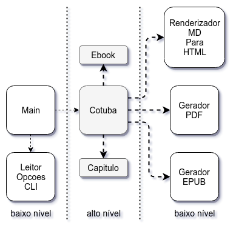
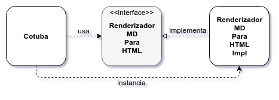
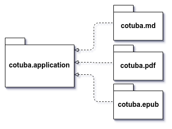

# Dependency Inversion Principle: dependências gerenciadas

## Uma classe com muitas dependências

Considere que, em um projeto interno da nossa empresa, temos a seguinte classe:

```java
public class EmissorNotaFiscal {

  private RegrasDeTributacao tributacao;
  private LegislacaoFiscal legislacao;
  private NotaFiscalDAO notas;
  private EnviadorEmail email;
  private EnviadorSMS sms;

  //...

  public NotaFiscal gera(Fatura fatura) {

    List<Imposto> impostos = tributacao.verifica(fatura);
    List<Isencao> isencoes = legislacao.analisa(fatura);

    NotaFiscal nota = aplica(impostos, isencoes); // método auxiliar

    notas.salva(nota);
    email.envia(nota);
    sms.envia(nota);

    return nota;
  }

}
```

> Esse exemplo é baseado no livro [OO e SOLID para Ninjas](https://www.casadocodigo.com.br/products/livro-oo-solid) (ANICHE, 2015).

Perceba que a classe `EmissorNotaFiscal` tem como dependências as classes:

- `RegrasDeTributacao`
- `LegislacaoFiscal`
- `NotaFiscalDAO`
- `EnviadorEmail`
- `EnviadorSMS`

Cada uma dessas classes tem uma responsabilidade bem definida, só um motivo para serem modificadas e, portanto, seguem o SRP.

Mas será que o design do código está bom o bastante?

Há um problema claro: a classe `EmissorNotaFiscal` tem **muitas dependências**.

## Acoplamento, Estabilidade e Volatilidade

Uma classe com muitas dependências tem **acoplamento** com muitas outras classes.

Além disso, o código acaba acoplado também às dependências das dependências e assim por diante. A classe `EmissorNotaFiscal` depende indiretamente:

- do Hibernate por meio de `NotaFiscalDAO`
- da API do SendGrid por meio de `EnviadorEmail`
- da API REST do Twilio por meio de `EnviadorSMS`

Mudanças nas dependências, ou nas dependências das dependências, podem acabar se propagando para a classe que as usa.

A flexibilidade e o reuso do código ficam prejudicados.

### Acoplamento bom x Acoplamento ruim

Acoplamento precisa existir. Uma classe totalmente desacoplada é uma classe inútil.

Só existe uma maneira de evitarmos totalmente o acoplamento: colocar todo o código, incluindo o de bibliotecas, numa mesma classe. Se tudo estiver junto, não há a necessidade de depender de nada externo. Mas isso levaria a uma quebra do SRP, a uma baixíssima coesão e a um pesadelo de manutenção!

Mas será que todo acoplamento é ruim? Não!

Num código Java, desde o primeiro `OlaMundo`, dependemos de `String` e de `System`. Esse acoplamento não chega a ser problemático, não é mesmo? As classes do pacote `java.lang` são **estáveis**: mudam muito pouco. E têm essa característica talvez porque são milhões de projetos que as usam e mudá-las teria um impacto gigantesco. Podemos depender delas tranquilamente. É o _acoplamento bom_.

Vamos comparar com as dependências da classe `EmissorNotaFiscal`. Qual é a chance, por exemplo, das classes `RegrasDeTributacao` ou `EnviadorSMS` mudarem? É grande! Essas classes são **voláteis**. Depender de classes voláteis é o _acoplamento ruim_.

> **Volátil**
>
> _FIG Pouco firme; inconstante, mudável, volúvel._
>
> [Michaelis Online](http://michaelis.uol.com.br/busca?r=0&f=0&t=0&palavra=vol%C3%A1til)

## Abstrações e inversão das dependências

Como minimizar os impactos de mudanças em dependências voláteis?

Usando **abstrações**! Podemos usar classes abstratas e, preferencialmente, interfaces.

Abstrações são estáveis: mudam muito menos que implementações.

Ao usarmos classes abstratas ou interfaces, o código não depende mais diretamente da dependência volátil e sim da abstração. E a dependência volátil, por sua vez, também depende da abstração, implementando-a. Por isso, podemos dizer que a **dependência é invertida**.

Porém, em _Runtime_, as chamadas são realizadas em uma implementação concreta.

Por exemplo, a dependência de `EmissorNotaFiscal` à classe `EnviadorSMS` poderia ser invertida tendo uma interface como intermediária.


É comum, em projetos Java, colocar o sufixo `Impl` na classe de implementação. Então, renomearíamos a classe para `EnviadorSMSImpl` e teríamos a interface `EnviadorSMS`. Depois discutiremos se o uso de `Impl` é uma boa prática ou não.

No artigo [Design Principles and Design Patterns](http://www.cvc.uab.es/shared/teach/a21291/temes/object_oriented_design/materials_adicionals/principles_and_patterns.pdf) (MARTIN, 2000), Uncle Bob declara que devemos:

_Depender de abstrações e não de implementações._

Essa ideia é uma velha conhecida:

> _Programe voltado à interface, não à implementação._
>
> GoF (Gamma & Helm & Johnson & Vlissides) no livro [Design Patterns](https://www.amazon.com/Design-Patterns-Object-Oriented-Addison-Wesley-Professional-ebook/dp/B000SEIBB8) (GAMMA et al., 1994)

## Regras de Negócio x Detalhes

Quando desenvolvemos uma aplicação, a parte mais importante do nosso código é a que implementa as _regras de negócio_.

Porém, grande parcela do código não está relacionada ao negócio e sim a coisas mais técnicas, _detalhes de implementação_, como UI Web e/ou Mobile, persistência e BD, integração com outros sistemas, frameworks, protocolos, etc.

Por isso, em suas palestras, Uncle Bob costuma a dizer que:

- A Web é um detalhe
- O BD é um detalhe

Deveríamos preparar o nosso código de negócio para "sobreviver" a mudanças completas nesses detalhes. Mas sem esses detalhes, não conseguiríamos expor uma UI ou persistir os dados.

Os detalhes técnicos são importantes, são os _mecanismos de entrega_ das regras de negócio para os usuários.

### Policy

Na verdade, em seus artigos e livros, Uncle Bob também usa o termo **policy** (algo como diretriz ou procedimento) para se referir às regras de negócio e outros tipos de procedimentos relacionados ao problema que está sendo resolvido.

Para quem desenvolve o Hibernate, ler um mapeamento ou gerar código SQL pode ser considerado _policy_. Variações entre os bancos de dados, como `AUTO_INCREMENT` ou `IDENTITY` na geração de PKs, seriam detalhes.

## Código de alto nível e baixo nível

Uncle Bob, no livro [Agile Principles, Patterns, and Practices in C#](https://www.amazon.com.br/Agile-Principles-Patterns-Practices-C/dp/0131857258) (MARTIN, 2006), divide o código em de **alto nível** e de **baixo nível**.

- Código de **alto nível** seria o código que implementa regras de negócio.

- Código de **baixo nível** seriam os mecanismos de entrega, os detalhes de implementação mais técnicos.

Das dependências da classe `EmissorNotaFiscal`, poderíamos classificar como de alto nível:

- `RegrasDeTributacao`
- `LegislacaoFiscal`

Já as dependências de baixo nível de `EmissorNotaFiscal` seriam:

- `NotaFiscalDAO`
- `EnviadorEmail`
- `EnviadorSMS`

### Alto/Baixo Nível e Entradas/Saídas

Uncle Bob diz, no livro [Clean Architecture](https://www.amazon.com/Clean-Architecture-Craftsmans-Software-Structure/dp/0134494164) (MARTIN, 2017), que código de alto nível é aquele mais distante das entradas ou saídas do sistema e, por isso, muda menos frequentemente e por razões mais importantes, relacionadas ao negócio.

Já o código de baixo nível, mais próximo das entradas ou saídas, muda mais frequentemente e com mais urgência.

## O Princípio da Inversão de Dependências

Pensando numa boa maneira de gerenciar as dependências no nosso código, Uncle Bob definiu o _Dependency Inversion Principle (DIP)_, o Princípio da Inversão de Dependências:

> **Dependency Inversion Principle (DIP)**
>
>_Módulos de alto nível não devem depender de módulos de baixo nível. Ambos devem depender de abstrações._
>
>_Abstrações não devem depender de detalhes. Detalhes devem depender de abstrações._

Se seguirmos o DIP à risca, tanto o código de alto nível como o código de baixo nível deveria depender de abstrações. Mas, muitas vezes, essa regra é relaxada, para simplificar o código.

Em outras palavras, regras de negócio não devem depender de mecanismos de entrega, mas de abstrações desses detalhes de implementação.

Em relação às dependências da classe `EmissorNotaFiscal`, para seguir o DIP, deveríamos criar abstrações para as dependências de baixo nível. Para isso, teríamos que definir:

- a interface `NotaFiscalDAO` como abstração de `NotaFiscalDAOImpl`, implementação que depende do Hibernate
- a interface `EnviadorEmail` como abstração de `EnviadorEmailImpl`, implementação que depende da API do SendGrid
- a interface `EnviadorSMS` como abstração de `EnviadorSMSImpl`, implementação que depende da API do Twilio

> _Se você está programando alguma classe qualquer com regras de negócio, e precisa depender de outro módulo, idealmente esse outro módulo deve ser uma abstração._
>
> Maurício Aniche, no livro [OO e SOLID para Ninjas](https://www.casadocodigo.com.br/products/livro-oo-solid) (ANICHE, 2015)

### Módulos

O que é um módulo nessa definição do DIP?

No livro [Clean Architecture](https://www.amazon.com/Clean-Architecture-Craftsmans-Software-Structure/dp/0134494164) (MARTIN, 2017), Uncle Bob define um módulo como um conjunto coeso de funções e dados ou, de maneira mais simples, um arquivo de código fonte. É um conceito que tenta abranger tanto linguagens OO como estruturadas e funcionais.

Mais adiante no curso, veremos um outro conceito para módulos, mais preciso e específico para a linguagem Java.

## Toda interface é uma abstração de alto nível?

As APIs da plataforma Java são repletas de interfaces.

Pense em `java.sql.Connection` do JDBC ou `javax.jms.Destination` do JMS.

São interfaces altamente estáveis: a probabilidade de serem alteradas é bem baixa.

Será que um código de regra de negócio que depende de algumas dessas interfaces segue o DIP?

Não! Uma abstração de alto nível é descrita em termos de negócio. APIs como o JDBC ou o JMS, mesmo estáveis, são de baixo nível porque são detalhes técnicos, mecanismos de entrega.

## DIP e a Arquitetura em 3 camadas

Pense em uma arquitetura em 3 camadas: Apresentação depende de Negócio que depende de Persistência.

Essa arquitetura NÃO atende ao DIP: código de alto nível (Negócio) depende de código de baixo nível (Persistência).

Para que atenda, teríamos que inserir abstrações na camada de Negócio para inverter as dependências, fazendo com que Persistência dependa de Negócio e não o contrário.


Como mencionamos anteriormente, para seguir de maneira estrita o DIP, deveríamos fazer com que a camada de Negócio (alto nível) também forneça abstrações para a camada de Apresentação (baixo nível), invertendo também essa dependência. Porém, é comum mantermos uma dependência direta do baixo nível ao alto nível, para que o código fique simplificado.

## Regra da Dependência

No livro [Clean Architecture](https://www.amazon.com/Clean-Architecture-Craftsmans-Software-Structure/dp/0134494164) (MARTIN, 2017), Uncle Bob define o que chama de **regra da dependência**, que está relacionada ao DIP:

_Dependências devem apontar apenas para dentro, em direção às regras de negócio._

## Acoplamento, Volatilidade, Abstrações e DIP no Cotuba

Analisando o Cotuba, depois das refatorações que o levaram em direção ao SRP, podemos classificar os níveis do código como:

- _alto nível_: as classes `Cotuba`, `Ebook` e `Capitulo`, que são relativas ao domínio do problema
- _baixo nível_: as classes relativas a UI, `Main` e `LeitorOpcoesCLI`, e as classes que implementam detalhes técnicos, `RenderizadorMDParaHTML`, `GeradorPDF` e `GeradorEPUB`

Será que o código do Cotuba fere o DIP?

A classe `Capitulo` não depende de nada além de `String`, uma dependência muito estável. Não a consideramos de baixo nível. Tudo OK.

A classe `Ebook` depende de `List` e `ArrayList`, que são classes bem estáveis e que também não são de baixo nível. Depende também de `Path`, da API NIO, que é uma dependência razoavelmente estável e não é de baixo nível. Sem problemas.

Porém, a classe `Cotuba`, uma classe de alto nível, depende de várias classes de baixo nível, que são mecanismos de entrega, como `RenderizadorMDParaHTML`, `GeradorPDF` e `GeradorEPUB`.



Precisamos inverter essas dependências!

## Exercício: invertendo as dependências da classe Cotuba

### Objetivo

Coloque o sufixo `Impl` nas classes das dependências de baixo nível da classe `Cotuba`.

Crie interfaces para essas implementações, fazendo com que `Cotuba` dependa dessas interfaces.

### Passo a passo

1. Renomeie as seguintes dependências de `Cotuba`:

  - de `RenderizadorMDParaHTML` para `RenderizadorMDParaHTMLImpl`
  - de `GeradorPDF` para `GeradorPDFImpl`
  - de `GeradorEPUB` para `GeradorEPUBImpl`

2. Extraia as interfaces `RenderizadorMDParaHTML`, `GeradorPDF` e `GeradorEPUB` das respectivas implementações.

  Dica: use o menu _Refactor > Extract Interface..._. Deixem marcadas as opções _Use the extracted interface type where possible_ e _Generate '@Override' annotations_. Desmarque as demais opções. Não esqueça de selecionar o método a ser declarado na interface e clique em OK.

  As classes devem ficar da seguinte maneira, depois dessas refatorações:

  ####### cotuba.md.RenderizadorMDParaHTML

  ```java
  package cotuba.md;

  import java.nio.file.Path;
  import java.util.List;

  import cotuba.domain.Capitulo;

  public interface RenderizadorMDParaHTML {

    List<Capitulo> renderiza(Path diretorioDosMD);

  }
  ```

  ####### cotuba.md.RenderizadorMDParaHTMLImpl

  ```java
  package cotuba.md;

  // imports omitido...

  public class RenderizadorMDParaHTMLImpl implements RenderizadorMDParaHTML { // modificado

    @Override //inserido
    public List<Capitulo> renderiza(Path diretorioDosMD) {
      // código omitido...
    }
  }
  ```

  ####### cotuba.pdf.GeradorPDF

  ```java
  package cotuba.pdf;

  import cotuba.domain.Ebook;

  public interface GeradorPDF {

    void gera(Ebook ebook);

  }
  ```

  ####### cotuba.pdf.GeradorPDFImpl

  ```java
  package cotuba.pdf;

  // imports omitido...

  public class GeradorPDFImpl implements GeradorPDF { // modificado

    @Override //inserido
    public void gera(Ebook ebook) {
      // código omitido...
    }
  }
  ```

  ####### cotuba.epub.GeradorEPUB

  ```java
  package cotuba.epub;

  import cotuba.domain.Ebook;

  public interface GeradorEPUB {

    void gera(Ebook ebook);

  }
  ```

  ####### cotuba.epub.GeradorEPUBImpl

  ```java
  package cotuba.epub;

  // imports omitido...

  public class GeradorEPUBImpl implements GeradorEPUB { // modificado

    @Override //inserido
    public void gera(Ebook ebook) {
      // código omitido...
    }
  }
  ```

3. Na classe `Cotuba`, devemos depender o máximo possível das interfaces.

  Se você marcou a opção _Use the extracted interface type where possible_, da refatoração _Extract Interface_, isso já deve ter sido feito.

  ```java
  package cotuba.application;

  import java.nio.file.Path;
  import java.util.List;

  import cotuba.domain.Capitulo;
  import cotuba.domain.Ebook;
  import cotuba.epub.GeradorEPUB; // inserido
  import cotuba.epub.GeradorEPUBImpl;
  import cotuba.md.RenderizadorMDParaHTML; // inserido
  import cotuba.md.RenderizadorMDParaHTMLImpl;
  import cotuba.pdf.GeradorPDF; // inserido
  import cotuba.pdf.GeradorPDFImpl;

  public class Cotuba {

    public void executa(String formato, Path diretorioDosMD, Path arquivoDeSaida) {

      RenderizadorMDParaHTML renderizador = new RenderizadorMDParaHTMLImpl(); // modificado
      List<Capitulo> capitulos = renderizador.renderiza(diretorioDosMD);

      Ebook ebook = new Ebook();
      ebook.setFormato(formato);
      ebook.setArquivoDeSaida(arquivoDeSaida);
      ebook.setCapitulos(capitulos);

      if ("pdf".equals(formato)) {

        GeradorPDF geradorPDF = new GeradorPDFImpl(); // modificado
        geradorPDF.gera(ebook);

      } else if ("epub".equals(formato)) {

        GeradorEPUB geradorEPUB = new GeradorEPUBImpl(); // modificado
        geradorEPUB.gera(ebook);

      } else {
        throw new RuntimeException("Formato do ebook inválido: " + formato);
      }
    }

  }
  ```

## Design Pattern: Factory, gerenciando dependências ao criar objetos

Repare na seguinte linha da classe `Cotuba`:

```java
RenderizadorMDParaHTML renderizador = new RenderizadorMDParaHTMLImpl();
```

Depender da abstração oferecida pela interface `RenderizadorMDParaHTML` é exatamente o que queremos.

Porém, ao instanciar `RenderizadorMDParaHTMLImpl`, estamos dependendo da implementação dessa abstração.

Isso é uma violação do DIP: além da abstração, um código de alto nível acabou dependendo diretamente de uma classe de baixo nível.



> _Um dos lugares mais comuns em que um design de código depende de classes concretas é ao criar instâncias. Por definição, não é possível instanciar abstrações. Portanto, para criar instâncias, é preciso depender de classes concretas._
>
> Uncle Bob, no artigo [Design Principles and Design Patterns](http://www.cvc.uab.es/shared/teach/a21291/temes/object_oriented_design/materials_adicionals/principles_and_patterns.pdf) (MARTIN, 2000) - Tradução livre

Instanciar objetos é um problema comum em OO:

- há um capítulo do livro [Design Patterns](https://www.amazon.com/Design-Patterns-Object-Oriented-Addison-Wesley-Professional-ebook/dp/B000SEIBB8) (GAMMA et al., 1994) que cataloga diversos _Creational Patterns_, soluções para a criação de objetos: _Abstract Factory_, _Builder_, _Factory Method_, _Prototype_ e _Singleton_.

- _Creator_, um tipo de objeto que encapsula a criação de outros objetos, é uma das responsabilidades recorrentes descritas por Craig Larman no livro [Applying UML and Patterns](https://www.amazon.com/Applying-UML-Patterns-Introduction-Object-Oriented/dp/0131489062) (LARMAN, 2004) nos princípios GRASP.

Larman diz que uma solução extremamente difundida para a criação de objetos é uma simplificação da _Abstract Factory_, que o autor chama de _Simple Factory_, _Concrete Factory_ ou simplesmente **Factory**.

> _Uma Factory tem várias vantagens:_
>
> - _separa a responsabilidade da criação de objetos complexos em objetos auxiliares coesos._
> - _esconde lógica de instanciação potencialmente complexa._
> - _permite a introdução de estratégias de gerenciamento de memória que melhoram o desempenho, como cache ou reciclagem de objetos._
>
> Craig Larman no livro [Applying UML and Patterns](https://www.amazon.com/Applying-UML-Patterns-Introduction-Object-Oriented/dp/0131489062) (LARMAN, 2004)

### Dependency Injection e Inversion of Control

DIP tem a ver com a qualidade das dependências: garantir que regras de negócio não dependam de detalhes de implementação.

Já _Dependency Injection (DI)_ está relacionado com a maneira como um objeto obtém as suas dependências.

Quando usamos DI, um framework ou container (Guice, Spring ou outro) fornece instâncias das dependências para um determinado objeto, ao invés do próprio objeto buscar essas instâncias por meio de _Factories_.

Como o objeto recebe as suas dependências "de fora" ao invés de buscá-las, DI é um tipo de _Inversion of Control (IoC)_, um conceito mais geral.

Por exemplo, ao registramos um `ActionListener` em um `JButton` do Swing, que será chamado se, eventualmente, o usuário clicar no botão, também estamos usando IoC.

Um outro nome para IoC é _Hollywood Principle_, que vem de uma frase comumente dita por produtores de cinema: "Não me ligue, deixa que eu te ligo".

### Explorando o código de uma Factory

Uma maneira comum em Java de criar uma _Factory_, é ter um método estático que, quando chamado, retorna uma nova instância da implementação "escondida" por trás de uma abstração.

Em geral, colocamos um sufixo `Factory` na classe:

####### cotuba.md.RenderizadorMDParaHTMLFactory

```java
public class RenderizadorMDParaHTMLFactory {

  public static RenderizadorMDParaHTML cria() {
    return new RenderizadorMDParaHTMLImpl();
  }

}
```

Um fato interessante é que, a partir do Java 8, podemos ter _métodos estáticos em interfaces_. Portanto, podemos evitar mais uma classe colocando o método `cria` na própria interface `RenderizadorMDParaHTML`:

####### cotuba.md.RenderizadorMDParaHTML

```java
public interface RenderizadorMDParaHTML {

  List<Capitulo> renderiza(Path diretorioDosMD);

  public static RenderizadorMDParaHTML cria() {
    return new RenderizadorMDParaHTMLImpl();
  }

}
```

## Exercício: usando Factory para as dependências da classe Cotuba

### Objetivo

Crie métodos estáticos que servirão como `Factory` para as implementações das interfaces `RenderizadorMDParaHTML`, `GeradorPDF` e `GeradorEPUB`.

Use esses novos métodos na classe `Cotuba`.

### Passo a passo

1. Defina o método `cria` na interface `RenderizadorMDParaHTML`, que retorna uma nova instância de `RenderizadorMDParaHTMLImpl`:

  ####### cotuba.md.RenderizadorMDParaHTML

  ```java
  public interface RenderizadorMDParaHTML {

    List<Capitulo> renderiza(Path diretorioDosMD);

    // inserido
    public static RenderizadorMDParaHTML cria() {
      return new RenderizadorMDParaHTMLImpl();
    }

  }
  ```

2. Defina também o método `cria` na interface `GeradorPDF`, retornando um `GeradorPDFImpl`:

  ####### cotuba.pdf.GeradorPDF

  ```java
  public interface GeradorPDF {

    void gera(Ebook ebook);

    // inserido
    public static GeradorPDF cria() {
      return new GeradorPDFImpl();
    }

  }
  ```

3. Faça o mesmo para a interface `GeradorEPUB`:

  ####### cotuba.epub.GeradorEPUB

  ```java
  public interface GeradorEPUB {

    void gera(Ebook ebook);

    // inserido
    public static GeradorEPUB cria() {
      return new GeradorEPUBImpl();
    }

  }
  ```

4. Na classe `Cotuba`, troque a instanciação de `RenderizadorMDParaHTMLImpl` pela chamada do método `cria` da interface `RenderizadorMDParaHTML`:

  ####### cotuba.application.Cotuba

  ```java
  R̶e̶n̶d̶e̶r̶i̶z̶a̶d̶o̶r̶M̶D̶P̶a̶r̶a̶H̶T̶M̶L̶ ̶r̶e̶n̶d̶e̶r̶i̶z̶a̶d̶o̶r̶ ̶=̶ ̶n̶e̶w̶ ̶R̶e̶n̶d̶e̶r̶i̶z̶a̶d̶o̶r̶M̶D̶P̶a̶r̶a̶H̶T̶M̶L̶I̶m̶p̶l̶(̶)̶;̶
  RenderizadorMDParaHTML renderizador = RenderizadorMDParaHTML.cria();
  ```

  Limpe também o import:

  ####### cotuba.application.Cotuba

  ```java
  i̶m̶p̶o̶r̶t̶ ̶c̶o̶t̶u̶b̶a̶.̶m̶d̶.̶R̶e̶n̶d̶e̶r̶i̶z̶a̶d̶o̶r̶M̶D̶P̶a̶r̶a̶H̶T̶M̶L̶I̶m̶p̶l̶;̶
  ```

5. Faça o mesmo para a interface `GeradorPDF`:

  ####### cotuba.application.Cotuba

  ```java
  G̶e̶r̶a̶d̶o̶r̶P̶D̶F̶ ̶r̶e̶n̶d̶e̶r̶i̶z̶a̶d̶o̶r̶ ̶=̶ ̶n̶e̶w̶ ̶G̶e̶r̶a̶d̶o̶r̶P̶D̶F̶I̶m̶p̶l̶(̶)̶;̶
  GeradorPDF geradorPDF = GeradorPDF.cria();
  ```

  O import deve ser limpo:

  ####### cotuba.application.Cotuba

  ```java
  i̶m̶p̶o̶r̶t̶ ̶c̶o̶t̶u̶b̶a̶.̶p̶d̶f̶.̶G̶e̶r̶a̶d̶o̶r̶P̶D̶F̶I̶m̶p̶l̶;̶
  ```

6. Use também o método `cria` da interface `GeradorEPUB`:

  ####### cotuba.application.Cotuba

  ```java
  G̶e̶r̶a̶d̶o̶r̶E̶P̶U̶B̶ ̶g̶e̶r̶a̶d̶o̶r̶E̶P̶U̶B̶ ̶=̶ ̶n̶e̶w̶ ̶G̶e̶r̶a̶d̶o̶r̶E̶P̶U̶B̶I̶m̶p̶l̶(̶)̶;̶
  GeradorEPUB geradorEPUB = GeradorEPUB.cria();
  ```

  Não esqueça de limpar o import:

  ####### cotuba.application.Cotuba

  ```java
  i̶m̶p̶o̶r̶t̶ ̶c̶o̶t̶u̶b̶a̶.̶e̶p̶u̶b̶.̶G̶e̶r̶a̶d̶o̶r̶E̶P̶U̶B̶I̶m̶p̶l̶;̶
  ```

  Teste a geração de PDF e EPUB. Deve funcionar!

  Pronto! Agora `Cotuba`, uma a classe de alto nível , depende apenas de abstrações! A criação dos objetos ficou escondida em cada Factory.

  

## Nomeando as implementações

Em projetos Java, é comum colocar o sufixo `Impl` na classe que implementa uma interface quando há uma única implementação. Por exemplo, para a interface `EnviadorSMS`, teríamos a classe `EnviadorSMSImpl` como implementação.

Os desenvolvedores .NET têm um costume diferente: prefixar as interfaces com `I`. Então, teríamos `IEnviadorSMS` como interface e `EnviadorSMS` como implementação.

Não soa estranho ter classes como `EnviadorSMSImpl` ou interfaces como `IEnviadorSMS`?

Uma alternativa é colocar no nome da implementação algo que revela a tecnologia usada.

No caso da interface `EnviadorSMS`, como usamos a API do Twilio, a implementação poderia ser chamada de `EnviadorSMSComTwilio`. Se modificarmos a implementação para usar a API do Nexmo, poderíamos chamá-la de `EnviadorSMSComNexmo`.

De maneira análoga, teríamos `EnviadorEmailComSendGrid` ao invés de `EnviadorEmailImpl` e `NotaFiscalDAOComHibernate` ao invés de `NotaFiscalDAOImpl`.

## Exercício: melhorando o nome das implementações

### Objetivo

Remove o sufixo `Impl` das implementações.

Renomeie as implementações, considerando que:

- a renderização de Markdown usa a biblioteca CommonMark Java
- a geração de PDF usa a biblioteca iText
- a geração de EPUB usa a biblioteca Epublib

### Passo a passo

1. Renomeie as implementações das dependências de baixo nível de `Cotuba`:

  - de `RenderizadorMDParaHTMLImpl` para `RenderizadorMDParaHTMLComCommonMark`
  - de `GeradorPDFImpl` para `GeradorPDFComIText`
  - de `GeradorEPUBImpl` para `GeradorEPUBComEpublib`

## Abstrações mais perto de quem as usa

As interfaces `RenderizadorMDParaHTML`, `GeradorPDF` e `GeradorEPUB`, que servem como abstrações para as dependências de baixo nível da classe `Cotuba`, estão próximas às suas implementações:

- a interface `RenderizadorMDParaHTML` está no pacote `cotuba.md`
- a interface `GeradorPDF` está no pacote `cotuba.pdf`
- a interface `GeradorEPUB` está no pacote `cotuba.epub`

Parece bem organizado mas há um problema de design. Para revelar esse problema, vamos pensar nas dependências um nível acima das classes: as **dependências entre pacotes**.

A classe `Cotuba` é a _cliente_ das interfaces `RenderizadorMDParaHTML`, `GeradorPDF` e `GeradorEPUB`. Afinal de contas, são abstrações criadas exatamente para inverter as dependências de `Cotuba`.

Veja os imports:

####### cotuba.application.Cotuba

```java
package cotuba.application;

// demais imports omitidos...

import cotuba.epub.GeradorEPUB;
import cotuba.md.RenderizadorMDParaHTML;
import cotuba.pdf.GeradorPDF;

public class Cotuba {

  // código omitido...

}
```

O pacote de `Cotuba` é `cotuba.application`, que acaba dependendo de abstrações dos pacotes `cotuba.md`, `cotuba.pdf` e `cotuba.epub`.


Um pacote com código de alto nível está dependente de pacotes com código de baixo nível. Isso fere o DIP!

Agora, se movermos as interfaces usadas por `Cotuba` para o pacote `cotuba.application`, as abstrações estarão mais próximas de quem as usa.

A dependência entre os pacotes também passa a ser invertida: o pacote de alto nível não depende mais dos pacotes de baixo nível, mas o contrário!



> _Interfaces de Serviço, em geral, são do cliente (quem as usa)._
>
> Uncle Bob, no livro [Agile Principles, Patterns, and Practices in C#](https://www.amazon.com.br/Agile-Principles-Patterns-Practices-C/dp/0131857258) (MARTIN, 2006)

## Exercício: movendo as abstrações do Cotuba

### Objetivo

Mova as abstrações para o mesmo pacote da classe `Cotuba`.

### Passo a passo

1. Mova as interfaces `RenderizadorMDParaHTML`, `GeradorPDF` e `GeradorEPUB` para o pacote `cotuba.application`.

  Como dessas interfaces será o mesmo da classe `Cotuba`, certifique-se que os imports desnecessários foram removidos:

  ####### cotuba.application.Cotuba

  ```java
  i̶m̶p̶o̶r̶t̶ ̶c̶o̶t̶u̶b̶a̶.̶e̶p̶u̶b̶.̶G̶e̶r̶a̶d̶o̶r̶E̶P̶U̶B̶;̶
  i̶m̶p̶o̶r̶t̶ ̶c̶o̶t̶u̶b̶a̶.̶m̶d̶.̶R̶e̶n̶d̶e̶r̶i̶z̶a̶d̶o̶r̶M̶D̶P̶a̶r̶a̶H̶T̶M̶L̶;̶
  i̶m̶p̶o̶r̶t̶ ̶c̶o̶t̶u̶b̶a̶.̶p̶d̶f̶.̶G̶e̶r̶a̶d̶o̶r̶P̶D̶F̶;̶
  ```

2. (opcional) Discussão: será mesmo que invertemos as dependências dos pacotes?

  Qual detalhe ainda faz com que, pensando em pacotes, haja uma quebra do DIP?

  _Observação: resolveremos esse problema em um capítulo posterior._


## Uma classe para os parâmetros

Repare no método `executa` da classe `Cotuba`:

```java
public class Cotuba {

  public void executa(String formato, Path diretorioDosMD, Path arquivoDeSaida) {
    // código omitido...
  }

}
```

Esse método recebe três parâmetros atualmente. A chance desse número aumentar é razoável. E uma lista longa de parâmetros é algo terrível de entender, principalmente na chamada do método.

Poderíamos criar uma classe para agrupar esses parâmetros, simplificando a assinatura do método `executa`.

O livro [Refactoring](https://www.amazon.com/Refactoring-Improving-Design-Existing-Code/dp/0201485672/) (FOWLER et al., 1999) cataloga a refatoração _Introduce Parameter Object_ (Introduzir Objeto Parâmetro).

Além de simplificar a assinatura de um método, outra motivação dessa refatoração é agrupar parâmetros que aparecem juntos, repetidamente, em diversos métodos da mesma classe ou de classes diferentes.

Uma das vantagens é ter um lugar para colocar lógica que manipula esses parâmetros.

Mas veja só... Já temos uma classe que agrupa `formato`, `diretorioDosMD` e `arquivoDeSaida`: a classe `LeitorOpcoesCLI`!

## Exercício: simplificando parâmetros

### Objetivo

Use a classe `LeitorOpcoesCLI` como parâmetro do método `executa` da classe `Cotuba`.

### Passo a passo

1. Altere o método `executa` da classe `Cotuba` para receber um `LeitorOpcoesCLI` como parâmetro:

  ####### cotuba.application.Cotuba

  ```java
  public class Cotuba {

    public void executa(LeitorOpcoesCLI parametros) { // modificado

      // restante do código ...
  ```

  Não esqueça do import:

  ####### cotuba.application.Cotuba

  ```java
  import cotuba.cli.LeitorOpcoesCLI;
  ```

  O código deve apresentar erros de compilação no uso dos parâmetros antigos. Vamos corrigi-los no próximo passo.

2. Dentro do método `executa` de `Cotuba`, crie novas variáveis com os mesmos nomes dos parâmetros que foram removidos, `formato`, `diretorioDosMD` e `arquivoDeSaida`:

  ####### cotuba.application.Cotuba

  ```java
  public void executa(LeitorOpcoesCLI parametros) {

    String formato = parametros.getFormato(); // inserido
    Path diretorioDosMD = parametros.getDiretorioDosMD(); // inserido
    Path arquivoDeSaida = parametros.getArquivoDeSaida(); // inserido

    // restante do código ...
  ```

  Agora o código da classe `Cotuba` deve compilar com sucesso!

3. Na classe `Main`, altere a chamada do método `executa` da classe `Cotuba`, passando o objeto `opcoesCLI`. Remova as variáveis desnecessárias, mantendo as que ainda são usadas.

  ####### cotuba.cli.Main

  ```java
  LeitorOpcoesCLI opcoesCLI = new LeitorOpcoesCLI(args);

  P̶a̶t̶h̶ ̶d̶i̶r̶e̶t̶o̶r̶i̶o̶D̶o̶s̶M̶D̶ ̶=̶ ̶o̶p̶c̶o̶e̶s̶C̶L̶I̶.̶g̶e̶t̶D̶i̶r̶e̶t̶o̶r̶i̶o̶D̶o̶s̶M̶D̶(̶)̶;̶
  S̶t̶r̶i̶n̶g̶ ̶f̶o̶r̶m̶a̶t̶o̶ ̶=̶ ̶o̶p̶c̶o̶e̶s̶C̶L̶I̶.̶g̶e̶t̶F̶o̶r̶m̶a̶t̶o̶(̶)̶;̶
  Path arquivoDeSaida = opcoesCLI.getArquivoDeSaida();
  boolean modoVerboso = opcoesCLI.isModoVerboso();

  try {

    Cotuba cotuba = new Cotuba();

    c̶o̶t̶u̶b̶a̶.̶e̶x̶e̶c̶u̶t̶a̶(̶f̶o̶r̶m̶a̶t̶o̶,̶ ̶d̶i̶r̶e̶t̶o̶r̶i̶o̶D̶o̶s̶M̶D̶,̶ ̶a̶r̶q̶u̶i̶v̶o̶D̶e̶S̶a̶i̶d̶a̶)̶;̶
    cotuba.executa(opcoesCLI); // modificado
  ```

4. Teste a geração do PDF e do EPUB. Deve funcionar!

## Ih! Ferimos o DIP...

A classe `Cotuba`, do pacote `cotuba.application`, é uma classe relacionada à aplicação, de alto nível, que tem a ver com problema que estamos resolvendo.

Já a classe `LeitorOpcoesCLI`, do pacote `cotuba.cli`, é um detalhe de implementação, de baixo nível, que tem a ver com o mecanismo de entrega de UI que escolhemos: a linha de comando.

Ao fazermos `Cotuba`, em seu método `executa`, receber um objeto da classe `LeitorOpcoesCLI` como parâmetro, fizemos um código de alto nível depender de um de baixo nível. Por isso, violamos o DIP.

Como fazer para aderir ao DIP novamente?

Criar um abstração, invertendo a dependência!

## Exercício: mais uma interface para inverter as dependências

### Objetivo

Cria uma abstração chama `ParametrosCotuba` a partir de `LeitorOpcoesCLI` e a use como parâmetro no método `executa` da classe `Cotuba`.

A nova abstração deve ficar no mesmo pacote de `Cotuba`.

### Passo a passo

1. Extraia uma interface `ParametrosCotuba` da classe que contém _getters_ para os atributos `formato`, `diretorioDosMD` e `arquivoDeSaida`.

  Certifique-se que a nova interface está declarada no pacote `cotuba.application`.

  Dica: use o menu _Refactor > Extract Interface..._. Deixem marcadas as opções _Use the extracted interface type where possible_ e _Generate '@Override' annotations_. Desmarque as demais opções. Não esqueça de selecionar os getters a serem declarados na interface e clique em OK.

  O resultado esperado está a seguir:

  ####### cotuba.application.ParametrosCotuba

  ```java
  package cotuba.application;

  import java.nio.file.Path;

  public interface ParametrosCotuba {

    Path getDiretorioDosMD();

    String getFormato();

    Path getArquivoDeSaida();

  }
  ```

  ####### cotuba.cli.LeitorOpcoesCLI

  ```java
  import cotuba.application.ParametrosCotuba; // inserido

  public class LeitorOpcoesCLI implements ParametrosCotuba { // modificado

    // restante do código...
  }
  ```

  ####### cotuba.application.Cotuba

  ```java
  import java.nio.file.Path;
  import java.util.List;

  i̶m̶p̶o̶r̶t̶ ̶c̶o̶t̶u̶b̶a̶.̶c̶l̶i̶.̶L̶e̶i̶t̶o̶r̶O̶p̶c̶o̶e̶s̶C̶L̶I̶;̶
  import cotuba.domain.Capitulo;
  import cotuba.domain.Ebook;
  
  public class Cotuba {

    public void executa(ParametrosCotuba parametros) { // modificado
  
    // restante do código...
  ```

  Observe que a classe `Cotuba` passa a depender apenas:
  
  - de bibliotecas padrão do Java: API de Collections e NIO
  - das classes de domínio: `Ebook` e `Capitulo`
  - de abstrações: `ParametrosCotuba`, `RenderizadorMDParaHTML`, `GeradorPDF` e `GeradorEPUB`

  

2. Teste a geração dos PDFs e EPUBs. Deve funcionar!
