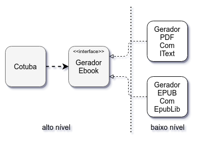

# Open/Closed Principle: objetos flexíveis

## Em busca da abstração perfeita

Vamos voltar ao exemplo do `EmissorNotaFiscal` que vimos no capítulo sobre DIP:

```java
public class EmissorNotaFiscal {

  private RegrasDeTributacao tributacao;
  private LegislacaoFiscal legislacao;
  private NotaFiscalDAO notas;
  private EnviadorEmail email;
  private EnviadorSMS sms;

  //...

  public NotaFiscal gera(Fatura fatura) {

    List<Imposto> impostos = tributacao.verifica(fatura);
    List<Isencao> isencoes = legislacao.analisa(fatura);

    NotaFiscal nota = aplica(impostos, isencoes); // método auxiliar

    notas.salva(nota);
    email.envia(nota);
    sms.envia(nota);

    return nota;
  }

}
```

> Esse exemplo é baseado no livro [OO e SOLID para Ninjas](https://www.casadocodigo.com.br/products/livro-oo-solid) (ANICHE, 2015).

Considerando que `NotaFiscalDAO`, `EnviadorEmail` e `EnviadorSMS` são interfaces que abstraem as dependências de baixo nível da classe `EmissorNotaFiscal`, será que chegamos a um bom design?

Repare que, ao final do método `gera` de `EmissorNotaFiscal`, são feitas várias ações:

- persistir a nota gerada no BD através de `NotaFiscalDAO` e sua implementação `NotaFiscalDAOComHibernate`
- enviar uma notificação por email através de `EnviadorEmail` e sua implementação `EnviadorEmailComSendGrid`
- enviar um notificação por SMS através de `EnviadorSMS` e sua implementação `EnviadorSMSComTwilio`

Podemos buscar abstrações melhores.

Email e SMS são tipos de notificação, não é mesmo?

Poderíamos criar uma abstração para `Notificacao`, que seria implementada tanto por `EnviadorEmailComSendGrid` como por `EnviadorSMSComTwilio`:

```java
public interface Notificacao {
  void notifica(NotaFiscal nota);
}
```


Mas podemos ir além: todas essas ações, de persistência ou de notificação, são um conjunto de ações que devem ser feitas após a emissão da nota fiscal.

Que tal uma abstração chamada `AcaoPosEmissao`? Tanto `NotaFiscalDAOComHibernate` quanto`EnviadorEmailComSendGrid` e `EnviadorSMSComTwilio` seriam implementações.

```java
public interface AcaoPosEmissao {
  void faz(NotaFiscal nota);
}
```


Na classe `EmissorNotaFiscal`, teríamos uma lista de `AcaoPosEmissao` que percorreríamos no final da geração da nota, invocando cada implementação:

```java
public class EmissorNotaFiscal {

  private RegrasDeTributacao tributacao;
  private LegislacaoFiscal legislacao;
  private List<AcaoPosEmissao> acoes;

  //...

  public NotaFiscal gera(Fatura fatura) {

    List<Imposto> impostos = tributacao.verifica(fatura);
    List<Isencao> isencoes = legislacao.analisa(fatura);

    NotaFiscal nota = aplica(impostos, isencoes); // método auxiliar

    for (AcaoPosEmissao acao: acoes) {
      acao.faz(nota);
    }

    return nota;
  }

}
```

## Flexibilidade

Note que podemos encaixar qualquer tipo de ação na abstração `AcaoPosEmissao`.

Ao surgirem novas necessidades, como envio para o SAP ERP ou para um novo sistema da prefeitura, bastaria fornecermos mais uma implementação.

Com uma abstração correta, o código se torna extremamente **flexível**, tolerante a mudanças. É o que exatamente o que almejamos em um design OO.

> **Flexível**
>
> _Que se adapta bem a diferentes atividades ou funções; acomodatício, adaptável, moldável._
>
> [Michaelis Online](http://michaelis.uol.com.br/busca?r=0&f=0&t=0&palavra=flex%C3%ADvel)

Perceba que não há tanta diferença entre as interfaces `Notificacao` e `AcaoPosEmissao` em termos de código. Basicamente, o que mudam são os nomes dos métodos e das próprias interfaces.

A principal diferença é em termos semânticos: o significado da abstração muda, tornando-se mais moldável.

## Design Pattern: Command, abstraindo operações

A abstração `AcaoPosEmissao` serve tanto para persistência, como para notificações, como para qualquer outro tipo de operação a ser feita depois da emissão da nota fiscal.

A ideia de ter uma abstração que representa uma operação do sistema, sem detalhes sobre o que é feito, é descrita no **Command Pattern** do livro [Design Patterns](https://www.amazon.com/Design-Patterns-Object-Oriented-Addison-Wesley-Professional-ebook/dp/B000SEIBB8) (GAMMA et al., 1994).

## Variações Protegidas

Esconder os detalhes de várias implementações diferentes, mas relacionadas, por trás de uma mesma abstração é o que Craig Larman chama de _Variações Protegidas_ no artigo [Protected Variation](https://www.martinfowler.com/ieeeSoftware/protectedVariation.pdf) (LARMAN, 2001):

_Identifique pontos previstos de variação e crie uma interface estável em torno deles._

Precisamos, constantemente, analisar o nosso código em busca de pontos de articulação onde nosso design varia e, por meio de abstrações, torná-los flexíveis.

> _Encontrar os pontos onde sua modelagem precisa ser flexível e onde não precisa é um desafio._
>
> Maurício Aniche, no livro "OO e SOLID para Ninjas" (2015)

## O Princípio Aberto/Fechado

Uncle Bob parte de uma frase de Bertrand Meyer, pioneiro de OO, no livro [Object-Oriented Software Construction](https://www.amazon.com/Object-Oriented-Software-Construction-Prentice-Hall-International/dp/0136290493) (MEYER, 1988), para cunhar o seguinte princípio:

> **Open/Closed Principle (OCP)**
>
> _Entidades de software (classes, módulos, funções, etc) devem ser abertas para extensão mas fechadas para modificação._

De acordo com o OCP, classes devem ser abertas e fechadas ao mesmo tempo. Como assim?

Esse princípio trata de esclarecer que, em um bom design OO, deve ser possível criar novos comportamentos sem modificar o código já existente.

É o que fizemos ao criar abstração `AcaoPosEmissao` no exemplo anterior: podemos adicionar novas ações sem mudar a classe `EmissorNotaFiscal`, que dispara a execução dessas ações.

> _Devemos escrever módulos que podem ser estendidos sem que sejam modificados._
> _Mudar o que os módulos fazem sem mudar o seu código fonte._
>
> Uncle Bob, no artigo [Design Principles and Design Patterns](http://www.cvc.uab.es/shared/teach/a21291/temes/object_oriented_design/materials_adicionals/principles_and_patterns.pdf) (MARTIN, 2000)

### OCP e DIP

No artigo [Design Principles and Design Patterns](http://www.cvc.uab.es/shared/teach/a21291/temes/object_oriented_design/materials_adicionals/principles_and_patterns.pdf) (MARTIN, 2000), Uncle Bob compara os princípios DIP e OCP, mostrando que são complementares:

_Se o OCP declara o objetivo de uma arquitetura OO, o DIP declara o seu mecanismo fundamental._

O DIP fomenta a classificação de dependências em alto/baixo nível e a inversão das dependências em direção às regras de negócio.

Isso conduz a abstrações que levam a um código que pode ser estendido sem modificá-lo: o intuito do OCP.

## OCP, boas abstrações e o Cotuba

Repare nas abstrações definidas pelas interfaces `GeradorPDF` e `GeradorEPUB`:

###### cotuba.application.GeradorPDF

```java
public interface GeradorPDF {

  void gera(Ebook ebook);

  // factory omitida...

}
```

###### cotuba.application.GeradorEPUB

```java
public interface GeradorPDF {

  void gera(Ebook ebook);

  // factory omitida...

}
```

Ambas as interfaces definem um método `gera` que recebe como parâmetro um `Ebook` e não tem nenhum retorno.

As abstrações são idênticas! Há algo de errado nisso, não?

Tanto PDF como EPUB são formatos de ebooks.

Poderíamos criar uma abstração mais relacionada ao problema que estamos resolvendo: um gerador de books.

Esse gerador não define em qual formato o ebook deverá ser gerado. Esse detalhe é tarefa para as implementações.

A geração de ebooks seria mais flexível: para novos formatos, basta uma nova implementação. É o espírito do OCP!



## Exercício: uma abstração melhor para a geração de ebooks

### Objetivo

Crie uma interface `GeradorEbook` e faça com que `GeradorPDFComIText` e `GeradorEPUBComEpublib` a implemente.

### Passo a passo

1. Crie uma nova interface `GeradorEbook` no pacote `cotuba.application`, conforme a seguir:

  ####### cotuba.application.GeradorEbook

  ```java
  package cotuba.application;

  import cotuba.domain.Ebook;

  public interface GeradorEbook {

    void gera(Ebook ebook);

  }
  ```

2. Faça a classe `GeradorPDFComIText` implementar a nova interface, removendo a anterior:

  ####### cotuba.pdf.GeradorPDFComIText

  ```java

  i̶m̶p̶o̶r̶t̶ ̶c̶o̶t̶u̶b̶a̶.̶a̶p̶p̶l̶i̶c̶a̶t̶i̶o̶n̶.̶G̶e̶r̶a̶d̶o̶r̶P̶D̶F̶;̶
  import cotuba.application.GeradorEbook; // inserido
  //outros imports...

  p̶u̶b̶l̶i̶c̶ ̶c̶l̶a̶s̶s̶ ̶G̶e̶r̶a̶d̶o̶r̶P̶D̶F̶C̶o̶m̶I̶T̶e̶x̶t̶ ̶i̶m̶p̶l̶e̶m̶e̶n̶t̶s̶ ̶G̶e̶r̶a̶d̶o̶r̶P̶D̶F̶ ̶{̶
  public class GeradorPDFComIText implements GeradorEbook { // modificado

    // código omitido ...

  }
  ```

3. Faça o mesmo na classe `GeradorEPUBComEpublib`:

  ####### cotuba.epub.GeradorEPUBComEpublib

  ```java

  i̶m̶p̶o̶r̶t̶ ̶c̶o̶t̶u̶b̶a̶.̶a̶p̶p̶l̶i̶c̶a̶t̶i̶o̶n̶.̶G̶e̶r̶a̶d̶o̶r̶E̶P̶U̶B̶;̶
  import cotuba.application.GeradorEbook; // inserido
  //outros imports...

  p̶u̶b̶l̶i̶c̶ ̶c̶l̶a̶s̶s̶ ̶G̶e̶r̶a̶d̶o̶r̶E̶P̶U̶B̶C̶o̶m̶E̶p̶u̶b̶l̶i̶b̶ ̶i̶m̶p̶l̶e̶m̶e̶n̶t̶s̶ ̶G̶e̶r̶a̶d̶o̶r̶E̶P̶U̶B̶ ̶{̶
  public class GeradorEPUBComEpublib implements GeradorEbook { // modificado

    // código omitido ...

  }
  ```

  Ignore, por enquanto, os erros de compilação nas interfaces `GeradorPDF` e `GeradorEPUB`. Vamos corrigi-los!

## Exercício: removendo interfaces desnecessárias

### Objetivo

Remova as interfaces `GeradorPDF` e `GeradorEPUB` e corrija o restante do código. 

### Passo a passo

1. As interfaces `GeradorPDF` e `GeradorEPUB` devem apresentar erros de compilação nos respectivos métodos `cria`.

  Essas interfaces não tem mais utilidade. Remova-as sem dó!

  ```
  c̶o̶t̶u̶b̶a̶.̶a̶p̶p̶l̶i̶c̶a̶t̶i̶o̶n̶.̶G̶e̶r̶a̶d̶o̶r̶P̶D̶F̶
  c̶o̶t̶u̶b̶a̶.̶a̶p̶p̶l̶i̶c̶a̶t̶i̶o̶n̶.̶G̶e̶r̶a̶d̶o̶r̶E̶P̶U̶B̶
  ```

  Agora o erro de acontecer na classe `Cotuba`, na criação das instâncias dos geradores.

2. Use a interface `GeradorEbook`, instanciando os objetos apropriados, na classe `Cotuba`:

  ####### cotuba.application.Cotuba

  ```java
  GeradorEbook gerador; // inserido

  if ("pdf".equals(formato)) {

    G̶e̶r̶a̶d̶o̶r̶P̶D̶F̶ ̶g̶e̶r̶a̶d̶o̶r̶P̶D̶F̶ ̶=̶ ̶G̶e̶r̶a̶d̶o̶r̶P̶D̶F̶.̶c̶r̶i̶a̶(̶)̶;̶
    g̶e̶r̶a̶d̶o̶r̶P̶D̶F̶.̶g̶e̶r̶a̶(̶e̶b̶o̶o̶k̶)̶;̶

    gerador = new GeradorPDFComIText(); // inserido

  } else if ("epub".equals(formato)) {

    G̶e̶r̶a̶d̶o̶r̶E̶P̶U̶B̶ ̶g̶e̶r̶a̶d̶o̶r̶E̶P̶U̶B̶ ̶=̶ ̶G̶e̶r̶a̶d̶o̶r̶E̶P̶U̶B̶.̶c̶r̶i̶a̶(̶)̶;̶
    g̶e̶r̶a̶d̶o̶r̶E̶P̶U̶B̶.̶g̶e̶r̶a̶(̶e̶b̶o̶o̶k̶)̶;̶

    gerador = new GeradorEPUBComEpublib(); // inserido

  } else {
    throw new RuntimeException("Formato do ebook inválido: " + formato);
  }

  gerador.gera(ebook); // inserido
  ```

3. Teste a geração de PDF e EPUB. Deve funcionar!

## Design Pattern: Strategy, diferentes maneiras de fazer a mesma coisa

Ao definirmos a abstração de um gerador sem um formato específico, criamos uma maneira mais flexível de gerar ebooks.

Para um novo formato de ebook, basta uma nova implementação de `GeradorEbook`.

A definição de uma abstração comum a várias implementações diferentes de um mesmo comportamento é descrita no **Strategy Pattern** do livro [Design Patterns](https://www.amazon.com/Design-Patterns-Object-Oriented-Addison-Wesley-Professional-ebook/dp/B000SEIBB8) (GAMMA et al., 1994).

Nos termos do livro, o Strategy define uma família de algoritmos intercambiáveis, encapsulados em um contrato comum.

### Strategy ou Command?

No exemplo do começo do capítulo, da emissão de notas fiscais, a persistência no BD e as notificações por email e SMS foram "escondidas" atrás da interface `AcaoPosEmissao`.

Já no exemplo do Cotuba, maneiras diferentes de gerar um ebook foram "escondidas" atrás da interface `GeradorEbook`.

Usamos o mesmo mecanismo nos dois casos: interfaces e suas implementações.

Então, por que o primeiro caso é um exemplo do _Command Pattern_ e o segundo, do _Strategy Pattern_?

A principal diferença entre o _Command_ e o _Strategy_ não é o código resultante, mas o objetivo:

- no _Command_, queremos abstrair uma operação genérica, sem definir o que é feito
- no _Strategy_, abstraímos um procedimento específico que faz, de jeitos diferentes, coisas parecidas

## Exercício: simplificando os nomes das implementações

### Objetivo

Não há mais necessidade de revelarmos a tecnologia usada na implementação no nome da classe.

Temos dois geradores de ebook. O que os diferencia é o formato gerado.

Adeque os nomes das implementações de `GeradorEbook`, simplificando-os.

### Passo a passo

1. Renomeie as classes que implementam a interface `GeradorEbook` da seguinte maneira:

  - de `GeradorEPUBComEpublib` para `GeradorEPUB`
  - de `GeradorPDFComIText` para `GeradorPDF`

## Uma Factory inteligente

Ao removermos as antigas interfaces `GeradorPDF` e `GeradorEPUB`, que agora são nomes de classes, acabamos inserindo dependências indesejadas na classe `Cotuba`.

Perceba pelos seguintes imports:

```java
import cotuba.epub.GeradorEPUB;
import cotuba.pdf.GeradorPDF;
```

Fizemos com que uma classe de alto nível, `Cotuba`, dependesse das classes de baixo nível `GeradorPDF` e `GeradorEPUB`.

E, pensando em pacotes, fizemos com que `cotuba.application`, de alto nível, dependesse de `cotuba.pdf` e `cotuba.epub`, de baixo nível.

Regras de negócio dependendo de mecanismos de entrega... Violamos o DIP!

Como resolver?

Criando as instâncias das implementações fora do objeto que as usa. Ou seja, como uma _Factory_.

Essa nova _Factory_ será inteligente, já que terá uma lógica mais elaborada que as que já havíamos definido: dado um formato de ebook, será retornada uma instância da implementação correta.

## Exercício: implementando uma Factory inteligente

### Objetivo

Defina uma _Factory_ na interface `GeradorEbook` que, dado um formato, cria a instância apropriada.

### Passo a passo

1. Crie um novo método chamado `cria` na interface `GeradorEbook`, que recebe uma `String` no parâmetro `formato` e retorna uma instância de `GeradorEbook`:

  ####### cotuba.application.GeradorEbook

  ```java
  public interface GeradorEbook {

    void gera(Ebook ebook);

    public static GeradorEbook cria(String formato) { // inserido
    }
  }
  ```

2. Mova a lógica da criação de instâncias de `GeradorEbook` da classe `Cotuba` para o novo método `cria`. Não deixe da incluir o `return`:

  ####### cotuba.application.GeradorEbook

  ```java
  GeradorEbook gerador;

  if ("pdf".equals(formato)) {

    gerador = new GeradorPDF();

  } else if ("epub".equals(formato)) {

    gerador = new GeradorEPUB();

  } else {
    throw new RuntimeException("Formato do ebook inválido: " + formato);
  }

  return gerador; // ATENÇÃO!
  ```

3. Use a _Factory_ de `GeradorEbook` no método `executa` da classe `Cotuba`:

  ####### cotuba.application.Cotuba

  ```java
  GeradorEbook gerador = GeradorEbook.cria(formato); // modificado

  gerador.gera(ebook);
  ```

  Não deixe de limpar os imports desnecessários.

  ####### cotuba.application.Cotuba

  ```java
  i̶m̶p̶o̶r̶t̶ ̶c̶o̶t̶u̶b̶a̶.̶e̶p̶u̶b̶.̶G̶e̶r̶a̶d̶o̶r̶E̶P̶U̶B̶;̶
  i̶m̶p̶o̶r̶t̶ ̶c̶o̶t̶u̶b̶a̶.̶p̶d̶f̶.̶G̶e̶r̶a̶d̶o̶r̶P̶D̶F̶;̶
  ```

4. Teste a geração de PDF e EPUB. Deve funcionar!

  Nesse momento, as dependências da classe `Cotuba` estão algo como a seguinte imagem:

  


## Polimorfismo

À medida que avançamos nas refatorações, fomos caminhando na direção do polimorfismo e nos distanciando de condicionais na classe `Cotuba`.

Uma boa abstração aliada a polimorfismo nos permite criar geradores de ebook em diferentes formatos sem modificar a classe que usa esses geradores.

OCP na veia!

O livro [Refactoring](https://www.amazon.com/Refactoring-Improving-Design-Existing-Code/dp/0201485672/) (FOWLER et al., 1999) cataloga a refatoração _Replace Conditional with Polymorphism_ (Substituir Condicional por Polimorfismo).

Ao mover cada ramificação da condicional para uma implementação diferente de uma abstração comum, usando de polimorfismo, conseguimos simplificar o código da classe original.

Um bom design OO vai ter poucas condicionais como _if-else_ ou _switch-case_.

> _Objetos têm um mecanismo fabuloso, mensagens polimórficas, que permitem expressar lógica condicional de maneira flexível mas clara._
>
> _Ao trocar condicionais explícitos por mensagens polimórficas, comumente você consegue:_
> - _reduzir duplicação,_
> - _tornar seu código mais claro e_
> - _aumentar a flexibilidade_
>
> _tudo ao mesmo tempo._
>
> Kent Beck, no livro [Refactoring](https://www.amazon.com/Refactoring-Improving-Design-Existing-Code/dp/0201485672/) (FOWLER et al., 1999)

## A campanha Anti-IF

Nos distanciamos de condicionais em direção ao polimorfismo na classe `Cotuba`.

Mas onde foram parar esses condicionais? No método `cria` da interface `GeradorEbook`, a _Factory_ de geradores de ebook.

Será que é possível livrar-nos totalmente de instruções _if-else_ e _switch-case_?

Francesco Cirillo, desenvolvedor de software e criador da técnica Pomodoro de gerenciamento de tempo, iniciou em 2007 a **campanha Anti-IF**:

> _Muitos times querem ser ágeis, mas têm dificuldade em reduzir a complexidade de código._
> _Vamos começar com algo concreto: saber como usar objetos de uma maneira que permita que os desenvolvedores eliminem os IFs ruins, aqueles que frequentemente comprometem a flexibilidade e a habilidade de evoluir do software._
>
> Francesco Cirillo, no site [Anti-IF Campaign](https://francescocirillo.com/pages/anti-if-campaign) (CIRILLO)

Como podemos eliminar os _if-else_ ao máximo do código do Cotuba?

### Mapeando formatos para geradores

Uma das maneira é ter um `Map<String, GeradorEbook>` que, dado um determinado formato, contém a implementação de `GeradorEbook` correspondente.

Definiríamos esse `Map` na interface `GeradorEbook`:

```java
import java.util.HashMap;
import java.util.Map;

// outros imports...

public interface GeradorEbook {

  Map<String, GeradorEbook> GERADORES = new HashMap<>();

  // código omitido...
}
```

Apesar de parecer um atributo, `GERADORES` é uma constante, implicitamente `public static final`.

Mas como inicializar os valores nesse `Map`? Não podemos definir blocos `static` em interfaces, muito menos construtores.

Podemos usar a sintaxe _double brace initialization_, que define um bloco de inicialização em uma subclasse anônima! É usado em algumas bibliotecas como a [jMock](http://jmock.org).

Veja:

```java
public interface GeradorEbook {

  Map<String, GeradorEbook> GERADORES = new HashMap<String, GeradorEbook>() {{
    put("pdf", new GeradorPDF());
    put("epub", new GeradorEPUB());
  }};

  // código omitido...
}
```

Perceba que não é possível usar o _diamond operator_ ao usar inicialização com _double braces_ porque é necessário definir os tipos contidos no `HashMap`.

Então, usaríamos o `Map` para obter os geradores a partir do formato, sem a necessidade de nenhuma condicional:

```java
public interface GeradorEbook {

  // código omitido...

  public static GeradorEbook cria(String formato) {
    GeradorEbook gerador = GERADORES.get(formato);

    if (gerador == null) {
      throw new RuntimeException("Formato do ebook inválido: " + formato);
    }

    return gerador;
  }
```

Guilherme Silveira explora uma implementação parecida, usando mapas, e uma outra usando a Reflection API do Java no post [Como não aprender orientação a objetos: o excesso de ifs](http://blog.caelum.com.br/como-nao-aprender-orientacao-a-objetos-o-excesso-de-ifs/) (SILVEIRA, 2011).

### Usando o poder das enums

Até agora, os formatos PDF e EPUB estão representados no código como `String`.

Poderíamos defini-los numa enum. Como é um conceito do domínio, podemos colocá-la no pacote `cotuba.domain`:

```java
package cotuba.domain;

public enum FormatoEbook {

  PDF, EPUB;

}
```

Enums são tipos bastante poderosos em Java: podem ter atributos, construtores (apenas privados) e métodos públicos ou privados.

Podemos usar esse poder das enums para evitar condicionais:

```java
public enum FormatoEbook {

  PDF(new GeradorPDF()),
  EPUB(new GeradorEPUB());

  private GeradorEbook gerador;

  private FormatoEbook(GeradorEbook gerador) {
    this.gerador = gerador;
  }

  public GeradorEbook getGerador() {
    return gerador;
  }

}
```

## Exercício: Até mais, condicionais!

### Objetivo

Defina uma enum `FormatoEbook` no pacote `cotuba.domain` com valores para PDF e EPUB.

Armazene um `GeradorEbook` nessa enum.

Use a nova enum para obter instâncias dos geradores.

### Passo a passo

1. Defina a enum `FormatoEbook` no pacote `cotuba.domain`, cujos valores PDF e EPUB armazenam os respectivos geradores de ebook, conforme o código a seguir:

  ####### cotuba.domain.FormatoEbook

  ```java
  package cotuba.domain;

  import cotuba.application.GeradorEbook;
  import cotuba.epub.GeradorEPUB;
  import cotuba.pdf.GeradorPDF;

  public enum FormatoEbook {

    PDF(new GeradorPDF()),
    EPUB(new GeradorEPUB());

    private GeradorEbook gerador;

    private FormatoEbook(GeradorEbook gerador) {
      this.gerador = gerador;
    }

    public GeradorEbook getGerador() {
      return gerador;
    }

  }
  ```

2. Na classe `Ebook`, mude o tipo do atributo `formato` para `FormatoEbook` e corrija os _getters_ e os _setters_:

  ####### cotuba.domain.Ebook

  ```java
  public class Ebook {

    p̶r̶i̶v̶a̶t̶e̶ ̶S̶t̶r̶i̶n̶g̶ ̶f̶o̶r̶m̶a̶t̶o̶;̶
    private FormatoEbook formato; // modificado

    private Path arquivoDeSaida;

    private List<Capitulo> capitulos;

    p̶u̶b̶l̶i̶c̶ ̶S̶t̶r̶i̶n̶g̶ ̶g̶e̶t̶F̶o̶r̶m̶a̶t̶o̶(̶)̶ ̶{̶
    public FormatoEbook getFormato() { // modificado
      return formato;
    }

    p̶u̶b̶l̶i̶c̶ ̶v̶o̶i̶d̶ ̶s̶e̶t̶F̶o̶r̶m̶a̶t̶o̶(̶S̶t̶r̶i̶n̶g̶ ̶f̶o̶r̶m̶a̶t̶o̶)̶ ̶{̶
    public void setFormato(FormatoEbook formato) { // modificado
      this.formato = formato;
    }

    // restante do código...
  
  }
  ```

3. Deve acontecer um erro de compilação na classe `Cotuba`. Use a nova enum como tipo da variável `formato`:

  ####### cotuba.application.Cotuba

  ```java
  import cotuba.domain.FormatoEbook; // inserido

  public class Cotuba {

    public void executa(ParametrosCotuba parametros) {

      S̶t̶r̶i̶n̶g̶ ̶f̶o̶r̶m̶a̶t̶o̶ ̶=̶ ̶p̶a̶r̶a̶m̶e̶t̶r̶o̶s̶.̶g̶e̶t̶F̶o̶r̶m̶a̶t̶o̶(̶)̶;̶
      FormatoEbook formato = parametros.getFormato();

      // código omitido...

    }
  
  }
  ```

  Devem acontecer novos erros de compilação. Vamos arrumá-los aos poucos.

4. Na interface `ParametrosCotuba`, corrija o tipo de retorno do método `getFormato`:

  ####### cotuba.application.ParametrosCotuba

  ```java
  import cotuba.domain.FormatoEbook; // inserido

  public interface ParametrosCotuba {

    S̶t̶r̶i̶n̶g̶ ̶g̶e̶t̶F̶o̶r̶m̶a̶t̶o̶(̶)̶;̶
    FormatoEbook getFormato(); // modificado

    // outros métodos...

  }
  ```

5. Em `LeitorOpcoesCLI`, mude o tipo do atributo `formato` para `FormatoEbook` e corrija o _getter_ e o construtor.

  ####### cotuba.cli.LeitorOpcoesCLI

  ```java
  import cotuba.domain.FormatoEbook; // inserido

  public class LeitorOpcoesCLI implements ParametrosCotuba {

    p̶r̶i̶v̶a̶t̶e̶ ̶S̶t̶r̶i̶n̶g̶ ̶f̶o̶r̶m̶a̶t̶o̶;̶
    private FormatoEbook formato; // modificado

    // outro parâmetros...

    public LeitorOpcoesCLI(String[] args) {

      // código omitido...

      f̶o̶r̶m̶a̶t̶o̶ ̶=̶ ̶n̶o̶m̶e̶D̶o̶F̶o̶r̶m̶a̶t̶o̶D̶o̶E̶b̶o̶o̶k̶.̶t̶o̶L̶o̶w̶e̶r̶C̶a̶s̶e̶(̶)̶;̶
      formato = FormatoEbook.valueOf(nomeDoFormatoDoEbook.toUpperCase()); // modificado

      // código omitido...

      f̶o̶r̶m̶a̶t̶o̶ ̶=̶ ̶"̶p̶d̶f̶"̶;̶
      formato = FormatoEbook.PDF; // modificado

      // código omitido...

      a̶r̶q̶u̶i̶v̶o̶D̶e̶S̶a̶i̶d̶a̶ ̶=̶ ̶P̶a̶t̶h̶s̶.̶g̶e̶t̶(̶"̶b̶o̶o̶k̶.̶"̶ ̶+̶ ̶f̶o̶r̶m̶a̶t̶o̶.̶t̶o̶L̶o̶w̶e̶r̶C̶a̶s̶e̶(̶)̶)̶;̶
      arquivoDeSaida = Paths.get("book." + formato.name().toLowerCase()); // modificado

      // restante do código...

    }

    @Override
    p̶u̶b̶l̶i̶c̶ ̶S̶t̶r̶i̶n̶g̶ ̶g̶e̶t̶F̶o̶r̶m̶a̶t̶o̶(̶)̶ ̶{̶
    public FormatoEbook getFormato() { // modificado
      return formato;
    }

    // outros getters...

  }
  ```

6. Na interface `GeradorEbook`, corrija o método `cria`, para que receba um `FormatoEbook`. Faça com que a instância do gerador seja obtida da própria enum:

  ####### cotuba.application.GeradorEbook

  ```java
  public interface GeradorEbook {

    // código omitido...

    p̶u̶b̶l̶i̶c̶ ̶s̶t̶a̶t̶i̶c̶ ̶G̶e̶r̶a̶d̶o̶r̶E̶b̶o̶o̶k̶ ̶c̶r̶i̶a̶(̶S̶t̶r̶i̶n̶g̶ ̶f̶o̶r̶m̶a̶t̶o̶)̶ ̶{̶
    public static GeradorEbook cria(FormatoEbook formato) { // modificado

      G̶e̶r̶a̶d̶o̶r̶E̶b̶o̶o̶k̶ ̶g̶e̶r̶a̶d̶o̶r̶;̶
      i̶f̶ ̶(̶"̶p̶d̶f̶"̶.̶e̶q̶u̶a̶l̶s̶(̶f̶o̶r̶m̶a̶t̶o̶)̶)̶ ̶{̶
        g̶e̶r̶a̶d̶o̶r̶ ̶=̶ ̶n̶e̶w̶ ̶G̶e̶r̶a̶d̶o̶r̶P̶D̶F̶(̶)̶;̶
      }̶ ̶e̶l̶s̶e̶ ̶i̶f̶ ̶(̶"̶e̶p̶u̶b̶"̶.̶e̶q̶u̶a̶l̶s̶(̶f̶o̶r̶m̶a̶t̶o̶)̶)̶ ̶{̶
        g̶e̶r̶a̶d̶o̶r̶ ̶=̶ ̶n̶e̶w̶ ̶G̶e̶r̶a̶d̶o̶r̶E̶P̶U̶B̶(̶)̶;̶
      }̶ ̶e̶l̶s̶e̶ ̶{̶
        t̶h̶r̶o̶w̶ ̶n̶e̶w̶ ̶R̶u̶n̶t̶i̶m̶e̶E̶x̶c̶e̶p̶t̶i̶o̶n̶(̶"̶F̶o̶r̶m̶a̶t̶o̶ ̶d̶o̶ ̶e̶b̶o̶o̶k̶ ̶i̶n̶v̶á̶l̶i̶d̶o̶:̶ ̶"̶ ̶+̶ ̶f̶o̶r̶m̶a̶t̶o̶)̶;̶
      }̶

      GeradorEbook gerador = formato.getGerador(); // modificado

      return gerador;
    }

  }
  ```

  Arrume os imports:

  ####### cotuba.application.GeradorEbook

  ```java
  i̶m̶p̶o̶r̶t̶ ̶c̶o̶t̶u̶b̶a̶.̶e̶p̶u̶b̶.̶G̶e̶r̶a̶d̶o̶r̶E̶P̶U̶B̶;̶
  i̶m̶p̶o̶r̶t̶ ̶c̶o̶t̶u̶b̶a̶.̶p̶d̶f̶.̶G̶e̶r̶a̶d̶o̶r̶P̶D̶F̶;̶

  import cotuba.domain.FormatoEbook; // inserido
  ```

  O código deve compilar sem erros.

7. Teste a geração de PDF e EPUB. Deve funcionar!

  Fizemos várias alterações na direção de boas abstrações e de um código sem _if-else_.

  Agora, para definir um novo formato de ebook, basta criarmos mais uma implementação de `GeradorEbook` e mais um valor na enum `FormatoEbook`.

  Não precisamos alterar o código da classe `Cotuba`. Nem de outras classes!
