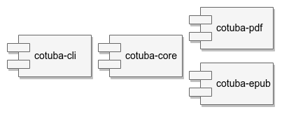
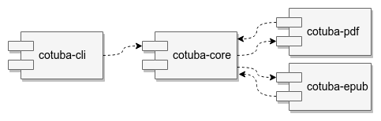
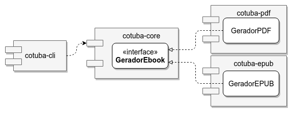
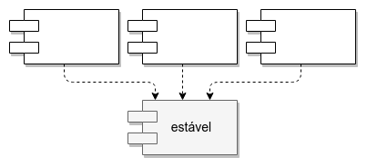

# Princípios de Coesão e Acoplamento de Módulos

## O que são módulos?

À medida que aplicações crescem em tamanho e complexidade, é necessária alguma maneira de organizar o código para além de classes.

Uma aplicação pode ser separada em módulos, que são "fatias" independentes de código.

Kirk Knoernschild, no livro [Java Application Architecture: Modularity Patterns](https://www.amazon.com.br/Java-Application-Architecture-Modularity-Patterns/dp/0321247132) (KNOERNSCHILD, 2012), explora algumas características dos módulos. Módulos são:

- **Implantáveis**: são entregáveis que podem ser executados em _runtime_
- **Reusáveis**: são nativamente reusáveis por diferentes aplicações, sem a necessidade de comunicação pela rede. As funcionalidade de um módulo são invocadas diretamente, dentro da mesma JVM e, portanto, do mesmo processo (no Windows, o mesmo `java.exe`).
- **Testáveis**: podem ser testados independentemente, com testes de unidade.
- **Gerenciáveis**: em um sistema de módulos, podem ser instalados, reinstalados e desinstalados.
- **Sem estado**: classes podem ter estado, módulos não.
- **Unidades de Composição**: podem se unir a outros módulos para compor uma aplicação.


Qual será o artefato Java que contém todas essas características?

## JARs

Em Java, código é definido em classes. Classes ficam organizadas dentro de pacotes.

E qual é a maneira de agrupar pacotes? É o JAR, ou **J**ava **AR**chive.

JARs são arquivos compactados no padrão ZIP que contém pacotes que, por sua vez, contém os `.class` compilados a partir do código fonte das classes.

Um JAR é implantável, reusável, testável, gerenciável, sem estado e é possível compô-lo com outros JARs para formar uma aplicação.  

No livro [Java Application Architecture: Modularity Patterns](https://www.amazon.com.br/Java-Application-Architecture-Modularity-Patterns/dp/0321247132) (KNOERNSCHILD, 2012), Kirk Knoernschild define:

_O melhor candidato à unidade de modularidade na plataforma Java é o arquivo JAR!_

## Porque modularizar?

No livro [Modular Java](https://pragprog.com/book/cwosg/modular-java) (WALLS, 2009), Craig Walls cita algumas vantagens de modularizar uma aplicação:

- capacidade de trocar um módulo por outro, com uma implementação diferente, desde que a interface pública seja mantida
- facilidade de compreensão de cada módulo individualmente
- possibilidade de desenvolvimento em paralelo, permitindo que tarefas sejam divididas entre diferentes times
- testabilidade melhorada, permitindo um outro nível de testes, que trata um módulo como uma unidade
- flexibilidade, permitindo o reuso de módulos em outras aplicações

## O que é reuso?

Uncle Bob diz em seu artigo [Granularity](https://drive.google.com/file/d/0BwhCYaYDn8EgOGM2ZGFhNmYtNmE4ZS00OGY5LWFkZTYtMjE0ZGNjODQ0MjEx/view) (MARTIN, 1996e) que **copiar e colar código dos outros não é reuso** porque você se torna dono do código que você copia:

- se algo tiver que ser adaptado, você deve alterar o código
- se você achar bugs, você deve corrigi-los
- se o autor original encontrar bugs, você que deverá ficar sabendo e descobrir o que deve ser alterado na sua cópia

Copiar e colar pode ser mais fácil em um primeiro momento mas é muito caro no longo prazo, em que manutenções são frequentes.

No mesmo artigo, Uncle Bob diz:

_Eu reuso código se, e somente se, eu nunca preciso olhar para o código fonte. [...]_
_Ou seja, eu espero que o código que eu estou reusando seja tratado como um produto. Não é mantido por mim. Não é distribuído por mim. Eu sou o consumidor. O autor, ou outra entidade, é responsável por mantê-lo._

Reuso não é algo específico de linguagens OO, mas mecanismos como interfaces e polimorfismo facilitam a criação de APIs reutilizáveis de maneira consistente.

Reutilizar código de terceiros, como bibliotecas e frameworks, permite um ganho enorme de produtividade. Imagine a complicação de um mundo sem JPA/Hibernate ou Spring, por exemplo.

Também é possível reaproveitar código entre diferentes aplicações de uma mesma empresa/organização. Quanto maior a base de código, maior é a chance de reuso.

## Princípios de coesão de módulos

Ao pensarmos em módulos, uma grande questão é: como "fatiar" o código para definir o que deve ficar em cada módulo?

Ou melhor: quais classes devem ficar em quais módulos? Quais as **responsabilidades** de um módulo?

Coesão, algo importante no nível de classes, também é importante no nível de módulos.

Por isso, Uncle Bob, define alguns princípios relativos à **coesão** dos módulos.

## O Princípio da Equivalência entre Entrega e Reuso

O reuso de um módulo pode ser feito por terceiros ou por outros times da mesma empresa.

Mas como um módulo pode ser entregue para reuso?

Pode ser através de:

- um site próprio
- pelo GitHub, GitLab ou equivalente
- por uma ferramenta como Maven ou Gradle, no repositório central ou em um gerenciador de artefatos como o Sonatype Nexus ou JFrog Artifactory

Uma vez fechado um grupo de alterações no código, acontece o processo de compilação, teste, documentação e entrega dos módulos, publicando uma nova versão. Quem usa esse módulo, deve ser avisado sobre a nova versão.

Só os módulos que são versionados, entregues e disponibilizados por quem os mantém podem ser considerados reusáveis.

Além disso, não disponibilizamos classes diretamente. O que usamos são os módulos, que são agrupamentos de classes.

E usamos apenas a totalidade de um módulo. Não é possível usar apenas parte do que está contido em um módulo. Um módulo é atômico. Indivisível.

Essa constatação é descrita por Uncle Bob no seguinte princípio:

> **Release/Reuse Equivalency Principle (REP)**
>
> _A granularidade de reuso é a granularidade de entrega._

## O Princípio do Agrupamento Comum

Mudanças em uma aplicação são necessárias. Se o mundo muda, a aplicação muda.

Para isolar o impacto dessas mudanças no nível de classes, temos o SRP. O SRP nos diz que devemos agrupar, em uma classe, apenas código que tem o mesmo motivo para ser modificado.

Mas e no nível de módulos?

Quando há necessidade de uma modificação na aplicação, o ideal é que uma alteração seja isolada no código de apenas um módulo. Dessa forma, é minimizado o trabalho de publicar uma nova versão: ao invés de entregar vários módulos, será entregue apenas um.

Uncle Bob definiu um princípio que é o equivalente ao SRP para módulos:

> **Common Closure Principle (CCP)**
>
> _Agrupe em módulos as classes que são modificadas pelos mesmos motivos e ao mesmo tempo. Separe em módulos diferentes as classes que são modificadas em momentos e por motivos diferentes._

O ideal é que uma mudança ocasione a alteração do código de apenas um módulo. Mas, na prática, pode acontecer de termos que modificar código de vários módulos.

O agrupamento das classes deve ser feito considerando as mudanças mais prováveis de acontecer. Desejamos minimizar o número de módulos a serem modificados. A maneira de atingir isso vai depender do problema que estamos resolvendo. E, claro, podemos errar.

## O Princípio do Reuso Comum

O ISP define que classes não devem depender de métodos que não usam. Isso implica em interfaces coesas, que definem contratos menores e, também, em usar interfaces para expor o mínimo possível de uma classe.

Qual o equivalente no nível de módulos?

Não deveríamos colocar, em um mesmo módulo, classes que seriam utilizadas apenas por parte dos clientes desse módulo.

Uma mudança em uma classe forçaria a publicação de uma nova versão do módulo já que não é possível entregar apenas parte de um módulo.

Uma nova versão iria requerer recompilação, reteste e reimplantação de todos que usam o módulo. Mesmo daqueles que não usam a classe modificada.

O equivalente ao ISP para módulos foi definido por Uncle Bob no seguinte princípio:

> **Common Reuse Principle (CRP)**
>
> _As classes de um módulo são reusadas em grupo. Quem reusa uma dessas classes, reusa todas._
>
> ou
>
> _Não force quem usa um módulo a depender de coisas de que eles não precisam._

## A tensão entre os princípios de coesão de módulos

Uncle Bob diz, no livro [Clean Architecture](https://www.amazon.com/Clean-Architecture-Craftsmans-Software-Structure/dp/0134494164) (MARTIN, 2017), que há uma tensão entre o REP, o CCP e o CRP:

- REP agrupa classes para facilitar o reuso por outros projetos
- CCP agrupa classes para minimizar impactos de mudanças
- CRP divide módulos em menores, pensando em evitar dependências e entregas desnecessárias

O REP e CCP levariam à inclusão de mais classes, tendendo a criar módulos maiores, com granularidade mais grossa. Porém, os motivos de agrupamento são diferentes: o REP por reuso, o CCP por mudanças.

Já o CRP levaria à exclusão de classes, tendendo a criar módulos menores, com granularidade mais fina.

Se a granularidade for muito grossa, com muitas classes em poucos módulos, uma mudança levará a novas versões sem muitas novidades para boa parte de quem usa esses módulos.

Se, por outro lado, a granularidade dos módulos for muito fina, com poucas classes em muitos módulos, o impacto de uma mudança levará a alterações em diversos módulos diferentes.

Saber qual princípio deve ser favorecido é uma decisão que deve levar em conta o contexto atual do projeto. À medida que o projeto avança, o contexto muda e as decisões devem ser reavaliadas.

## Módulos, componentes ou pacotes?

Em seus textos mais antigos, Uncle Bob usava o termo _packages_, ou **pacotes**, para se referir ao que chamamos de módulos.

Porém, pacote é um termo com um significado bem definido na plataforma Java, que define tanto a estrutura de diretórios como o nome completo (ou _fully qualified name_) de uma classe. Em outras tecnologias OO, como C++ e C#, esse tipo de agrupamento de classes é conhecido como _namespace_.

No post [The Principles of OOD](http://butunclebob.com/ArticleS.UncleBob.PrinciplesOfOod) (MARTIN, 2005), esclarece a confusão:

_[No contexto dos princípios de pacotes,] um pacote é um entregável binário como um arquivo `.jar` ou um `dll`, em oposição a um `package` Java ou a um `namespace` C++._

Em livros mais recentes, Uncle Bob usa o termo _binary components_ ou simplesmente _components_ ou, em português, **componentes**.

A partir do JDK 9, há uma tecnologia de componentização, o JPMS, que usa o termo **módulos**. É o termo que estamos utilizando. Estudaremos essa nova tecnologia em capítulos posteriores.

## Modularizando o Cotuba

Os módulos da plataforma Java são JARs.

O Cotuba já tem alguns módulos:

- `cotuba-cli`: faz a renderização de MD para HTML, a geração de EPUB e PDF, a interface de linha de comando, expõe um plugin para aplicação de temas e um _hook_ para a finalização de ebook, e a lógica para integrar isso tudo
- `tema-paradizo`: o tema da empresa Paradizo
- `estatisticas-ebook`: gera estatísticas para o ebook ao final da geração

As implementações dos plugins `Tema` e `AoFinalizarGeracao`, nos módulos `tema-paradizo` e `estatisticas-ebook`, respectivamente são módulos bem coesos, com responsabilidades bem definidas.

Porém, será que o módulo `cotuba-cli` respeita o CCP? Será que contém apenas classes que tem os mesmos motivos para serem modificadas?

Uma alteração no código do módulo `cotuba-cli` pode ser necessário por mudanças:

- na interface de linha de comando e/ou na biblioteca Apache Commons CLI
- na renderização do MD e/ou na biblioteca CommonMark Java
- na geração do PDF e/ou na biblioteca iText
- na geração do EPUB e/ou na biblioteca Epublib
- na aplicação dos temas e/ou na biblioteca Jsoup

São muitos motivos para mudar o `cotuba-cli`!

Há muitas maneiras de "fatiar" esse módulo, separando classes que mudam por diferentes razões.

### Um módulo por pacote

Uma ideia seria ter um módulo para cada pacote. Isso levaria a vários módulos com responsabilidades bem pequenas:

- `cotuba-cli`, responsável pela interface da linha de comando
- `cotuba-application`, contendo a classe `Cotuba` e demais abstrações de alto nível
- `cotuba-domain`, contendo código de domínio
- `cotuba-pdf`, que gera o PDF
- `cotuba-epub`, que gera o EPUB
- `cotuba-md`, que renderiza os arquivos MD para HTML
- `cotuba-tema`, que aplica os temas no HTML, se existirem
- `cotuba-plugin`, que expõe os plugins


Módulos com responsabilidades bem definidas respeitam o CCP: teríamos agrupado classes que mudam pelo mesmo motivo.

Além disso, como "pulverizamos" o código em vários módulos minúsculos, uma aplicação poderia utilizar apenas partes dos módulos. Por exemplo, para renderizar arquivos MD, usaria (ou melhor, reusaria) o módulo `cotuba-md`.

O módulo de renderização de MDs, por sua vez, usa os módulos `cotuba-tema`, `cotuba-application` e `cotuba-domain`. Já o módulo de temas usa `cotuba-plugin`.

E o módulo `cotuba-domain`, em sua enum `FormatoEbook` acaba usando classes do módulo `cotuba-pdf` e `cotuba-epub`, por incrível que pareça. Veja:

```java
import cotuba.application.GeradorEbook;
import cotuba.epub.GeradorEPUB;
import cotuba.pdf.GeradorPDF;

public enum FormatoEbook {

  PDF(new GeradorPDF()),
  EPUB(new GeradorEPUB());

  // restante do código...

}
```

O reuso de `cotuba-md` acabaria forçando o reuso de quase todos os módulos, menos do `cotuba-cli`.

Será que essa solução atende ao CRP? Não! Para atender, não deveríamos ter classes não utilizadas ao (re)usar um módulo. Porém, ao (re)usar o módulo `cotuba-md`, teríamos também classes para gerar PDFs e EPUBs. Inúteis!

E quanto à granularidade da entrega? Muito fina: seriam 7 módulos em conjunto para (re)usar a renderização de MDs. Considerando a interface de linha de comando, 8 módulos! O controle de versões e a entrega seriam dificultados. E, extrapolando um pouco o REP, se a entrega for difícil, o reuso é difícil.

Resumindo, em relação a essa ideia de um módulo por pacote teríamos:

- CCP: atendido com louvor, pelos módulos focados e com responsabilidades bem definidas
- CRP: não atendido, porque acabamos tendo que usar módulos indiretamente, com código desnecessário
- REP: entrega e reuso dificultados pelo grande número de módulos

### Um módulo separado para a UI

Uma outra ideia seria ter um módulo separado para a UI e outro para o resto da aplicação. Teríamos módulos como os a seguir:

- `cotuba-cli`, responsável pela interface da linha de comando
- `cotuba-core`, responsável por todo o resto, como a renderização do MD para HTML, aplicação dos possíveis temas, e a geração de PDF e EPUB


O módulo `cotuba-cli` teria uma responsabilidade bem delimitada. Já o `cotuba-core`, teria toda a lógica de geração dos ebooks. Em termos de CCP, aumentaríamos os motivos para mudança desse último módulo.

Se uma aplicação desejar o reuso da renderização de MDs, teria que depender do `cotuba-core` como um todo. E acabaria levando junto código desnecessário. Ou seja, o CRP não é atendido.

Já o REP é favorecido: apenas um módulo, o `cotuba-core`, deve ser versionado e entregue para que possa haver reuso da renderização de MDs. Com a interface de linha de comando, seriam 2 módulos.

Resumindo, com a estratégia de separar a UI em módulo próprio, teríamos:

- CCP: menos favorecido que a solução anterior pois há um módulo bem focado na UI e outro mais geral, com mais razões para ser modificado
- CRP: não atendido, da mesma maneira que a solução anterior, porque acabamos com código desnecessário no módulo geral
- REP: bastante facilitado em relação à solução anterior, já que há a entrega, e o respectivo reuso, de apenas 2 módulos

### Um módulo para cada entrada e saída

Há ainda outra ideia: separar, em módulos específicos, o código das entradas, das saídas e das regras de negócio.

No caso do Cotuba, quais seriam as entradas e saídas? A entrada é feita por meio de parâmetros na UI de linha de comando. Já as saídas são os ebooks gerados.

Por isso, teríamos os módulos:

- `cotuba-cli`, responsável pela interface da linha de comando
- `cotuba-pdf`, com código para a geração de PDF
- `cotuba-epub`, com código para a geração de EPUB
- `cotuba-core`, que contém a renderização do MD, aplicação dos possíveis temas e lógicas de negócio



Em termos de CCP, há uma distribuição de responsabilidades bem razoável, com módulos focados em cada possível mudança. Se, por exemplo, a taxa de modificações na linha de comando for frequente, mudaríamos apenas o módulo `cotuba-cli`. Alterações no PDF, afetariam somente o módulo apropriado.

No caso de reuso da renderização de MDs, dependeríamos do módulo `cotuba-core`, com tudo o que há dentro dele. Ainda precisaríamos dos módulos que geram os formatos de ebook, que são dependências da enum `FormatoEbook`.

Se, por exemplo, o reuso pretendido for da geração de PDFs, precisaríamos do módulo `cotuba-pdf`. Também precisaríamos do `cotuba-core`, cujas classes e interfaces são usadas pelo gerador de PDFs. Como `cotuba-core` pode disparar a geração de EPUBs, precisaríamos também do módulo `cotuba-epub`.

Quanto ao REP, o versionamento e entrega de apenas um módulo, o `cotuba-core`, permitiria o reuso da renderização de MDs. Ao todo, teríamos 4  módulos.

Em relação aos princípios de coesão de módulos, teríamos:

- CCP: um meio termo, com módulos mais focados do que ao separarmos apenas a UI mas menos focados do que um módulo por pacote
- CRP: não atendido, porque ao tentar reusar o módulo geral ou cada módulo dos geradores, acabaríamos precisando de quase todos os módulos
- REP: também um meio termo, com entrega, e possível reuso, de 4 módulos

### Escolhendo uma estratégia de modularização

Qual estratégia escolher? Podemos:

- deixar tudo num módulo só, como está
- módulos por pacote, "pulverizando" o código em 8 módulos
- um módulo para a UI de linha de comando, outro pro resto
- um módulo para a entrada (UI de linha de comando), um para cada saída (geradores de PDF e EPUB) e outro para a coordenação da geração de ebooks

Para balancear entre reusabilidade de apenas parte dos módulos, coesão, manutenibilidade e simplicidade no desenvolvimento, versionamento e entrega, vamos usar a estratégia de um módulo separado para UI.

## Módulos Maven

Poderíamos criar dois projetos separados para cada módulo: um para o de UI, outro para o resto. Mas teríamos que mantê-los separadamente.

Com o Maven, é possível criarmos um **multi-module project**, que permite definir vários módulos em um mesmo projeto. O Maven ficaria responsável por obter as dependências necessárias e o fazer _build_ na ordem correta. Os artefatos gerados (JARs, WARs e/ou EARs) teriam a mesma versão.

Devemos definir um módulo pai, ou supermódulo, que contém um ou mais módulos filhos, ou submódulos.

No caso do Cotuba, teríamos um supermódulo `cotuba` e os submódulos `cotuba-cli` e `cotuba-core`. A estrutura de diretórios seria a seguinte:

```txt
cotuba
│
├── pom.xml
│
├── cotuba-cli
│   ├── pom.xml
│   └── src
│
└── cotuba-core
    ├── pom.xml
    └── src
```

O supermódulo `cotuba` deve definir um `pom.xml`.  Nesse arquivo, a propriedade `packaging` deve ter o valor `pom`. Devem ser definidas propriedades, dependências, repositórios e outras configurações comuns a todos os submódulos. Esses submódulos devem ser declarados da seguinte maneira:

```xml
<modules>
  <module>cotuba-core</module>
  <module>cotuba-cli</module>
</modules>
```

Já os submódulos não devem definir um `<groupId>` ou `<version>` próprios, apenas o `<artifactId>`. Devem declarar qual é o seu supermódulo com a tag `<parent>`. Segue o exemplo para o módulo de UI:

```xml
<parent>
  <groupId>cotuba</groupId>
  <artifactId>cotuba</artifactId>
  <version>0.0.1-SNAPSHOT</version>
</parent>

<artifactId>cotuba-cli</artifactId>
```

Os arquivos `pom.xml` dos submódulos podem definir em seus `pom.xml` suas próprias configurações, como propriedades, dependências e repositórios.

Se houver uma dependência a outros módulos do supermódulo, é possível usar `${project.version}` como versão. Por exemplo, o submódulo `cotuba-cli` deve declarar a dependência ao submódulo `cotuba-core` conforme o código que segue:

```xml
<dependency>
  <groupId>cotuba</groupId>
  <artifactId>cotuba-core</artifactId>
  <version>${project.version}</version>
</dependency>
```

## Exercício: criando um projeto Maven multi-módulos

### Objetivo

Crie um projeto Maven multi-módulos chamado `cotuba`.

As propriedades devem ficar nesse supermódulo.

### Passo a passo

1. No Eclipse, vá em  _File > New > Maven Project_.

  Marque a opção _Create a simple project (skip archetype selection)_.

  Desmarque a opção _Use default Workspace location_.

  Em _Location_, coloque `/home/<usuario-do-curso>/modulos/cotuba`.

  Não esqueça de trocar `<usuario-do-curso>` pelo nome de usuário do curso.

  Clique em _Next_.

  Na próxima tela, preencha:

  - _Group Id_: `cotuba`
  - _Artifact Id_: `cotuba`

  Deixe o campo _Version_ como `0.0.1-SNAPSHOT`.

  Modifique o _Packaging_ para `pom`.

  Os demais campos podem ficar vazios.

  Clique em _Finish_.

2. No `pom.xml` do projeto `cotuba`, o supermódulo, corrija a codificação de caracteres e a versão do Java.

  ####### cotuba/pom.xml

  ```xml
  <properties>
    <project.build.sourceEncoding>UTF-8</project.build.sourceEncoding>
    <maven.compiler.source>1.8</maven.compiler.source>
    <maven.compiler.target>1.8</maven.compiler.target>
  </properties>
  ```

  Para que as mudanças tenham efeito, clique com o botão direito no projeto `cotuba` e vá em _Maven > Update project..._.

  Selecione o projeto `cotuba` e clique em _OK_.

  As configurações no supermódulo serão aplicadas por padrão a todos os submódulos.

## Exercício: criando um módulo para a aplicação

### Objetivo

Crie um módulo `cotuba-core` como um submódulo de `cotuba`. Deverá conter todo o código do Cotuba, menos a parte de linha de comando.

Defina as dependências e repositórios apropriados nesse módulo.

### Passo a passo

1. Vá em _File > New > Other..._. Busque por _Maven Module_.

  Marque a opção _Create a simple project (skip archetype selection)_.

  Em _Module Name_, coloque `cotuba-core`.

  Certifique-se que o _Parent Project_ é `cotuba`.

  Clique em _Next_.

  Na próxima tela, mude o _Group Id_ para `cotuba`.

  Mantenha o campo _Artifact Id_ com o valor `cotuba-core`, _Version_ com `0.0.1-SNAPSHOT` e o _Packaging_ para `jar`.

  Os demais campos podem ficar vazios.

  Clique em _Finish_.

  Perceba que o novo módulo já é definido no `pom.xml` do supermódulo:

  ####### cotuba/pom.xml

  ```xml
  <modules>
    <module>cotuba-core</module>
  </modules>
  ```

  Perceba também que, no `pom.xml` do módulo `cotuba-core`, o supermódulo já está definido como `<parent>`:

  ####### cotuba-core/pom.xml

  ```xml
  <parent>
    <groupId>cotuba</groupId>
    <artifactId>cotuba</artifactId>
    <version>0.0.1-SNAPSHOT</version>
  </parent>
  ```

2. Copie, do projeto `cotuba-cli` para o _source folder_ `src/main/java` do módulo `cotuba-core`, os seguintes pacotes :

  - `cotuba.application`
  - `cotuba.domain`
  - `cotuba.domain.builder`
  - `cotuba.epub`
  - `cotuba.md`
  - `cotuba.pdf`
  - `cotuba.plugin`
  - `cotuba.tema`

  Ou seja, deixe de fora apenas o pacote `cotuba.cli`.

3. Precisamos definir como dependências as bibliotecas CommonMark Java, iText pdfHTML, Epublib e Jsoup.

  Copie do `pom.xml` do projeto `cotuba-cli`, o código a seguir:

  ####### cotuba-core/pom.xml

  ```xml
  <dependencies>

    <dependency>
      <groupId>commons-cli</groupId>
      <artifactId>commons-cli</artifactId>
      <version>1.4</version>
    </dependency>

    <dependency>
      <groupId>com.atlassian.commonmark</groupId>
      <artifactId>commonmark</artifactId>
      <version>0.11.0</version>
    </dependency>

    <dependency>
      <groupId>nl.siegmann.epublib</groupId>
      <artifactId>epublib-core</artifactId>
      <version>3.1</version>
      <exclusions>
        <exclusion>
          <groupId>net.sf.kxml</groupId>
          <artifactId>kxml2</artifactId>
        </exclusion>
        <exclusion>
          <groupId>xmlpull</groupId>
          <artifactId>xmlpull</artifactId>
        </exclusion>
      </exclusions>
    </dependency>

    <dependency>
      <groupId>net.sf.kxml</groupId>
      <artifactId>kxml2</artifactId>
      <version>2.5.1-SNAPSHOT</version>
      <classifier>jar-with-dependencies</classifier>
      <exclusions>
        <exclusion>
          <groupId>org.xmlpull</groupId>
          <artifactId>xmlpull</artifactId>
        </exclusion>
      </exclusions>
    </dependency>

    <dependency>
      <groupId>com.itextpdf</groupId>
      <artifactId>html2pdf</artifactId>
      <version>2.0.0</version>
      <exclusions>
        <exclusion>
          <groupId>com.itextpdf</groupId>
          <artifactId>forms</artifactId>
        </exclusion>
      </exclusions>
    </dependency>

    <dependency>
      <groupId>org.jsoup</groupId>
      <artifactId>jsoup</artifactId>
      <version>1.11.2</version>
    </dependency>

  </dependencies>
  ```

4. As bibliotecas iText pdfHTML e Epublib, assim como algumas de suas dependências, não estão definidas no repositório central do Maven. Precisam de repositórios próprios.

  Copie a definição desses repositórios do `pom.xml` do projeto `cotuba-cli` para o desse módulo:

  ####### cotuba-core/pom.xml

  ```xml
  <repositories>

    <repository>
      <id>psiegman-repo</id>
      <url>https://github.com/psiegman/mvn-repo/raw/master/releases</url>
    </repository>

    <repository>
      <id>iText Repository</id>
      <name>iText Repository-releases</name>
      <url>https://repo.itextsupport.com/releases</url>
    </repository>

    <repository>
      <id>mvn-repo</id>
      <url>https://rawgit.com/alexandreaquiles/mvn-repo/master</url>
    </repository>

  </repositories>
  ```

  Após essas alterações, o projeto `cotuba-core` deve ser compilado com sucesso.

## Exercício: criando um módulo para a linha de comando

### Objetivo

Crie o módulo `cotuba-cli`, como um submódulo de `cotuba`. Deverá conter o código da interface de linha de comando.

Declare `cotuba-core` como dependência e definições de build.

### Passo a passo

1. Vamos reaproveitar o código do projeto `cotuba-cli`, aquele que ainda não está modularizado. Para isso:

  - crie uma nova pasta chamada `cotuba-cli` em `/home/<usuario-do-curso>/modulos/cotuba` (não esqueça de trocar <usuario-do-curso> pelo nome de usuário do curso)
  - mova o arquivo `pom.xml` e a pasta `src` do projeto `cotuba-cli` para essa nova pasta

  Mantenha a pasta `exemplo`, que contém o livro de exemplo, no diretório original.

  Volte ao Eclipse e faça um _refresh_ do `cotuba-cli`, o projeto anterior, que acabou de ser movido.

  Deve ser exibida a seguinte mensagem:

  _The location for project 'cotuba-cli' (cotuba) has been deleted._
  _Delete 'cotuba-cli' from the workspace?_

  Escolha _Yes_. O projeto será removido.

  _Caso a mensagem não apareça, remova o projeto `cotuba-cli` do Eclipse._

2. Importe o projeto que foi movido, acessando _File > Import... > Existing Maven Projects_.

  Em _Root Directory_, coloque `/home/<usuario-do-curso>/modulos/cotuba/cotuba-cli`.

  Não esqueça de trocar `<usuario-do-curso>` pelo nome de usuário do curso.

  Clique em _Finish_.

  No `pom.xml` do supermódulo, declare o submódulo `cotuba-cli`:

  ####### cotuba/pom.xml

  ```xml
  <modules>
    <module>cotuba-core</module>
    <module>cotuba-cli</module> 
  </modules>
  ```

3. No `pom.xml` do módulo `cotuba-cli`, remova os trechos que declaram propriedades e repositórios, que são desnecessários. Deixe apenas a dependência à biblioteca Apache Commons CLI e as definições de `<build>`. Adicione a definição do `<parent>`. O resultado deve ser o seguinte:

  ####### cotuba-cli/pom.xml

  ```xml
  <project xmlns="http://maven.apache.org/POM/4.0.0" xmlns:xsi="http://www.w3.org/2001/XMLSchema-instance"
  xsi:schemaLocation="http://maven.apache.org/POM/4.0.0 http://maven.apache.org/xsd/maven-4.0.0.xsd">
  <modelVersion>4.0.0</modelVersion>

  
  <parent>
    <groupId>cotuba</groupId>
    <artifactId>cotuba</artifactId>
    <version>0.0.1-SNAPSHOT</version>
  </parent>

  <̶g̶r̶o̶u̶p̶I̶d̶>̶c̶o̶t̶u̶b̶a̶<̶/̶g̶r̶o̶u̶p̶I̶d̶>̶
  <artifactId>cotuba-cli</artifactId>
  <̶v̶e̶r̶s̶i̶o̶n̶>̶0̶.̶0̶.̶1̶-̶S̶N̶A̶P̶S̶H̶O̶T̶<̶/̶v̶e̶r̶s̶i̶o̶n̶>̶

  <̶p̶r̶o̶p̶e̶r̶t̶i̶e̶s̶>̶
   
  <̶/̶p̶r̶o̶p̶e̶r̶t̶i̶e̶s̶>̶

  <dependencies>

    <dependency>
        <groupId>commons-cli</groupId>
        <artifactId>commons-cli</artifactId>
        <version>1.4</version>
    </dependency>
  
    

  </dependencies>

  <build>
    <plugins>
      <plugin>
        <artifactId>maven-assembly-plugin</artifactId>
        <version>3.1.0</version>
        <configuration>
          <descriptors>
            <descriptor>src/assembly/distribution.xml</descriptor>
          </descriptors>
        </configuration>
        <executions>
          <execution>
            <id>make-assembly</id>
            <phase>package</phase>
            <goals>
              <goal>single</goal>
            </goals>
          </execution>
        </executions>
      </plugin>
    </plugins>
  </build>

  <̶r̶e̶p̶o̶s̶i̶t̶o̶r̶i̶e̶s̶>̶
    
  <̶/̶r̶e̶p̶o̶s̶i̶t̶o̶r̶i̶e̶s̶>̶

  </project>
  ```

4. No código do módulo `cotuba-cli`, deixe apenas o pacote `cotuba.cli`.

  Remova os seguintes pacotes:

  - `c̶o̶t̶u̶b̶a̶.̶a̶p̶p̶l̶i̶c̶a̶t̶i̶o̶n̶`
  - `c̶o̶t̶u̶b̶a̶.̶d̶o̶m̶a̶i̶n̶`
  - `c̶o̶t̶u̶b̶a̶.̶d̶o̶m̶a̶i̶n̶.̶b̶u̶i̶l̶d̶e̶r̶`
  - `c̶o̶t̶u̶b̶a̶.̶e̶p̶u̶b̶`
  - `c̶o̶t̶u̶b̶a̶.̶m̶d̶`
  - `c̶o̶t̶u̶b̶a̶.̶p̶d̶f̶`
  - `c̶o̶t̶u̶b̶a̶.̶p̶l̶u̶g̶i̶n̶`
  - `c̶o̶t̶u̶b̶a̶.̶t̶e̶m̶a̶`

5. Devem acontecer alguns erros de compilação, já que removemos vários pacotes com classes que são usadas por `Main` e `LeitorOpcoesCLI`.

  As classes removidas estão definidas no módulo `cotuba-core`. Devemos inserir esse módulo como dependência de `cotuba-cli`, usando a versão do próprio projeto:

  ####### cotuba-cli/pom.xml

  ```xml
  <dependencies>

    <dependency>
      <groupId>commons-cli</groupId>
      <artifactId>commons-cli</artifactId>
      <version>1.4</version>
    </dependency>

    
    <dependency>
      <groupId>cotuba</groupId>
      <artifactId>cotuba-core</artifactId>
      <version>${project.version}</version>
    </dependency>

  </dependencies>
  ```

  A compilação deve ter sucesso!

6. Para testar, é possível usar as _Run Configurations_ já definidas no Eclipse.

  Também podemos fazer o build pelo Terminal, com os seguintes comandos:

  ```sh
  cd ~/modulos/cotuba
  mvn install
  ```

  O resultado deve ser algo similar ao seguinte:

  ```txt
  [INFO] ------------------------------------------------------------------------
  [INFO] Reactor Summary:
  [INFO] 
  [INFO] cotuba 0.0.1-SNAPSHOT .............................. SUCCESS [  0.607 s]
  [INFO] cotuba-core ........................................ SUCCESS [  2.701 s]
  [INFO] cotuba-cli 0.0.1-SNAPSHOT .......................... SUCCESS [  7.437 s]
  [INFO] ------------------------------------------------------------------------
  [INFO] BUILD SUCCESS
  [INFO] ------------------------------------------------------------------------
  [INFO] Total time: 10.938 s
  ```

  E para gerar um PDF, devemos executar os comandos a seguir:

  ```sh
  unzip -o cotuba-cli/target/cotuba-*-distribution.zip -d ~/Desktop
  cd ~/Desktop
  ./cotuba.sh -d ~/cotuba/exemplo -f pdf
  ```

  Caso haja módulos (JARs) de plugins no diretório `libs`, eles serão aplicados.

## Princípios de acoplamento de módulos

Dificilmente, uma aplicação será composta por apenas um módulo. Mesmo se o código da aplicação em si estiver modularizado, usaremos módulos (os JARs) de bibliotecas e frameworks. E esses módulos, por sua vez, comumente tem outros módulos como **dependência**.

Podemos dizer, portanto, que (quase) todo módulo tem **acoplamento** com outros módulos.

É importante minimizar o acoplamento e ter o controle dessas dependências.

Por isso, Uncle Bob, define alguns princípios relativos ao acoplamento de módulos.

## O Princípio das Dependências Acíclicas

Vamos voltar ao exemplo de módulos separados para a entrada e para a saída.

Lembrando, teríamos os seguintes módulos:

- `cotuba-cli`, um módulo para a interface de linha de comando (a entrada)
- `cotuba-pdf` e `cotuba-epub`, módulos para cada formato de ebook (as saídas)
- `cotuba-core`, um módulo para as regras de negócio.

As dependências entre os módulos seriam:

- `cotuba-cli` depende de `cotuba-core`
- `cotuba-pdf` e `cotuba-epub` também dependem de `cotuba-core`
- `cotuba-core`, conforme mencionamos antes, depende das implementações dos geradores de ebook de `cotuba-pdf` e `cotuba-epub`

Veja que haveria um ciclo nas dependências de `cotuba-core`, `cotuba-pdf` e `cotuba-epub`:



Se alguma aplicação desejar usar apenas o módulo `cotuba-pdf` para gerar PDFs, vai depender de `cotuba-core`. Até aí tudo bem!

Como `cotuba-core` depende tanto de `cotuba-pdf` como de `cotuba-epub`, ao usarmos o gerador de PDFs, acabaríamos dependendo também do gerador de EPUBs. E isso ocorre por causa dessa **dependência cíclica**.

Às vezes, não é tão fácil descobrir as dependências cíclicas: pode ser que o ciclo se forme em dependências transitivas, as dependências das dependências. Por exemplo, do "ponto de vista" `cotuba-cli` de, que só depende diretamente de `cotuba-core`, não há ciclos. Mas há uma dependência transitiva, por meio de `cotuba-core`, com `cotuba-pdf` e `cotuba-epub`. E esses módulos formam o ciclo que destacamos anteriormente.

Dependências cíclicas também afetam a compilação: para compilar `cotuba-pdf` precisaríamos do JAR de `cotuba-pdf` e `cotuba-epub`. Porém, para compilar `cotuba-pdf` e `cotuba-epub` precisaríamos do  de `cotuba-core`. Um dilema. Um beco sem saída.

Dependências cíclicas são tão problemáticas que um projeto Maven multi-módulos não pode ter esse tipo de acoplamento. Se tiver, o projeto não será compilado com sucesso.

Para reafirmar o problema de dependências cíclicas, Uncle Bob cunhou o seguinte princípio:

> **Acyclic Dependencies Principle (ADP)**
>
> _Não permita ciclos no grafo de dependências de módulos._

### Quebrando ciclos com abstrações

E como quebramos ciclos? Devemos inverter as dependências!

O módulo `cotuba-core` poderia fornecer a abstração `GeradorEbook` que seria implementada pelas classes `GeradorPDF`, do módulo `cotuba-pdf`, e `GeradorEPUB`, do módulo `cotuba-epub`. Ambos os módulos de geração de ebook passariam a depender de `cotuba-core`. Não o contrário.



Poderíamos transformar os módulos `cotuba-pdf` e `cotuba-epub` em plugins. A interface `GeradorEbook` seria a SPI (Service Provider Interface). As implementações dos gerados para cada formato de ebook seriam Service Providers. Obteríamos as implementações disponíveis para essa SPI através do Service Loader. Dessa forma, a enum `FormatoEbook` deixaria de depender das implementações.

## O Princípio das Dependências Estáveis

Para Uncle Bob, a **estabilidade** de um módulo está relacionada com o cuidado necessário para mudá-lo. Um módulo muito estável é aquele em que temos que pensar bastante antes de fazer qualquer mudança. E quando isso acontece? Quando há outros módulos que dependem de um dado módulo. Quanto mais módulos dependerem desse módulo, maior é sua estabilidade.

_Detalhe: em português, é comum que a palavra estabilidade tenha uma conotação positiva. Porém, ao pensarmos em módulos, estabilidade é apenas uma característica, sem juízo de valor. Módulos estáveis são aqueles que devemos modificar com muito cuidado._

Para ter uma ideia da estabilidade de um módulo, devemos contar quantos outros módulos dependem dele. Em um diagrama, seriam o número de setas que entram em um módulo.

Considerando, a estabilidade, vamos comparar dois possíveis designs de módulos:

- `cotuba-cli` depende de `cotuba-core` que, por sua vez, depende de `cotuba-pdf` e `cotuba-epub`
- `cotuba-cli` depende de `cotuba-core`, assim como `cotuba-pdf` e `cotuba-epub`, através da inversão de dependências

No primeiro design, nenhum módulo depende de `cotuba-cli`. Não há exigência de estabilidade para essa módulo. Já sob a perspectiva de `cotuba-pdf` e `cotuba-epub`, há um módulo que dependem de ambos, o `cotuba-core`. Portanto, há a exigência de estabilidade. O mesmo vale para `cotuba-core`, que tem `cotuba-cli` dependendo de si, o que exige estabilidade.

Estabilidade dificulta a mudança. Por exemplo, uma mudança no módulo `cotuba-pdf`, afetaria `cotuba-core` e, indiretamente, `cotuba-cli`.

Já no segundo design, que quebra ciclos por meio da inversão de dependências, não há exigência de estabilidade para `cotuba-cli`, `cotuba-pdf` ou `cotuba-epub`. Porém, há uma exigência maior de estabilidade para `cotuba-core` porque teríamos os outros 3 módulos dependendo desse.


Perceba, no diagrama anterior, que as setas que representam as dependências apontam para o mesmo módulo central, o `cotuba-core`. Há uma grande exigência de estabilidade para o módulo central. Os módulos periféricos não precisam ser estáveis, já que não há outros módulos que dependem deles. Podemos dizer que as setas estão direcionadas ao módulo mais estável.

Uncle Bob consideraria esse último design melhor pois, considerando o todo, temos uma menor quantidade de módulos com exigência de estabilidade. Dessa forma, a mudança ficaria facilitada.

A ideia de ter as dependências entre módulos direcionadas para o módulo mais estável é descrita no seguinte princípio:

> **Stable Dependencies Principle (SDP)**
>
> _Tenha dependências na direção da estabilidade._

## O Princípio das Abstrações Estáveis

Módulos em que há a exigência de estabilidade precisam ser mudados com cuidado: uma pequena alteração pode exigir modificações em vários outros módulos.

Porém, podemos tornar esses módulos estáveis fáceis de estender fazendo com que eles definam abstrações. Abstrações levam a flexibilidade. Quanto mais interfaces e classes abstratas forem definidas em um módulo, mais fácil será estendê-lo.

Um módulo para o qual há uma grande exigência de estabilidade deve ser composto, em grande parte, por abstrações.

Uncle Bob define um princípio com esse conceito:

> **Stable Abstractions Principle (SAP)**
>
> _Um módulo deve ser tão abstrato quanto for estável._

Uncle Bob compara o SDP, SAP e DIP no livro [Agile Principles, Patterns, and Practices in C#](https://www.amazon.com.br/Agile-Principles-Patterns-Practices-C/dp/0131857258) (MARTIN, 2006):

_Combinados, o SDP e o SAP formam o DIP para componentes [módulos]. O SDP diz que as dependências devem ser na direção da estabilidade. O SAP diz que estabilidade implica em abstração. Portanto, as dependências devem ser na direção da abstração._

_Entretanto, o DIP lida com classes. Com classes, não há tons de cinza. Uma classe ou é abstrata ou não é._

_A combinação do SDP com o SAP lida com componentes [módulos] e permite que um componente [módulo] seja parcialmente abstrato ou parcialmente estável._

## Exercício: um módulo para a geração de PDFs

### Objetivo

Crie o submódulo `cotuba-pdf`, que deve conter o código para a geração de PDFs.

Declare o submódulo `cotuba-core` e a biblioteca iText pdfHTML como dependências.

### Passo a passo

1. Vá em _File > New > Other..._. Busque por _Maven Module_.

  Marque a opção _Create a simple project (skip archetype selection)_.

  Em _Module Name_, coloque `cotuba-pdf`.

  Certifique-se que o _Parent Project_ é `cotuba`.

  Clique em _Next_.

  Na próxima tela, mude o _Group Id_ para `cotuba`.

  Mantenha o campo _Artifact Id_ com o valor `cotuba-pdf`, _Version_ com `0.0.1-SNAPSHOT` e o _Packaging_ para `jar`.

  Os demais campos podem ficar vazios.

  Clique em _Finish_.

  Perceba que o novo módulo já é definido no `pom.xml` do supermódulo:

  ####### cotuba/pom.xml

  ```xml
  <modules>
    <module>cotuba-core</module>
    <module>cotuba-cli</module>
    <module>cotuba-pdf</module> 
  </modules>
  ```

  Perceba também que, no `pom.xml` do módulo `cotuba-pdf`, o supermódulo já está definido como `<parent>`:

  ####### cotuba-pdf/pom.xml

  ```xml
  <parent>
    <groupId>cotuba</groupId>
    <artifactId>cotuba</artifactId>
    <version>0.0.1-SNAPSHOT</version>
  </parent>
  ```

2. Copie o pacote `cotuba.pdf` do submódulo `cotuba-core` para o _source folder_ `src/main/java` do novo submódulo `cotuba-pdf`.

  Remova o pacote `cotuba.pdf` de `cotuba-core`.

  Devem acontecer alguns erros de compilação, em ambos os módulos que alteramos. Corrigiremos mais adiante.

3. Declare o submódulo `cotuba-core` e a biblioteca iText pdfHTML como dependências de `cotuba-pdf`.

  ####### cotuba-pdf/pom.xml

  ```xml
  <dependencies>

    <dependency>
      <groupId>cotuba</groupId>
      <artifactId>cotuba-core</artifactId>
      <version>${project.version}</version>
    </dependency>

    <dependency>
      <groupId>com.itextpdf</groupId>
      <artifactId>html2pdf</artifactId>
      <version>2.0.0</version>
      <exclusions>
        <exclusion>
          <groupId>com.itextpdf</groupId>
          <artifactId>forms</artifactId>
        </exclusion>
      </exclusions>
    </dependency>

  </dependencies>
  ```

  O iText pdfHTML necessita da configuração de um repositório próprio:

  ```xml
  <repositories>

    <repository>
      <id>iText Repository</id>
      <name>iText Repository-releases</name>
      <url>https://repo.itextsupport.com/releases</url>
    </repository>

  </repositories>
  ```

  Remova essas dependências e repositórios do `pom.xml` do submódulo `cotuba-core`.

4. Perceba que, no submódulo `cotuba-core`, a enum `FormatoEbook` apresenta um erro de compilação.

  Podemos tentar resolver esse erro, declarando `cotuba-pdf` como dependência de `cotuba-core`:

  ####### cotuba-core/pom.xml

  ```xml
  <dependency>
    <groupId>cotuba</groupId>
    <artifactId>cotuba-pdf</artifactId>
    <version>${project.version}</version>
  </dependency>
  ```

  Para recompilar, clique com o botão direito no projeto `cotuba-core` e, então, _Maven > Update Project..._. Selecione todos os projetos e clique em OK.

  Os projetos NÃO serão compilados com sucesso.

  Observe na aba _Problems_ do Eclipse que foi detectado um ciclo:

  _A cycle was detected in the build path of project 'cotuba-core'._
  _The cycle consists of projects {cotuba-core, cotuba-pdf, cotuba-cli, estatisticas-ebook, tema-paradizo}_

5. Tente fazer o build pelo Terminal, com os seguintes comandos:

  ```sh
  cd ~/modulos/cotuba
  mvn install
  ```

  Deverá ser exibido um erro de referência cíclica:

  ```txt
  [ERROR] The projects in the reactor contain a cyclic reference:
  Edge between 'Vertex{label='cotuba:cotuba-pdf:0.0.1-SNAPSHOT'}' and 'Vertex{label='cotuba:cotuba-core:0.0.1-SNAPSHOT'}'
  introduces to cycle in the graph
      cotuba:cotuba-core:0.0.1-SNAPSHOT -->
      cotuba:cotuba-pdf:0.0.1-SNAPSHOT -->
      cotuba:cotuba-core:0.0.1-SNAPSHOT @
  ```

## Exercício: um módulo para a geração de EPUBs

### Objetivo

Crie o submódulo `cotuba-epub`, que deve conter o código para a geração de EPUBs.

Declare o submódulo `cotuba-core` e a biblioteca Epublib como dependências.

### Passo a passo

1. Vá em _File > New > Other..._. Busque por _Maven Module_.

  Marque a opção _Create a simple project (skip archetype selection)_.

  Em _Module Name_, coloque `cotuba-epub`.

  Certifique-se que o _Parent Project_ é `cotuba`.

  Clique em _Next_.

  Na próxima tela, mude o _Group Id_ para `cotuba`.

  Mantenha o campo _Artifact Id_ com o valor `cotuba-epub`, _Version_ com `0.0.1-SNAPSHOT` e o _Packaging_ para `jar`.

  Os demais campos podem ficar vazios.

  Clique em _Finish_.

  Perceba que o novo módulo já é definido no `pom.xml` do supermódulo:

  ####### cotuba/pom.xml

  ```xml
  <modules>
    <module>cotuba-core</module>
    <module>cotuba-cli</module>
    <module>cotuba-pdf</module>
    <module>cotuba-epub</module> 
  </modules>
  ```

  Perceba também que, no `pom.xml` do módulo `cotuba-epub`, o supermódulo já está definido como `<parent>`:

  ####### cotuba-epub/pom.xml

  ```xml
  <parent>
    <groupId>cotuba</groupId>
    <artifactId>cotuba</artifactId>
    <version>0.0.1-SNAPSHOT</version>
  </parent>
  ```

2. Copie o pacote `cotuba.epub` do submódulo `cotuba-core` para o _source folder_ `src/main/java` do novo submódulo `cotuba-epub`.

  Remova o pacote `cotuba.epub` de `cotuba-core`.

3. Declare o submódulo `cotuba-core` e a biblioteca Epublib como dependências de `cotuba-epub`.

  Adicione também a biblioteca kXML, uma dependência de Epublib.

  ####### cotuba-epub/pom.xml

  ```xml
  <dependencies>

    <dependency>
      <groupId>cotuba</groupId>
      <artifactId>cotuba-core</artifactId>
      <version>${project.version}</version>
    </dependency>

    <dependency>
      <groupId>nl.siegmann.epublib</groupId>
      <artifactId>epublib-core</artifactId>
      <version>3.1</version>
      <exclusions>
        <exclusion>
          <groupId>net.sf.kxml</groupId>
          <artifactId>kxml2</artifactId>
        </exclusion>
        <exclusion>
          <groupId>xmlpull</groupId>
          <artifactId>xmlpull</artifactId>
        </exclusion>
      </exclusions>
    </dependency>

    <dependency>
      <groupId>net.sf.kxml</groupId>
      <artifactId>kxml2</artifactId>
      <version>2.5.1-SNAPSHOT</version>
      <classifier>jar-with-dependencies</classifier>
      <exclusions>
        <exclusion>
          <groupId>org.xmlpull</groupId>
          <artifactId>xmlpull</artifactId>
        </exclusion>
      </exclusions>
    </dependency>

  </dependencies>
  ```

  O Epublib necessita da configuração de dois repositórios próprios:

  ```xml
  <repositories>

    <repository>
      <id>psiegman-repo</id>
      <url>https://github.com/psiegman/mvn-repo/raw/master/releases</url>
    </repository>

    <repository>
      <id>mvn-repo</id>
      <url>https://rawgit.com/alexandreaquiles/mvn-repo/master</url>
    </repository>

  </repositories>
  ```

  Remova essas dependências e repositórios do `pom.xml` do submódulo `cotuba-core`.

4. Declare o novo submódulo `cotuba-epub` como dependência de `cotuba-core`:

  ####### cotuba-core/pom.xml

  ```xml
  <dependency>
    <groupId>cotuba</groupId>
    <artifactId>cotuba-epub</artifactId>
    <version>${project.version}</version>
  </dependency>
  ```

  Clique com o botão direito no projeto `cotuba-core` e, então, _Maven > Update Project..._. Selecione todos os projetos e clique em OK.

  Os projetos ainda terão erros de compilação tanto pelo Eclipse como pelo Maven. Ainda há um ciclo nas dependências.

## Exercício: quebrando ciclos através de plugins

### Objetivo

Transforme os módulos `cotuba-pdf` e `cotuba-epub` em plugins.

A SPI deve ser a interface `GeradorEbook`.

### Passo a passo

1. Mova a interface `GeradorEbook`, do pacote `cotuba.application` do submódulo `cotuba-core`, para o pacote `cotuba.plugin`.

  Adicione o método `formato` nessa interface, que retorna um `FormatoEbook`.

  Modifique o método `cria` para obter a implementação do gerador a partir do `ServiceLoader`.

  ####### cotuba-core/cotuba.plugin.GeradorEbook

  ```java
  public interface GeradorEbook {

    void gera(Ebook ebook);

    FormatoEbook formato(); // inserido

    // modificado
    public static GeradorEbook cria(FormatoEbook formato) {

      for (GeradorEbook gerador : ServiceLoader.load(GeradorEbook.class)) {
        if (gerador.formato().equals(formato)) {
          return gerador;
        }
      }

      throw new RuntimeException("Formato do ebook inválido: " + formato);
    }

  }
  ```

  Não deixe de adicionar o import:

  ####### cotuba-core/cotuba.plugin.GeradorEbook

  ```java
  import java.util.ServiceLoader;
  ```

2. Remova do `pom.xml` de `cotuba-core`, as dependências `cotuba-pdf` e `cotuba-epub`:

  ####### cotuba-core/pom.xml

  ```xml
  <̶d̶e̶p̶e̶n̶d̶e̶n̶c̶y̶>̶
    <̶g̶r̶o̶u̶p̶I̶d̶>̶c̶o̶t̶u̶b̶a̶<̶/̶g̶r̶o̶u̶p̶I̶d̶>̶
    <̶a̶r̶t̶i̶f̶a̶c̶t̶I̶d̶>̶c̶o̶t̶u̶b̶a̶-̶p̶d̶f̶<̶/̶a̶r̶t̶i̶f̶a̶c̶t̶I̶d̶>̶
    <̶v̶e̶r̶s̶i̶o̶n̶>̶$̶{̶p̶r̶o̶j̶e̶c̶t̶.̶v̶e̶r̶s̶i̶o̶n̶}̶<̶/̶v̶e̶r̶s̶i̶o̶n̶>̶
  <̶/̶d̶e̶p̶e̶n̶d̶e̶n̶c̶y̶>̶

  <̶d̶e̶p̶e̶n̶d̶e̶n̶c̶y̶>̶
    <̶g̶r̶o̶u̶p̶I̶d̶>̶c̶o̶t̶u̶b̶a̶<̶/̶g̶r̶o̶u̶p̶I̶d̶>̶
    <̶a̶r̶t̶i̶f̶a̶c̶t̶I̶d̶>̶c̶o̶t̶u̶b̶a̶-̶e̶p̶u̶b̶<̶/̶a̶r̶t̶i̶f̶a̶c̶t̶I̶d̶>̶
    <̶v̶e̶r̶s̶i̶o̶n̶>̶$̶{̶p̶r̶o̶j̶e̶c̶t̶.̶v̶e̶r̶s̶i̶o̶n̶}̶<̶/̶v̶e̶r̶s̶i̶o̶n̶>̶
  <̶/̶d̶e̶p̶e̶n̶d̶e̶n̶c̶y̶>̶
  ```

  Nesse momento, a dependência cíclica foi quebrada.

3. Simplifique a enum `FormatoEbook`, do pacote `cotuba.domain` do submódulo `cotuba-core`, fazendo com que não haja dependências às classes `GeradorPDF` e `GeradorEPUB`. Deixe somente os valores `PDF` e `EPUB`.

  ####### cotuba-core/cotuba.domain.FormatoEbook

  ```java
  public enum FormatoEbook {

    PDF, EPUB;

  }
  ```

  Limpe os imports desnecessários:

  ####### cotuba-core/cotuba.domain.FormatoEbook

  ```java
  i̶m̶p̶o̶r̶t̶ ̶c̶o̶t̶u̶b̶a̶.̶e̶p̶u̶b̶.̶G̶e̶r̶a̶d̶o̶r̶E̶P̶U̶B̶;̶
  i̶m̶p̶o̶r̶t̶ ̶c̶o̶t̶u̶b̶a̶.̶p̶d̶f̶.̶G̶e̶r̶a̶d̶o̶r̶P̶D̶F̶;̶
  i̶m̶p̶o̶r̶t̶ ̶c̶o̶t̶u̶b̶a̶.̶a̶p̶p̶l̶i̶c̶a̶t̶i̶o̶n̶.̶G̶e̶r̶a̶d̶o̶r̶E̶b̶o̶o̶k̶;̶
  ```

4. Na classe `GeradorPDF`, do pacote `cotuba.pdf` do submódulo `cotuba-pdf`, defina o método `formato` com o valor apropriado:

  ####### cotuba-pdf/cotuba.pdf.GeradorPDF

  ```java
  public class GeradorPDF implements GeradorEbook {

    @Override
    public FormatoEbook formato() { // inserido
      return FormatoEbook.PDF;
    }

    @Override
    public void gera(Ebook ebook) {
      // código omitido...
    }

  }
  ```

  Ajuste os imports:

  ####### cotuba-pdf/cotuba.pdf.GeradorPDF

  ```java
  import cotuba.domain.FormatoEbook;
  import cotuba.plugin.GeradorEbook;
  ```

5. Ainda no submódulo `cotuba-pdf`, defina o arquivo com o nome do service provider:

  ####### cotuba-pdf/src/main/resources/META-INF/services/cotuba.plugin.GeradorEbook

  ```txt
  cotuba.pdf.GeradorPDF
  ```

6. Faça com que a classe `GeradorEPUB`,  do pacote `cotuba.epub` do submódulo `cotuba-epub`, defina o método `formato` com o valor apropriado:

  ####### cotuba-epub/cotuba.epub.GeradorEPUB

  ```java
  public class GeradorEPUB implements GeradorEbook {

    @Override
    public FormatoEbook formato() { // inserido
      return FormatoEbook.EPUB;
    }

    @Override
    public void gera(Ebook ebook) {
      // código omitido...
    }

  }
  ```

  Não deixe de fazer o import:

  ####### cotuba-epub/cotuba.epub.GeradorEPUB

  ```java
  import cotuba.domain.FormatoEbook;
  ```

6. No submódulo `cotuba-epub`, defina o arquivo com o nome do service provider:

  ####### cotuba-epub/src/main/resources/META-INF/services/cotuba.plugin.GeradorEbook

  ```txt
  cotuba.epub.GeradorEPUB
  ```

7. Clique com o botão direito no projeto `cotuba-core` e, então, _Maven > Update Project..._. Selecione
todos os projetos e clique em OK.

  Com os ciclos quebrados por meio de plugins, a compilação terá sucesso.

  Abra o Terminal e faça o build do Cotuba com os seguintes comandos:

  ```sh
  cd ~/modulos/cotuba
  mvn install
  ```

  O resultado deverá ser algo como:

  ```txt
  [INFO] ------------------------------------------------------------------------
  [INFO] Reactor Summary:
  [INFO] 
  [INFO] cotuba 0.0.1-SNAPSHOT .............................. SUCCESS [  0.934 s]
  [INFO] cotuba-core ........................................ SUCCESS [  3.611 s]
  [INFO] cotuba-cli ......................................... SUCCESS [  2.106 s]
  [INFO] cotuba-pdf ......................................... SUCCESS [  0.411 s]
  [INFO] cotuba-epub 0.0.1-SNAPSHOT ......................... SUCCESS [  4.973 s]
  [INFO] ------------------------------------------------------------------------
  [INFO] BUILD SUCCESS
  [INFO] ------------------------------------------------------------------------
  [INFO] Total time: 12.381 s
  ```

  Verifique os JARs gerados. Cada módulo terá, em seu diretório `target`, o seu respectivo JAR:

  ```txt
  cotuba
  │
  ├── pom.xml
  │
  ├── cotuba-cli
  │   ├── pom.xml
  │   ├── src
  │   └── target
  │       ├── cotuba-cli-0.0.1-SNAPSHOT-distribution.zip
  │       └── cotuba-cli-0.0.1-SNAPSHOT.jar
  │
  ├── cotuba-core
  │   ├── pom.xml
  │   ├── src
  │   └── target
  │       └── cotuba-core-0.0.1-SNAPSHOT.jar
  │
  ├── cotuba-epub
  │   ├── pom.xml
  │   ├── src
  │   └── target
  │       └── cotuba-epub-0.0.1-SNAPSHOT.jar
  │
  └── cotuba-pdf
     ├── pom.xml
     ├── src
     └── target
         └── cotuba-pdf-0.0.1-SNAPSHOT.jar
  ```

8. O arquivo `cotuba-cli-0.0.1-SNAPSHOT-distribution.zip` deveria conter todos os arquivos essenciais para a geração de ebooks com o Cotuba.

  Porém, verifique que o ZIP atual não contém os JARs de `cotuba-pdf` e `cotuba-epub`, nem de suas respectivas dependências.

  Para que o ZIP tenha todos os JARs necessários, devemos declarar no Maven dependências aos submódulos :

  ####### cotuba-cli/pom.xml

  ```xml
  <dependency>
    <groupId>cotuba</groupId>
    <artifactId>cotuba-pdf</artifactId>
    <version>${project.version}</version>
  </dependency>

  <dependency>
    <groupId>cotuba</groupId>
    <artifactId>cotuba-epub</artifactId>
    <version>${project.version}</version>
  </dependency>
  ```

  É importante frisar que tratam-se de dependências do Maven, que disponibilizam o JAR para o submódulo `cotuba-cli`.

  

  Em termos de dependências de código entre módulos, que são definidas uso efetivo de classes de outros módulos, teríamos um diagrama diferente:

  

  As classes presentes nos JARs dos módulos `cotuba-pdf` e `cotuba-epub` não são usadas diretamente pelo módulo `cotuba-cli`. A dependência do Maven apenas faz com que os, depois do build, os JARs dos módulos geradores de ebook fiquem disponíveis no diretório `libs` do ZIP. A ligação entre a SPI e os service providers é feita pela classe `ServiceLoader`. Não há dependência direta de código.

9. Refaça o build:

  ```sh
  cd ~/modulos/cotuba
  mvn install
  ```

  Para testar, copie os artefatos do ZIP para o Desktop com o comando:

  ```sh
  unzip -o cotuba-cli/target/cotuba-*-distribution.zip -d ~/Desktop
  ```

  Vá até o Desktop e execute o Cotuba, gerando um PDF:

  ```sh
  cd ~/Desktop
  ./cotuba.sh -d ~/cotuba/exemplo -f pdf
  ```

  Teste também a geração de EPUBs.

## Métrica: instabilidade

Uncle Bob define uma métrica que considera o número de dependências que entram e que saem de um módulo: a **instabilidade** (ou _instability_, em inglês).

Para calcular a instabilidade de um módulo, precisamos da seguinte métrica:

- _fan-in_: conta as dependências de entrada, ou seja, o número de classes externas, de outros módulos, que dependem de classes internas de um módulo.
- _fan-out_: conta as dependências de saída,ou seja, o número de classes internas de um módulo que dependem de classes externas, de outros módulos.

Para contar esses números de classes externas, devemos analisar os imports de cada classe, identificando quais ultrapassam a barreira do módulo.

A partir dessas informações podemos calcular a instabilidade `I` com a seguinte fórmula:

`I = fan-out / (fan-in + fan-out)`

O valor de `I` será entre 0 e 1.

Um valor 0 indica que um módulo não depende de nenhum outro (fan-out é 0) mas outros módulos o tem como dependência (fan-in maior que 0). Tal módulo apresentaria o máximo de estabilidade possível.



Um valor 1 indica que um módulo depende de vários outros (fan-out maior que 0) mas nenhum módulo o tem como dependência (fan-in é 0). Tal módulo apresentaria o máximo de instabilidade possível.


De acordo com o SDP, um módulo deve depender de módulos mais estáveis. Portanto, a métrica `I` de um módulo deve ser maior que as métricas dos módulos dos quais ele depende.

## Métrica: abstratividade

Uncle Bob também define uma métrica que considera a proporção de abstrações de um módulo: a **abstratividade** (ou _abstractness_, em inglês).

Considere que `Na` é o número de classes abstratas e interfaces de um módulo e `Nc` é o número total de tipos, somando classes e interfaces.

O cálculo da abstratividade `A` deve ser feito com a fórmula a seguir:

`A = Na / Nc`

O valor de `A` varia de 0 a 1.

Um valor 0 indica que o módulo não possui nenhuma classe abstrata nem interface.

Um valor 1 indica que o módulo tem somente classes abstratas ou interfaces.

De acordo com o SAP, a abstratividade deve acompanhar a estabilidade de um módulo. Por isso, podemos dizer que quanto menor a métrica `I` maior deverá ser a abstratividade.
