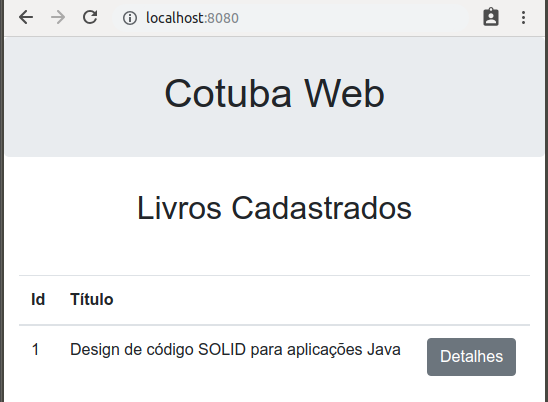
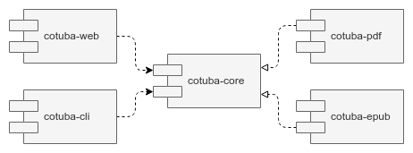

# Além da linha de comando

## Uma interface Web para o Cotuba

Digamos que um outro time implementou uma interface Web para o Cotuba, que é composta por 3 diferentes telas:

- Uma tela principal, que lista todos os livros cadastrados



- Uma tela que detalha os capítulos do livro e que permite gerar o EPUB e o PDF


- Uma tela de edição de um capítulo


Essa UI Web foi implementada em um módulo específico.

Teríamos, então, duas UIs:

- uma interface de linha de comando, implementada pelo módulo `cotuba-cli`
- uma interface Web, implementada pelo novo módulo `cotuba-web`



## Exercício: uma UI Web

1. Abra um Terminal e baixe o Cotuba Modular usando o Git:

  ```sh
  git clone https://github.com/caelum/cotuba-modular.git
  ```

2. Copie o submódulo `cotuba-web` para o seu projeto:

  ```sh
  cp -R cotuba-web/ ~/modulos/cotuba/
  ```

3. No Eclipse, vá em _File > Import... > Existing Maven Projects_ e clique em _Next_.
  Em _Root Directory_, aponte para o diretório que contém a UI Web do Cotuba, preenchendo o campo com `/home/<usuario-do-curso>/modulos/cotuba/cotuba-web`.
  Não esqueça de trocar `<usuario-do-curso>` pelo nome de usuário do curso.
  Clique em _OK_.
  Clique em _Finish_ e seu projeto será importado.

4. Abra o `pom.xml` do supermódulo Cotuba e declare o submódulo Web:

  ####### cotuba/pom.xml

  ```xml
  <modules>
    <module>cotuba-core</module>
    <module>cotuba-cli</module>
    <module>cotuba-pdf</module>
    <module>cotuba-epub</module>
    <module>cotuba-web</module> <!-- inserido -->
  </modules>
  ```

5. Execute a UI Web do Cotuba clicando com o botão direito na classe `Boot` do pacote `cotuba.web` e escolhendo _Run As... > Java Application_.

  Depois de várias mensagens, você deve ver o Console algo como:

  ```txt
  2018-10-15 14:01:34.860  INFO 14993 --- [  restartedMain] o.s.b.w.embedded.tomcat.TomcatWebServer  :
    Tomcat started on port(s): 8080 (http) with context path ''
  2018-10-15 14:01:34.865  INFO 14993 --- [  restartedMain] cotuba.web.Boot                          :
    Started Boot in 11.356 seconds (JVM running for 12.392)
  ```

  Cotuba Web no ar!

6. Acesse e explore o Cotuba Web a partir da URL a seguir:

  http://localhost:8080/

## Entendendo o código do Cotuba Web

A UI Web do Cotuba foi implementada usando as seguintes tecnologias:

- Spring Boot, com configurações em `src/main/resources/application.properties`
- Thymeleaf para as telas, que ficam em `src/main/resources/templates`
- MySQL como banco de dados
- Flyway para manter scripts de BD, que ficam em `src/main/resources/db/migration`
- Spring Data JPA, para facilitar o código de acesso a dados

O código do módulo `cotuba-web` está organizado no seguinte pacotes:

- `cotuba.web`, que contém a classe principal `Boot`, que sobe o servidor Web
- `cotuba.web.application`, que contém as classes `CadastroDeCapitulos` e `CadastroDeLivros`, que representam as histórias de usuário, e as interfaces `RepositorioDeCapitulos` e `RepositorioDeLivros`, que usa o Spring Data JPA para implementar o acesso a dados
- `cotuba.web.domain`, que contém as classes `Livro` e `Capitulo`, o pequeno modelo de domínio do Cotuba Web
- `cotuba.web.controller`, que expõe as histórias do usuário na Web, associando-as aos templates Thymeleaf

## Exercício: implementando o download de ebooks

### Objetivo

Implemente um controller para a geração de ebooks com mapeamentos para PDF e para EPUB.

Por enquanto, disponibilize para download apenas os arquivos já gerados durante o curso.

### Passo a passo

1. Depois de gerar um ebook, deve ser disponibilizado o arquivo para _download_.

  No Spring MVC, uma das maneiras de se fazer isso é através de um `ResponseEntity<ByteArrayResource>`.

  Defina uma classe `SpringFileUtils` no pacote `cotuba.web`, que recebe um `Path` e um _media type_ e retorna um `ResponseEntity<ByteArrayResource>` configurado com os dados do arquivo e os cabeçalhos necessários:

  ####### cotuba.web.SpringFileUtils

  ```java
  public class SpringFileUtils {

    public static ResponseEntity<ByteArrayResource> montaResponseOArquivo(Path path, String type) {
      try {
        byte[] data = Files.readAllBytes(path);
        ByteArrayResource resource = new ByteArrayResource(data);

        String filename = path.getFileName().toString();

        HttpHeaders headers = new HttpHeaders();
        headers.add(HttpHeaders.CONTENT_TYPE, type);
        headers.add(HttpHeaders.CONTENT_DISPOSITION, "attachment;filename=" + filename);

        return ResponseEntity.ok().headers(headers).contentLength(data.length).body(resource);

      } catch (IOException ex) {
        throw new RuntimeException(ex);
      }
    }

  }
  ```

  Não deixe de fazer os imports:

  ####### cotuba.web.SpringFileUtils

  ```java
  import java.io.IOException;
  import java.nio.file.Files;
  import java.nio.file.Path;

  import org.springframework.core.io.ByteArrayResource;
  import org.springframework.http.HttpHeaders;
  import org.springframework.http.ResponseEntity;
  ```

2. Defina um Controller, no pacote `cotuba.web.controller`, com as URLs apropriadas para cada formato de ebook, PDF e EPUB.

  Por enquanto, disponibilize para download, por meio da classe `SpringFileUtils`, os arquivos já gerados para cada formato.

  ####### cotuba.web.controller.GeracaoDeLivrosController

  ```java
  @Controller
  public class GeracaoDeLivrosController {

    @GetMapping("/livros/{id}/pdf")
    public ResponseEntity<ByteArrayResource> geraPDF(@PathVariable("id") Long id, Model model) {

      // ATENÇÃO: troque <usuario-do-curso> pelo usuário do curso
      Path pdf = Paths.get("/home/<usuario-do-curso>/Desktop/book.pdf");

      return SpringFileUtils.montaResponseOArquivo(pdf, "application/pdf");

    }

    @GetMapping("/livros/{id}/epub")
    public ResponseEntity<ByteArrayResource> geraEPUB(@PathVariable("id") Long id, Model model) {

      // ATENÇÃO: troque <usuario-do-curso> pelo usuário do curso
      Path epub = Paths.get("/home/<usuario-do-curso>/Desktop/book.epub");

      return SpringFileUtils.montaResponseOArquivo(epub, "application/epub+zip");

    }

  }
  ```

  Não esqueça de trocar `<usuario-do-curso>` pelo nome de usuário do curso.

  Certifique-se que os imports corretos foram feitos:

  ####### cotuba.web.controller.GeracaoDeLivrosController

  ```java
  import java.nio.file.Path;
  import java.nio.file.Paths;

  import org.springframework.core.io.ByteArrayResource;
  import org.springframework.http.ResponseEntity;
  import org.springframework.stereotype.Controller;
  import org.springframework.ui.Model;
  import org.springframework.web.bind.annotation.GetMapping;
  import org.springframework.web.bind.annotation.PathVariable;
  ```

3. A aplicação já deve ter sido reiniciada automaticamente.
  Acesse a página de detalhes de livros e clique nos botões de geração de PDF ou EPUB.
  O download do ebook deve ser realizado.

## Exercício: preparando para chamar o Cotuba

### Objetivo

Execute a classe `Cotuba` passando os dados do livro e o formato como parâmetro.

Disponibilize o arquivo gerado para download, alterando o controller.

### Passo a passo

1. Adicione como dependência do módulo `cotuba-web` os módulos:

  - `cotuba-core`, cujas classes serão chamadas diretamente pelo código Web
  - `cotuba-pdf` e `cotuba-epub`, que não serão chamados diretamente, mas cujos JARs precisam estar presentes para servirem como plugins

  ####### cotuba-web/pom.xml

  ```xml
  <!-- inserido -->
  <dependency>
    <groupId>cotuba</groupId>
    <artifactId>cotuba-core</artifactId>
    <version>${project.version}</version>
  </dependency>

  <!-- inserido -->
  <dependency>
    <groupId>cotuba</groupId>
    <artifactId>cotuba-pdf</artifactId>
    <version>${project.version}</version>
  </dependency>

  <!-- inserido -->
  <dependency>
    <groupId>cotuba</groupId>
    <artifactId>cotuba-epub</artifactId>
    <version>${project.version}</version>
  </dependency>
  ```

2. Para chamar o Cotuba, vamos criar um classe `GeracaoDeLivros`, no pacote `cotuba.web.application`. Anote-a com `@Service`. Receba um `CadastroDeLivros` no construtor, armazenando-o em um atributo.

  ####### cotuba.web.application.GeracaoDeLivros

  ```java
  package cotuba.web.application;

  import org.springframework.stereotype.Service;

  @Service
  public class GeracaoDeLivros {

    private final CadastroDeLivros livros;

    public GeracaoDeLivros(CadastroDeLivros livros) {
      this.livros = livros;
    }

  }
  ```

3. Nessa classe, definiremos um método `geraLivro`, que recebe o `id` do livro a ser gerado e o formato do ebook. O retorno será um `Path` com o arquivo de saída.

  No novo método, use o `CadastroDeLivros` para obter o `Livro` a partir do `id` recebido como parâmetro.

  ####### cotuba.web.application.GeracaoDeLivros

  ```java
  @Service
  public class GeracaoDeLivros {

    // código omitido...

    public Path geraLivro(Long id, FormatoEbook formato) { // inserido

      Livro livro = livros.detalha(id); // inserido

      // CHAMADA DO COTUBA AQUI..

    }
  }
  ```

  Não esqueça de adicionar os seguintes imports:

  ####### cotuba.web.application.GeracaoDeLivros

  ```java
  import java.nio.file.Path;

  import cotuba.domain.FormatoEbook;
  import cotuba.web.domain.Livro;
  ```

  O código não compilará com sucesso ainda. Precisamos chamar o Cotuba!

4. Na classe `GeracaoDeLivrosController`, receba no construtor um objeto do tipo `GeracaoDeLivros`, armazenando-o em um atributo.

  ####### cotuba.web.controller.GeracaoDeLivrosController

  ```java
  @Controller
  public class GeracaoDeLivrosController {

    private final GeracaoDeLivros geracao; // inserido

    // inserido
    public GeracaoDeLivrosController(GeracaoDeLivros geracao) {
      this.geracao = geracao;
    }

    // código omitido...

  }
  ```

  Faça o import:

  ####### cotuba.web.controller.GeracaoDeLivrosController

  ```java
  import cotuba.web.application.GeracaoDeLivros;
  ```

5. Modifique os métodos `geraPDF` e `geraEPUB` do `GeracaoDeLivrosController`, invocando o método `geraLivro` de `GeracaoDeLivros` com o `FormatoEbook` adequado.

  ####### cotuba.web.controller.GeracaoDeLivrosController

  ```java
  @Controller
  public class GeracaoDeLivrosController {

    // código omitido...

    @GetMapping("/livros/{id}/pdf")
    public ResponseEntity<ByteArrayResource> geraPDF(@PathVariable("id") Long id, Model model) {

      P̶a̶t̶h̶ ̶p̶d̶f̶ ̶=̶ ̶P̶a̶t̶h̶s̶.̶g̶e̶t̶(̶"̶/̶h̶o̶m̶e̶/̶<̶u̶s̶u̶a̶r̶i̶o̶-̶d̶o̶-̶c̶u̶r̶s̶o̶>̶/̶D̶e̶s̶k̶t̶o̶p̶/̶b̶o̶o̶k̶.̶p̶d̶f̶"̶)̶;̶
      Path pdf = geracao.geraLivro(id, FormatoEbook.PDF); // inserido

      return SpringFileUtils.montaResponseOArquivo(pdf, "application/pdf");
    }

    @GetMapping("/livros/{id}/epub")
    public ResponseEntity<ByteArrayResource> geraEPUB(@PathVariable("id") Long id, Model model) {

      P̶a̶t̶h̶ ̶e̶p̶u̶b̶ ̶=̶ ̶P̶a̶t̶h̶s̶.̶g̶e̶t̶(̶"̶/̶h̶o̶m̶e̶/̶<̶u̶s̶u̶a̶r̶i̶o̶-̶d̶o̶-̶c̶u̶r̶s̶o̶>̶/̶D̶e̶s̶k̶t̶o̶p̶/̶b̶o̶o̶k̶.̶e̶p̶u̶b̶"̶)̶;̶
      Path epub = geracao.geraLivro(id, FormatoEbook.EPUB); // inserido

      return SpringFileUtils.montaResponseOArquivo(epub, "application/epub+zip");
    }

  }
  ```

  Não deixe de fazer o import:

  ####### cotuba.web.controller.GeracaoDeLivrosController

  ```java
  import cotuba.domain.FormatoEbook;
  ```

  Não é possível testar ainda, pois há um erro de compilação em `GeracaoDeLivros`.

## Chamando o Cotuba a partir da Web

Como chamar o Cotuba?

A primeira coisa é, no método `geraLivro` de `GeracaoDeLivros`, instanciá-lo:

```java
Cotuba cotuba = new Cotuba();
```

Precisamos invocar o método `executa` de `Cotuba`, que recebe como parâmetros uma instância da interface `ParametrosCotuba` e um `Consumer<String>`.

O `Consumer<String>` pode ser o _method reference_ `System.out::println`, que imprime as mensagens recebidas do Cotuba na saída padrão. No caso, o Console do Servidor Web.

Já para definir o `ParametrosCotuba`, precisamos criar uma implementação dessa interface. Podemos defini-la por meio da classe interna `ParametrosCotubaWeb`.

```java
@Service
public class GeracaoDeLivros {

  private static class ParametrosCotubaWeb implements ParametrosCotuba {

    @Override
    public FormatoEbook getFormato() {
    }

    @Override
    public Path getArquivoDeSaida() {
    }

    @Override
    public Path getDiretorioDosMD() {
    }

  }

}
```

Na classe interna `ParametrosCotubaWeb`, devemos receber o `Livro` e o `FormatoEbook` como parâmetros do construtor, definindo-os em atributos.

```java
private static class ParametrosCotubaWeb implements ParametrosCotuba {

  private Livro livro;
  private FormatoEbook formato;

  private ParametrosCotubaWeb(Livro livro, FormatoEbook formato) {
    this.livro = livro;
    this.formato = formato;
  }

  // código omitido...

}
```

O formato recebido deve ser retornado no método `getFormato`:

```java
private static class ParametrosCotubaWeb implements ParametrosCotuba {

  // código omitido...

  @Override
  public FormatoEbook getFormato() {
    return formato;
  }

}
```

Para definir o arquivo de saída, vamos criar um arquivo em um diretório temporário com o nome `book.pdf` ou `book.epub`, dependendo do formato.

```java
private static class ParametrosCotubaWeb implements ParametrosCotuba {

  // código omitido...

  @Override
  public Path getArquivoDeSaida() {
    try {

      Path diretorioTemporario = Files.createTempDirectory("ebooks");

      String nomeDoArquivoDeSaida = "book" + formato.name().toLowerCase();

      return diretorioTemporario.resolve(nomeDoArquivoDeSaida);

    } catch (IOException ex) {
      throw new RuntimeException(ex);
    }
  }

}
```

Se o formato a ser gerado for um EPUB, o arquivo de saída seria algo parecido com `/tmp/ebooks4379875856573865319/book.epub`.

No caso de um arquivo PDF, teríamos algo como `/tmp/ebooks1653289186159041686/book.pdf`.

Ainda é preciso definir o diretório onde estão os arquivos `.md`. Mas peraí...

## Quando nosso design não antecipa as mudanças

Temos dois clientes que invocam o Cotuba: a interface de linha de comando e a interface Web.

Cada cliente obtém os arquivos MD de maneiras distintas:

- o `cotuba-cli` obtém os `.md` de um diretório
- o `cotuba-web` obtém os `.md` da tabela de capítulos de seu BD

Poderíamos criar arquivos `.md`, salvando-os em um diretório, a partir dos capítulos do BD.


Mas será que é a melhor opção? Será que não há um problema no design? Há algum um ponto de mudança que não foi antecipado?

A classe que usa o diretório com os arquivos `.md` é a `RenderizadorMDParaHTMLComCommonMark`, que implementa a interface `RenderizadorMDParaHTML`.

Se repararmos bem, essa classe quebra o SRP. Há dois motivos para mudá-la:

- uma mudança na maneira de renderizar os arquivos MD para HTML
- uma mudança na maneira de obter esses arquivos MD

Há responsabilidades demais na classe `RenderizadorMDParaHTMLComCommonMark`!

## Mudanças inesperadas e design incremental

Às vezes é difícil antecipar mudanças que acontecerão no problema que estamos resolvendo e o respectivo impacto no código.

Consequentemente, não é trivial criar um design que tem flexibilidade onde realmente é necessário e que "abraça a mudança".

Quando detectarmos um problema no design, ao invés de tentarmos encaixar o código no design já existente, devemos corrigi-lo. Assim, com o tempo, teremos flexibilidades nos pontos certos.

> _Escrever código de qualidade é sempre incremental; você modela, observa seu modelo, aprende com ele e o melhora._
>
> Maurício Aniche, no livro [OO e SOLID para Ninjas](https://www.casadocodigo.com.br/products/livro-oo-solid) (ANICHE, 2015)

## Exercício: mais abstração, mais flexibilidade

### Objetivo

Para trazer flexibilidade na obtenção dos arquivos MD, crie uma abstração por meio da interface `RepositorioDeMDs`.

Faça com que a classe `Cotuba` receba essa abstração. A use na implementação de `RenderizadorMDParaHTML`.

Modifique apenas o código do módulo `cotuba-core`. Por enquanto, deixe outros módulos apresentando erros de compilação.

### Passo a passo

1. No pacote `cotuba.application` do módulo `cotuba-core`, crie a interface `RepositorioDeMDs`. Nessa interface, defina um método `obtemMDsDosCapitulos`, que retorna uma lista de `String`. A lista retornada conterá os MDs dos capítulos.

  ####### cotuba.application.RepositorioDeMDs

  ```java
  package cotuba.application;

  import java.util.List;

  public interface RepositorioDeMDs {

    List<String> obtemMDsDosCapitulos();

  }
  ```

2. Como teremos a abstração para a obtenção de MDs, podemos remover o diretório dos `ParametrosCotuba`:

  ####### cotuba.application.ParametrosCotuba

  ```java
  public interface ParametrosCotuba {

    P̶a̶t̶h̶ ̶g̶e̶t̶D̶i̶r̶e̶t̶o̶r̶i̶o̶D̶o̶s̶M̶D̶(̶)̶;̶

    FormatoEbook getFormato();

    Path getArquivoDeSaida();

  }  
  ```

3. No método `renderiza` da interface `RenderizadorMDParaHTML`, do pacote `cotuba.application`, troque o parâmetro `Path` por um `RepositorioDeMDs`.

  ####### cotuba.application.RenderizadorMDParaHTML

  ```java
  package cotuba.application;

  i̶m̶p̶o̶r̶t̶ ̶j̶a̶v̶a̶.̶n̶i̶o̶.̶f̶i̶l̶e̶.̶P̶a̶t̶h̶;̶
  import java.util.List;

  import cotuba.domain.Capitulo;
  import cotuba.md.RenderizadorMDParaHTMLComCommonMark;

  public interface RenderizadorMDParaHTML {

    L̶i̶s̶t̶<̶C̶a̶p̶i̶t̶u̶l̶o̶>̶ ̶r̶e̶n̶d̶e̶r̶i̶z̶a̶(̶P̶a̶t̶h̶ ̶d̶i̶r̶e̶t̶o̶r̶i̶o̶D̶o̶s̶M̶D̶)̶;̶
    List<Capitulo> renderiza(RepositorioDeMDs repositorioDeMDs);

    public static RenderizadorMDParaHTML cria() {
      return new RenderizadorMDParaHTMLComCommonMark();
    }
  }
  ```

4. Atualize a classe `RenderizadorMDParaHTMLComCommonMark`, que implementa a interface `RenderizadorMDParaHTML`, para cumprir o novo contrato.

  ####### cotuba.md.RenderizadorMDParaHTMLComCommonMark

  ```java
  public class RenderizadorMDParaHTMLComCommonMark implements RenderizadorMDParaHTML {

    @Override
    p̶u̶b̶l̶i̶c̶ ̶L̶i̶s̶t̶<̶C̶a̶p̶i̶t̶u̶l̶o̶>̶ ̶r̶e̶n̶d̶e̶r̶i̶z̶a̶(̶P̶a̶t̶h̶ ̶d̶i̶r̶e̶t̶o̶r̶i̶o̶D̶o̶s̶M̶D̶)̶ ̶{̶
    public List<Capitulo> renderiza(RepositorioDeMDs repositorioDeMDs) {

      // código omitido...

    }

  }
  ```

  Adicione o import:

  ####### cotuba.md.RenderizadorMDParaHTMLComCommonMark

  ```java
  import cotuba.application.RepositorioDeMDs;
  ```

5. Remova o trecho de código que lê os arquivos `.md` de um diretório de `RenderizadorMDParaHTMLComCommonMark`. Essa implementação ficará em outra classe.

  ####### cotuba.md.RenderizadorMDParaHTMLComCommonMark

  ```java
  public class RenderizadorMDParaHTMLComCommonMark implements RenderizadorMDParaHTML {

    @Override
    public List<Capitulo> renderiza(RepositorioDeMDs repositorioDeMDs) {

      List<Capitulo> capitulos = new ArrayList<>();

      P̶a̶t̶h̶M̶a̶t̶c̶h̶e̶r̶ ̶m̶a̶t̶c̶h̶e̶r̶ ̶=̶ ̶F̶i̶l̶e̶S̶y̶s̶t̶e̶m̶s̶.̶g̶e̶t̶D̶e̶f̶a̶u̶l̶t̶(̶)̶.̶g̶e̶t̶P̶a̶t̶h̶M̶a̶t̶c̶h̶e̶r̶(̶"̶g̶l̶o̶b̶:̶*̶*̶/̶*̶.̶m̶d̶"̶)̶;̶

      t̶r̶y̶ ̶(̶S̶t̶r̶e̶a̶m̶<̶P̶a̶t̶h̶>̶ ̶a̶r̶q̶u̶i̶v̶o̶s̶M̶D̶ ̶=̶ ̶F̶i̶l̶e̶s̶.̶l̶i̶s̶t̶(̶d̶i̶r̶e̶t̶o̶r̶i̶o̶D̶o̶s̶M̶D̶)̶)̶ ̶{̶

        a̶r̶q̶u̶i̶v̶o̶s̶M̶D̶
          .̶f̶i̶l̶t̶e̶r̶(̶m̶a̶t̶c̶h̶e̶r̶:̶:̶m̶a̶t̶c̶h̶e̶s̶)̶
          .̶s̶o̶r̶t̶e̶d̶(̶)̶
          .̶f̶o̶r̶E̶a̶c̶h̶(̶a̶r̶q̶u̶i̶v̶o̶M̶D̶ ̶-̶>̶ ̶{̶

            CapituloBuilder capituloBuilder = new CapituloBuilder();

            Parser parser = Parser.builder().build();
            Node document = null;
            try {
              document = parser.parseReader(Files.newBufferedReader(arquivoMD));

              // código omitido...

            } catch (Exception ex) {
              throw new RuntimeException("Erro ao fazer parse do arquivo " + arquivoMD, ex);
            }

            try {
              HtmlRenderer renderer = HtmlRenderer.builder().build();
              String html = renderer.render(document);

              // código omitido...

              Capitulo capitulo = capituloBuilder.constroi();

              capitulos.add(capitulo);

            } catch (Exception ex) {
              throw new RuntimeException("Erro ao renderizar para HTML o arquivo " + arquivoMD, ex);
            }

        }̶)̶;̶

      }̶ ̶c̶a̶t̶c̶h̶ ̶(̶I̶O̶E̶x̶c̶e̶p̶t̶i̶o̶n̶ ̶e̶x̶)̶ ̶{̶
        t̶h̶r̶o̶w̶ ̶n̶e̶w̶ ̶R̶u̶n̶t̶i̶m̶e̶E̶x̶c̶e̶p̶t̶i̶o̶n̶(̶"̶E̶r̶r̶o̶ ̶t̶e̶n̶t̶a̶n̶d̶o̶ ̶e̶n̶c̶o̶n̶t̶r̶a̶r̶ ̶a̶r̶q̶u̶i̶v̶o̶s̶ ̶.̶m̶d̶ ̶e̶m̶ ̶"̶ ̶+̶ ̶d̶i̶r̶e̶t̶o̶r̶i̶o̶D̶o̶s̶M̶D̶.̶t̶o̶A̶b̶s̶o̶l̶u̶t̶e̶P̶a̶t̶h̶(̶)̶,̶ ̶e̶x̶)̶;̶
      }̶

      return capitulos;

    }

  }
  ```

6. Use o método `obtemMDsDosCapitulos` de `RepositorioDeMDs` para adquirir os MDs a serem renderizados para HTML. Altere os trechos de código que dependem de arquivos. Mude as mensagens das exceções.

  ####### cotuba.md.RenderizadorMDParaHTMLComCommonMark

  ```java
  public class RenderizadorMDParaHTMLComCommonMark implements RenderizadorMDParaHTML {

    @Override
    public List<Capitulo> renderiza(RepositorioDeMDs repositorioDeMDs) {

      List<Capitulo> capitulos = new ArrayList<>();

      for (String md : repositorioDeMDs.obtemMDsDosCapitulos()) { // inserido

            CapituloBuilder capituloBuilder = new CapituloBuilder();

            Parser parser = Parser.builder().build();
            Node document = null;
            try {
              d̶o̶c̶u̶m̶e̶n̶t̶ ̶=̶ ̶p̶a̶r̶s̶e̶r̶.̶p̶a̶r̶s̶e̶R̶e̶a̶d̶e̶r̶(̶F̶i̶l̶e̶s̶.̶n̶e̶w̶B̶u̶f̶f̶e̶r̶e̶d̶R̶e̶a̶d̶e̶r̶(̶a̶r̶q̶u̶i̶v̶o̶M̶D̶)̶)̶;̶
              document = parser.parse(md);

              // código omitido...

            } catch (Exception ex) {

              t̶h̶r̶o̶w̶ ̶n̶e̶w̶ ̶R̶u̶n̶t̶i̶m̶e̶E̶x̶c̶e̶p̶t̶i̶o̶n̶(̶"̶E̶r̶r̶o̶ ̶a̶o̶ ̶f̶a̶z̶e̶r̶ ̶p̶a̶r̶s̶e̶ ̶d̶o̶ ̶a̶r̶q̶u̶i̶v̶o̶ ̶"̶ ̶+̶ ̶a̶r̶q̶u̶i̶v̶o̶M̶D̶,̶ ̶e̶x̶)̶;̶
              throw new RuntimeException("Erro ao fazer parse de markdown ", ex);

            }

            try {
              HtmlRenderer renderer = HtmlRenderer.builder().build();
              String html = renderer.render(document);

              // código omitido...

              Capitulo capitulo = capituloBuilder.constroi();

              capitulos.add(capitulo);

            } catch (Exception ex) {

              t̶h̶r̶o̶w̶ ̶n̶e̶w̶ ̶R̶u̶n̶t̶i̶m̶e̶E̶x̶c̶e̶p̶t̶i̶o̶n̶(̶"̶E̶r̶r̶o̶ ̶a̶o̶ ̶r̶e̶n̶d̶e̶r̶i̶z̶a̶r̶ ̶p̶a̶r̶a̶ ̶H̶T̶M̶L̶ ̶o̶ ̶a̶r̶q̶u̶i̶v̶o̶ ̶"̶ ̶+̶ ̶a̶r̶q̶u̶i̶v̶o̶M̶D̶,̶ ̶e̶x̶)̶;̶
              throw new RuntimeException("Erro ao renderizar MD para HTML", ex);

            }

        } // inserido

        return capitulos;

    }

  }
  ```

  Limpe os imports desnecessários:

  ####### cotuba.md.RenderizadorMDParaHTMLComCommonMark

  ```java
  i̶m̶p̶o̶r̶t̶ ̶j̶a̶v̶a̶.̶i̶o̶.̶I̶O̶E̶x̶c̶e̶p̶t̶i̶o̶n̶;̶
  i̶m̶p̶o̶r̶t̶ ̶j̶a̶v̶a̶.̶n̶i̶o̶.̶f̶i̶l̶e̶.̶F̶i̶l̶e̶S̶y̶s̶t̶e̶m̶s̶;̶
  i̶m̶p̶o̶r̶t̶ ̶j̶a̶v̶a̶.̶n̶i̶o̶.̶f̶i̶l̶e̶.̶F̶i̶l̶e̶s̶;̶
  i̶m̶p̶o̶r̶t̶ ̶j̶a̶v̶a̶.̶n̶i̶o̶.̶f̶i̶l̶e̶.̶P̶a̶t̶h̶;̶
  i̶m̶p̶o̶r̶t̶ ̶j̶a̶v̶a̶.̶n̶i̶o̶.̶f̶i̶l̶e̶.̶P̶a̶t̶h̶M̶a̶t̶c̶h̶e̶r̶;̶
  i̶m̶p̶o̶r̶t̶ ̶j̶a̶v̶a̶.̶u̶t̶i̶l̶.̶s̶t̶r̶e̶a̶m̶.̶S̶t̶r̶e̶a̶m̶;̶
  ```

7. Ajuste o método `executa` da classe `Cotuba`, para receber um `RepositorioDeMDs` como parâmetro. Remova o `diretorioDosMD` e use esse novo parâmetro.

  ####### cotuba.application.Cotuba

  ```java
  public class Cotuba {

    p̶u̶b̶l̶i̶c̶ ̶v̶o̶i̶d̶ ̶e̶x̶e̶c̶u̶t̶a̶(̶P̶a̶r̶a̶m̶e̶t̶r̶o̶s̶C̶o̶t̶u̶b̶a̶ ̶p̶a̶r̶a̶m̶e̶t̶r̶o̶s̶,̶ ̶C̶o̶n̶s̶u̶m̶e̶r̶<̶S̶t̶r̶i̶n̶g̶>̶ ̶a̶c̶a̶o̶P̶o̶s̶G̶e̶r̶a̶c̶a̶o̶)̶ ̶{̶
    public void executa(ParametrosCotuba parametros, Consumer<String> acaoPosGeracao, RepositorioDeMDs repositorioDeMDs) { // modificado

      FormatoEbook formato = parametros.getFormato();
      P̶a̶t̶h̶ ̶d̶i̶r̶e̶t̶o̶r̶i̶o̶D̶o̶s̶M̶D̶ ̶=̶ ̶p̶a̶r̶a̶m̶e̶t̶r̶o̶s̶.̶g̶e̶t̶D̶i̶r̶e̶t̶o̶r̶i̶o̶D̶o̶s̶M̶D̶(̶)̶;̶
      Path arquivoDeSaida = parametros.getArquivoDeSaida();

      RenderizadorMDParaHTML renderizador = RenderizadorMDParaHTML.cria();

      L̶i̶s̶t̶<̶C̶a̶p̶i̶t̶u̶l̶o̶>̶ ̶c̶a̶p̶i̶t̶u̶l̶o̶s̶ ̶=̶ ̶r̶e̶n̶d̶e̶r̶i̶z̶a̶d̶o̶r̶.̶r̶e̶n̶d̶e̶r̶i̶z̶a̶(̶d̶i̶r̶e̶t̶o̶r̶i̶o̶D̶o̶s̶M̶D̶)̶;̶
      List<Capitulo> capitulos = renderizador.renderiza(repositorioDeMDs);

      // código omitido...

    }

  }
  ```

  O código do módulo `cotuba-core` deve ser compilado com sucesso.

  Já os módulos `cotuba-cli` e `cotuba-web` ainda devem apresentar erros de compilação.

## Exercício: ajustando a linha de comando

### Objetivo

No módulo `cotuba-cli`, defina uma implementação de `RepositorioDeMDs`, obtendo os MDs dos diretórios.

Passe um objeto dessa nova classe para o `Cotuba`.

Faça outros ajustes necessários.

### Passo a passo

1. No pacote `cotuba.cli` do módulo `cotuba-cli`, crie a classe `MDsDoDiretorio` que implementa a interface `RepositorioDeMDs`.

  Receba, no construtor, um `Path` com o diretório onde estão os MDs, armazenando-o em um atributo.

  ####### cotuba.cli.MDsDoDiretorio

  ```java
  public class MDsDoDiretorio implements RepositorioDeMDs {

    private Path diretorioDosMD;

    public MDsDoDiretorio(Path diretorioDosMD) {
      this.diretorioDosMD = diretorioDosMD;
    }

    @Override
    public List<String> obtemMDsDosCapitulos() {
      List<String> mds = new ArrayList<>();

      PathMatcher matcher = FileSystems.getDefault().getPathMatcher("glob:**/*.md");

      try (Stream<Path> arquivosMD = Files.list(diretorioDosMD)) {

        arquivosMD
          .filter(matcher::matches)
          .sorted()
          .forEach(arquivoMD -> {
            try {
              String md = new String(Files.readAllBytes(arquivoMD));
              mds.add(md);
            } catch (Exception ex) {
              throw new RuntimeException("Erro ao ler arquivo " + arquivoMD, ex);
            }
          });

        return mds;
      } catch (IOException ex) {
        throw new RuntimeException("Erro tentando encontrar arquivos .md em " + diretorioDosMD.toAbsolutePath(),
            ex);
      }

    }

  }
  ```

  Não deixe de adicionar os imports corretos:

  ####### cotuba.cli.MDsDoDiretorio

  ```java
  import java.io.IOException;
  import java.nio.file.FileSystems;
  import java.nio.file.Files;
  import java.nio.file.Path;
  import java.nio.file.PathMatcher;
  import java.util.ArrayList;
  import java.util.List;
  import java.util.stream.Stream;

  import cotuba.application.RepositorioDeMDs;
  ```

2. Remova a anotação `@Override` do método `getDiretorioDosMD` da classe `LeitorOpcoesCLI`. O método não está mais definido na interface `ParametrosCotuba`.

  ####### cotuba.cli.LeitorOpcoesCLI

  ```java
  public class LeitorOpcoesCLI implements ParametrosCotuba {

    // código omitido...

    @̶O̶v̶e̶r̶r̶i̶d̶e̶
    public Path getDiretorioDosMD() {
      return diretorioDosMD;
    }

    // código omitido...

  }
  ```

3. Na classe `Main`, instancie `MDsDoDiretorio` com o diretório que contém os MDs e passe essa instância para a classe `Cotuba`.

  ####### cotuba.cli.Main

  ```java
  public class Main {

    public static void main(String[] args) {

      LeitorOpcoesCLI opcoesCLI = new LeitorOpcoesCLI(args);

      Path arquivoDeSaida = opcoesCLI.getArquivoDeSaida();
      boolean modoVerboso = opcoesCLI.isModoVerboso();

      Path diretorioDosMD = opcoesCLI.getDiretorioDosMD(); // inserido

      try {

        RepositorioDeMDs repositorio = new MDsDoDiretorio(diretorioDosMD); // inserido

        Cotuba cotuba = new Cotuba();

        c̶o̶t̶u̶b̶a̶.̶e̶x̶e̶c̶u̶t̶a̶(̶o̶p̶c̶o̶e̶s̶C̶L̶I̶,̶ ̶S̶y̶s̶t̶e̶m̶.̶o̶u̶t̶:̶:̶p̶r̶i̶n̶t̶l̶n̶)̶;̶
        cotuba.executa(opcoesCLI, System.out::println, repositorio);

        System.out.println("Arquivo gerado com sucesso: " + arquivoDeSaida);

      } catch (Exception ex) {
        // código omitido...
      }
    }

  }
  ```

  Defina o import:

  ####### cotuba.cli.Main

  ```java
  import cotuba.application.RepositorioDeMDs;
  ```

4. Teste a geração de PDFs e EPUBs pela linha de comando. Deve funcionar!

## Exercício: gerando ebooks a partir do Cotuba Web

### Objetivo

Faça a chamada da classe `Cotuba` a partir do módulo `cotuba-web`.

Define implementações adequadas para as interfaces `ParametrosCotuba` e para `RepositorioDeMDs`.

### Passo a passo

1. Crie a classe `ParametrosCotubaWeb`, no pacote `cotuba.web.application` do módulo `cotuba-web`, que implementa a interface `ParametrosCotuba`. No construtor, receba o formato do ebook a ser gerado. Defina o arquivo de saída em um diretório temporário.

  ####### cotuba.web.application.ParametrosCotubaWeb

  ```java
  public class ParametrosCotubaWeb implements ParametrosCotuba {

    private FormatoEbook formato;
    private Path arquivoDeSaida;

    public ParametrosCotubaWeb(FormatoEbook formato) {
      this.formato = formato;
    }

    @Override
    public FormatoEbook getFormato() {
      return formato;
    }

    @Override
    public Path getArquivoDeSaida() {
      if (arquivoDeSaida != null) {
        return arquivoDeSaida;
      }

      try {
        Path diretorio = Files.createTempDirectory("ebooks");
        String nomeDoArquivoDeSaida = "book." + formato.name().toLowerCase();
        this.arquivoDeSaida  = diretorio.resolve(nomeDoArquivoDeSaida);
        return arquivoDeSaida;
      } catch (IOException ex) {
        throw new RuntimeException(ex);
      }
    }
  }
  ```

  Não deixe de fazer os imports corretos:

  ####### cotuba.web.application.ParametrosCotubaWeb

  ```java
  import java.io.IOException;
  import java.nio.file.Files;
  import java.nio.file.Path;

  import cotuba.application.ParametrosCotuba;
  import cotuba.domain.FormatoEbook;
  ```

2. Defina a classe `MDsDoBancoDeDados`, também no pacote `cotuba.web.application`, com um construtor que recebe um `Livro`.

  Nessa classe, implemente `RepositorioDeMDs`. No método `obtemMDsDosCapitulos`, monte uma lista com os MD dos capítulos do livro.

  Faça com que o MD comece com o nome do capítulo como título (`#`).

  ####### cotuba.web.application.MDsDoBancoDeDados

  ```java
  public class MDsDoBancoDeDados implements RepositorioDeMDs {

    private Livro livro;

    public MDsDoBancoDeDados(Livro livro) {
      this.livro = livro;
    }

    @Override
    public List<String> obtemMDsDosCapitulos() {

      List<String> mds = new ArrayList<>();

      for (Capitulo capitulo : livro.getCapitulos()) {

        String md ="# " + capitulo.getNome() + "\n";
        md += capitulo.getMarkdown();

        mds.add(md);

      }

      return mds;
    }

  }
  ```

  As classes `Livro` e `Capitulo` devem ser as do pacote `cotuba.web.domain`.

  Adicione os imports adequados:

  ####### cotuba.web.application.MDsDoBancoDeDados

  ```java
  import java.util.ArrayList;
  import java.util.List;

  import cotuba.application.RepositorioDeMDs;
  import cotuba.web.domain.Capitulo;
  import cotuba.web.domain.Livro;
  ```

3. Na classe `GeracaoDeLivros`, do pacote `cotuba.web.application`, chame o `Cotuba` passando como parâmetros `ParametrosCotubaWeb` e `MDsDoBancoDeDados`. A `acaoPosGeracao` deve imprimir os resultados no console do servidor.

  ```java
  @Service
  public class GeracaoDeLivros {

    // código omitido...

    public Path geraLivro(Long id, FormatoEbook formato) {
      Livro livro = livros.detalha(id);

      Cotuba cotuba = new Cotuba();

      ParametrosCotuba parametros = new ParametrosCotubaWeb(formato);
      RepositorioDeMDs mdsDoBD = new MDsDoBancoDeDados(livro);

      cotuba.executa(parametros, System.out::println, mdsDoBD);

      return parametros.getArquivoDeSaida();
    }

  }
  ```

  Defina os imports necessários:

  ```java
  import cotuba.application.Cotuba;
  import cotuba.application.ParametrosCotuba;
  import cotuba.application.RepositorioDeMDs;
  ```

4. Certifique-se que o servidor Web está rodando. Se não estiver, execute a classe `Boot`.

  Teste a geração do PDF e do EPUB pela Web usando os botões apropriados da seguinte URL:

  http://localhost:8080/livros/1

  Deve funcionar!
