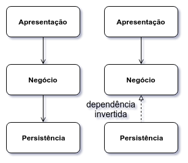

# Arquitetura Hexagonal

## Por uma arquitetura centrada no domínio

No capítulo sobre DIP, citamos uma das arquiteturas mais comuns em aplicações corporativas: a arquitetura em 3 camadas. Nessa arquitetura, Apresentação depende de Negócio que depende de Persistência.

A dependência da camada de Negócio, de alto nível, em direção à camada de Persistência, de baixo nível, viola o DIP.

Por meio de abstrações fornecidas pela camada de Negócio e implementadas pela camada de Persistência, invertemos as dependências.

Ao invertermos as dependências, faríamos com que a Persistência dependa do Negócio, e não o contrário. Alto nível não depende mais de baixo nível. O DIP é respeitado.

Todas as setas apontariam para o Negócio. Teríamos uma arquitetura centrada na lógica de negócio. O modelo de domínio passaria a ser o núcleo da aplicação.

## Hexágonos (ou Conectores & Adaptadores)

Alistair Cockburn, em seu artigo [Hexagonal Architecture](http://alistair.cockburn.us/Hexagonal+architecture) (COCKBURN, 2005), define uma estrutura de alto nível separa o código em duas partes: a de dentro e a de fora. A parte interna contém a lógica de negócio. Já a externa, contém detalhes de implementação, como UI e Persistência.

A parte interna, de Negócio, fornece uma API que é usada e/ou implementada pela parte externa.

O intuito, no fim das contas, é organizar a aplicação apartando o código relacionado a domínio do código mais técnico, relacionado a mecanismos de entrega.

Dessa maneira, é possível guiar o núcleo da aplicação por diferentes clientes: além da UI, scripts, outros programas e testes automatizados.

A mesma arquitetura é chamada por Alistair Cockburn de **Ports & Adapters**, algo como Conectores e Adaptadores. A API fornecida pela aplicação é análoga aos _ports_ (ou conectores) de dispositivos eletrônicos, que permitem que dispositivos externos sejam plugados. Cada conector é ligado a outros dispositivos por um ou mais adaptadores.

Um conector de UI fornecido pelo núcleo da aplicação pode ser usado por dispositivos como:

- uma UI de linha de comando
- uma UI Web
- um teste automatizado
- um reconhecedor de voz
- um Chat Bot

Já um conector de Persistência, pode ser usado por:

- um BD Relacional
- um BD Não-Relacional
- um BD em memória, para testes automatizados
- um WebService externo, como o Firebase

Um adaptador é código que implementa um conector, fazendo a ponte com um determinado dispositivo. Nos termos de Alistair Cockburn, traduz o protocolo do conector ao do dispositivo.

O hexágono é uma metáfora visual que dá a ideia de uma parte interna e uma parte externa. Além disso, um hexágono não unidimensional como um desenho de camadas. Os seis lados do hexágono remetem aos vários conectores de entrada e saída.

## Arquitetura Hexagonal no Cotuba

O Cotuba tem 5 módulos:

- `cotuba-core`, de alto nível, contém a lógica de negócio.
- `cotuba-cli`, de baixo nível, define uma UI de linha de comando.
- `cotuba-web`, de baixo nível, define uma UI Web.
- `cotuba-pdf`, de baixo nível, gera PDFs.
- `cotuba-epub`, de baixo nível, gera EPUBs.

O módulo central, o núcleo da aplicação, é o `cotuba-core`. Esse módulo renderiza MDs para HTMLs, aplica temas, chama o gerador de ebook no formato apropriado e permite ações pós-geração. Alguns dos conectores (ou _ports_) fornecidos são:

- `ParametrosCotuba`, um conector usado para receber parâmetros como o formato de ebook a ser gerado e o arquivo de saída.
- `RepositorioDeMDs`, um conector usado como fonte dos MDs.
- `GeradorEbook`, um conector usado para a geração de ebooks em diferentes formatos.

O módulo `cotuba-cli` torna o Cotuba acessível via Terminal, fornecendo adaptadores para os conectores `ParametrosCotuba`, que obtém parâmetros das opções de linha de comando, e `RepositorioDeMDs`, que lê os MDs de um diretório.

O módulo `cotuba-web` torna o Cotuba acessível via Navegador. O adaptador de`ParametrosCotuba` desse módulo obtém o formato do ebook a ser gerado da URL e o arquivo de saída de um diretório aleatório. Já o adaptador de `RepositorioDeMDs` lê os MDs do BD.

O módulo `cotuba-pdf` fornece um adaptador para `GeradorEbook` que usa a biblioteca iText pdfHTML para gerar um PDF a partir de HTMLs.

O módulo `cotuba-epub` fornece um adaptador para `GeradorEbook` que gerar um EPUB a partir dos HTMLs por meio da biblioteca Epublib.

Poderíamos definir mais módulos, encaixando-os nos conectores já existentes. Por exemplo, poderíamos definir um módulo `cotuba-mobi`, que gera um arquivo `.mobi`, adequado para ser lido no _e-reader_ Kindle. Para isso, o módulo `cotuba-core` não precisaria ser modificado.

### Os conectores de plugins do Cotuba

O módulo `cotuba-core` define também conectores para plugins:

- `Tema`, um conector para temas, usado pelo módulo `tema-paradizo`.
- `AoFinalizarGeracao`, um conector que permite ações após a geração do ebook, usado pelo módulo `estatisticas-ebook`.

Os módulos `tema-paradizo` e `estatisticas-ebook` seriam fornecidos por times de desenvolvedores diferentes dos que desenvolvem o Cotuba.

## Arquitetura de Plugins

Sob uma outra perspectiva, os _Ports and Adapters_ estão relacionados a uma **arquitetura de plugins**.

Uma interface de linha comando seria um plugin. Uma aplicação Web seria outro plugin. A persistência em um banco de dados relacional, outro plugin. Persistência em um datastore NoSQL, mais um plugin. Integrações com outros sistemas, mais plugins.

Usando interfaces, invertemos as dependências para que todos dependam do código de negócio que, por sua vez, não depende de ninguém. As dependências sempre apontam na direção das regras de negócio, nunca ao contrário. Cada mecanismo de entrega seria um plugin diferente.

## Barreiras Arquiteturais

No artigo [What is Software Architecture?](http://www.bredemeyer.com/whatis.htm) (MALAN, 2017), Ruth Malan associa Arquitetura Hexagonal à arquitetura de fortes medievais.

Em um forte medieval, são criadas várias **barreiras arquiteturais**, como fossos e muralhas, para proteger a parte interna. Muitas vezes, essas barreiras são concêntricas, criando várias camadas de proteção. Para permitir o acesso à parte interna, as muralhas têm portões e os fossos têm pontes.

Para proteger a lógica de negócio de dependências externas e voláteis, em uma Arquitetura Hexagonal, criamos barreiras arquiteturais por meio de abstrações (os conectores). As pontes para as dependências externas são feitas através dos adaptadores. Os conectores e adaptadores criam uma barreira arquitetural que permite pontos de acesso plugáveis.

## Clean Architecture

A arquitetura descrita por Uncle Bob no livro [Clean Architecture](https://www.amazon.com/Clean-Architecture-Craftsmans-Software-Structure/dp/0134494164) (MARTIN, 2017) é bastante semelhante à hexagonal.

O objetivo da _Clean Architecture_ de Uncle Bob é definir uma abordagem arquitetural que torna a aplicação:

- **independente de frameworks**: um framework não é sua aplicação. A estrutura de diretórios e as restrições do design do nosso código não deveriam ser determinadas por um framework. Frameworks deveriam ser usados apenas como ferramentas para que a aplicação cumpra suas necessidades.
- **independente da UI**: a UI muda mais frequentemente que o resto do sistema. Além disso, é possível termos diferentes UIs para as mesmas regras de negócio.
- **independente de BD**: as regras de negócio não devem depender de um Banco de Dados específico. Devemos possibilitar a troca, de maneira fácil, de Oracle ou SQL Server para MongoDB, CouchDB, Neo4J ou qualquer outro BD.
- **testável**: deve ser possível testar as regras de negócio diretamente, sem a necessidade de usar uma UI, BD ou servidor Web.

Para isso Uncle Bob define visualmente alguns círculos concêntricos:

- _Entities_: o círculo mais interno, contém regras de negócio críticas, que dizem respeito a diversas aplicações dentro da mesma empresa.
- _Use Cases_: usa as _Entities_ para prover regras de negócio para uma aplicação específica. Casos de uso ou histórias de usuário são representados como objetos.
- _Interface Adapters_: usam os _Use Cases_ e converte dados de/para dispositivos específicos.
- _Frameworks and Drivers_: o círculo mais externo, contém código específico de BDs, UI, sistemas externos e outros dispositivos.

### A Regra da Dependência

Conforme mencionamos no capítulo de DIP, Uncle Bob define a seguinte regra:

_Dependências devem apontar apenas para dentro, em direção às regras de negócio._

Um círculo interno não deve conhecer classes, métodos ou formatos de dados de círculos externos. Nenhuma mudança em um círculo externo deve afetar os círculos internos.

Para permitir isso, um círculo interno deve inverter as dependências, fornecendo abstrações que são implementadas pelo código de círculos externos.

## Outras arquiteturas semelhantes

Ainda no livro [Clean Architecture](https://www.amazon.com/Clean-Architecture-Craftsmans-Software-Structure/dp/0134494164) (MARTIN, 2017), Uncle Bob cita algumas outras arquiteturas semelhantes à Clean Architecture (e à Hexagonal):

- DCI (Data, Context and Interaction), descrita por James Coplien, pioneiro dos Design Patterns, e Trygve Reenskaug, criador do MVC.
- BCE (Boundary-Control-Entity), introduzida por Ivar Jacobson, um dos criadores do UML, no livro [Object Oriented Software Engineering: A Use-Case Driven Approach](https://www.amazon.com/Object-Oriented-Software-Engineering-Approach/dp/0201544350) (JACOBSON, 1992).

## Exercício: Discussão

A aplicação de uma Arquitetura Hexagonal faz sentido em algum projeto que você participou?

Discuta com o instrutor e com os colegas de turma.

## Para saber mais: Microsserviços e o Monólito Modular

O uso de **microsserviços** é uma abordagem de decomposição do código de um sistema em que as barreiras arquiteturais são serviços independentes e autônomos. Diferentes dos módulos, cuja comunicação é feita por chamadas de métodos no mesmo processo, os serviços têm uma comunicação inter-processo, pela rede. Entre as vantagens estão a possibilidade de implantação independente, a opção por tecnologias heterogêneas, a maior tolerância a falhas e mais facilidade ao escalar. As grandes desvantagens, porém, são a complexidade da solução e um possível impacto na performance pela comunicação em rede.

O "antagonista" dos microsserviços é o **monólito**: um único executável é implantado em produção. Para publicar uma nova versão, o sistema todo tem que ser reiniciado. Uma falha na versão publicada afeta todo o sistema. Há o perigo das dependências entre as fatias do código saírem do controle. A grande vantagem é a simplicidade e facilidade de evolução e refatoração do código.

Em seu artigo [Microservices and Jars](https://blog.cleancoder.com/uncle-bob/2014/09/19/MicroServicesAndJars.html) (MARTIN, 2014), Uncle Bob
 escreve:

_Não pule para microsserviços só porque parece legal. Antes, segregue o sistema em JARs usando uma arquitetura de plugins. Se isso não for suficiente, considere a introdução de limites de serviço [service boundaries] em pontos estratégicos._

No livro [Building Microservices](https://www.amazon.com/Building-Microservices-Designing-Fine-Grained-Systems/dp/1491950358/) (NEWMAN, 2015), Sam Newman argumenta que o uso de módulos são uma boa maneira de começar uma base de código, porque ajudam a manter junto código relacionado e a reduzir o acoplamento com outros módulos. Os módulos poderiam ser modelados a partir de _bounded contexts_, termo do _Domain Driven Design_ para os diferentes contextos de negócio de um sistema. Cada módulo passa a ser um candidato a um microsserviço. Para Newman, _"obter os limites incorretos entre os serviços pode ser caro, então é importante esperar que as coisas se estabilizem à medida que você se familiariza com um novo domínio"_.

Martin Fowler, em seu artigo [Monolith First](https://martinfowler.com/bliki/MonolithFirst.html) (FOWLER, 2015), descreve uma abordagem em que o desenvolvimento é iniciado em um monólito para só tardiamente quebrá-lo em microsserviços. Com o projeto em andamento, as necessidades de negócio e, consequentemente, as barreiras arquiteturais ficam mais claras. Fowler diz que _"a maneira lógica é ter um design cuidadoso do monólito, prestando atenção à modularidade do software, tanto no nível de APIs quanto no modo como os dados são armazenados. Faça isso bem e será relativamente simples migrar para microsserviços"_. Porém, Fowler indica que a abordagem de um monólito modular não é tão corriqueira. Descartar completamente o monólito ou retirar apenas alguns serviços de maior granularidade são abordagens mais comuns.
